# 第一章：GPU 硬件架构 — 从芯片物理结构到每个晶体管

**难度**: ⭐⭐ 进阶 (1.1-1.3) / ⭐⭐⭐ 专家 (1.4-1.7)
**前置知识**: 完成 [`tutorial.md`](../tutorial.md) Part 1-2；了解 CPU/内存/缓存的基本概念 (见第0章 0.3-0.5)
**读完你能做什么**: 看到 ncu 报告中的 SM、L2、HBM 指标时知道它们对应什么硬件
**配套代码**: 无（本章纯硬件知识）
**新手建议**: 先读 1.1 (CPU vs GPU)、1.5 (SM 内部)、1.6 (Slot 模型)，其余按需深入

> **本章首次出现的关键术语**:
> 在你读之前，下面这些词先有个印象，正文中每个都会详细解释:
>
> - **晶体管**: 芯片的基本构件，一个微型电子开关 (详见 appendix_hardware.md)
> - **ALU**: 算术逻辑单元，执行加减乘除的硬件电路
> - **缓存 (Cache)**: 处理器内部的高速小容量存储，自动保存最近用过的数据
> - **SM (Streaming Multiprocessor)**: GPU 的基本计算单元，类似 CPU 的"核心"
> - **HBM (High Bandwidth Memory)**: GPU 使用的高带宽显存，多层芯片堆叠
> - **Warp**: 32 个线程组成的一组，GPU 调度的最小单位 ([`tutorial.md`](../tutorial.md) Part 3 已介绍过)
> - **延迟隐藏**: GPU 的核心设计理念——不减少等待时间，而是在等待时切换到其他线程干活


## 1.1 为什么需要 GPU — 从晶体管预算说起

> **从你的第一个 CUDA 程序说起**:
>
> 在 [`tutorial.md`](../tutorial.md) Part 1 中你跑了向量加法: 100 万个 `c[i] = a[i] + b[i]`，GPU 比 CPU 快很多。
> 但你有没有想过:
>
> - 为什么 GPU 能同时跑 100 万个线程? CPU 只能跑几十个。
> - 这 100 万个线程真的是"同时"在跑吗? 还是在轮流跑?
> - 为什么向量加法即使在 GPU 上也不算很快? (它是 Memory Bound)
> - 为什么矩阵乘法用 Shared Memory 后快了那么多?
>
> 要回答这些问题, 需要理解 GPU 的硬件是怎么设计的。
> 这一章就是从芯片层面解答这些"为什么"。

一块芯片上有多少晶体管 (微型电子开关) 是固定的。
A100 有 542 亿个晶体管，H100 有 800 亿个。
芯片设计的核心决策：**这些晶体管怎么分配？**

CPU 把 ~60-70% 的晶体管用在缓存 (高速存储) 和控制逻辑上，
实际做算术运算的 ALU (算术逻辑单元) 只占 ~5%。
GPU 反过来：~40% 是计算单元和寄存器文件 (每个线程专属的极快存储)，
缓存和控制逻辑占比很小。

下面是一个 CPU 核心和一个 GPU SM (Streaming Multiprocessor，GPU 的基本计算单元)
的芯片面积分配对比:

```
下面是一个 CPU 核心和 GPU SM 的芯片面积分配对比。
不需要记住每个细节，重点是看两者的"面积分配比例"有多么不同:

Intel P-Core (~4mm², 约 10 亿晶体管):
┌──────────────────────────────────────┐
│ Branch Predictor + Frontend    ~15%  │ ← 分支预测器: 猜测下一步执行哪条指令
│ Rename/Allocate/ROB            ~20%  │ ← 乱序执行引擎: 让指令不按顺序执行以加速
│ Scheduler + Execution Units    ~10%  │ ← 实际的计算单元 (ALU: 做加减乘除)
│ L1 Data Cache (48KB)           ~10%  │ ← 一级缓存: 最靠近计算单元的高速存储
│ L1 Instr Cache (32KB)           ~5%  │ ← 指令缓存: 存放即将执行的指令
│ L2 Cache (1.25MB)              ~35%  │ ← 二级缓存: 面积最大的单元!
│ Other (TLB, Bus Interface)      ~5%  │
└──────────────────────────────────────┘
→ 计算单元只占 10%, 其余全是缓存和控制逻辑

NVIDIA Ampere SM (~5mm², 约 5 亿晶体管):
(SM = Streaming Multiprocessor, GPU 的基本计算单元, 类似 CPU 的一个"核心")
┌──────────────────────────────────────┐
│ 4× Warp Scheduler + Dispatch    ~5%  │ ← Warp 调度器: 选择哪组线程执行 (极简)
│ Register File (256KB)          ~30%  │ ← 寄存器文件: 每个线程的专属极快存储
│ 64× FP32 Core + 32× FP64      ~20%  │ ← 浮点计算单元 (FP32=单精度, FP64=双精度)
│ 4× Tensor Core                 ~10%  │ ← 矩阵乘法专用加速器 (后续第6章详解)
│ 16× LD/ST + 16× SFU            ~5%  │ ← LD/ST=访存单元, SFU=特殊函数(sin/cos/exp)
│ L1/Shared Memory (192KB)       ~25%  │ ← 一级缓存 + 可编程共享存储 (共享同一块硬件)
│ Other (I-Cache, Tex, etc.)      ~5%  │
└──────────────────────────────────────┘
→ 计算单元+寄存器占 60%! 缓存只占 25%, 控制逻辑只有 5%

关键差异:
- CPU 用 55% 面积做缓存+控制 → 让单线程极快
- GPU 用 60% 面积做寄存器+计算 → 让大量线程同时跑
```
<p align="center">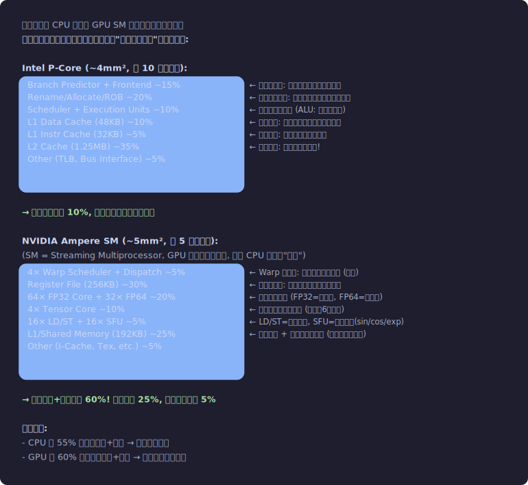</p>


**延迟隐藏的数学**:

GPU 不像 CPU 用巨大缓存来"减少"延迟, 而是用大量线程来"隐藏"延迟。

```
设:
  L_mem = 全局内存延迟 = 500 cycles (典型值)
  T_compute = 两次访存之间的计算时间 / Warp = 50 cycles
  
要完全隐藏延迟:
  需要的并发 Warp 数 ≥ L_mem / T_compute = 500 / 50 = 10 Warps

一个 Ampere SM 可以驻留最多 64 个 Warp:
  即使只有 25% Occupancy (16 Warps), 也超过 10 → 延迟完全隐藏

但如果算子的 T_compute 很小 (如 elementwise, T_compute ≈ 5 cycles):
  需要 500 / 5 = 100 Warps → 超过 SM 上限 (64)!
  → 无法完全隐藏 → 这就是为什么 elementwise 总是 Memory Bound
```


## 1.2 芯片物理拓扑 — 从 Die Shot 看起

> 上一节从晶体管预算的角度解释了 GPU "为什么"把面积分给计算单元。
> 这一节看 GPU 芯片的真实物理布局——SM 在哪里、L2 在哪里、HBM 怎么连的。
> 理解物理布局有助于理解为什么"SM 到不同 L2 Slice 的延迟不同"（数据路径的物理距离）。

以 GA100 (A100 的 die) 为例, 实际的芯片照片可以看到:

```
GA100 Die Layout (实际物理布局):

                        ┌─ HBM2e Stack ──┐
                        │                 │
    ┌───────────────────┤    Memory       ├───────────────────┐
    │                   │   Controller 0  │                   │
    │   ┌──────────┐    └────────┬────────┘    ┌──────────┐   │
    │   │  GPC 0   │             │             │  GPC 1   │   │
    │   │┌──┬──┬──┐│    ┌───────┴────────┐    │┌──┬──┬──┐│   │
    │   ││SM│SM│SM││    │                │    ││SM│SM│SM││   │
    │   │├──┼──┼──┤│    │                │    │├──┼──┼──┤│   │
    │   ││SM│SM│SM││    │    L2 Cache    │    ││SM│SM│SM││   │
    │   │├──┼──┼──┤│    │    Slice 0     │    │├──┼──┼──┤│   │
    │   ││SM│SM│SM││    │    (8MB)       │    ││SM│SM│SM││   │
    │   │└──┴──┴──┘│    │                │    │└──┴──┴──┘│   │
    │   └──────────┘    └───────┬────────┘    └──────────┘   │
    │                           │                             │
    │   ┌──────────┐    ┌───────┴────────┐    ┌──────────┐   │
    │   │  GPC 2   │    │   L2 Cache     │    │  GPC 3   │   │
    │   │(同上结构) │    │   Slice 1      │    │(同上)    │   │
    │   └──────────┘    └───────┬────────┘    └──────────┘   │
    │                           │                             │
    │   ┌──────────┐    ┌───────┴────────┐    ┌──────────┐   │
    │   │  GPC 4   │    │   L2 Cache     │    │  GPC 5   │   │
    │   │          │    │   Slice 2      │    │          │   │
    │   └──────────┘    └───────┬────────┘    └──────────┘   │
    │                           │                             │
    │               ┌───────────┴──────────┐                  │
    │               │   GigaThread Engine  │                  │
    │               │   + PCIe/NVLink      │                  │
    │               └──────────────────────┘                  │
    │                   │   Memory       │                    │
    │                   │  Controller 4  │                    │
    └───────────────────┴────────────────┴────────────────────┘

GA100 完整配置:
  8 GPC × 最多 16 SM/GPC = 128 SM (A100 SKU 启用 108)
  为什么不是 128? → Die 良率: 关掉缺陷 SM, 提高良品率
  
  40MB L2 Cache, 分布在芯片中央, 5 个 slice
  5 个 Memory Controller, 每个连接 1 个 HBM2e stack
  
物理尺寸:
  Die size: 826 mm² (巨大! 接近光刻机极限 ~858 mm²)
  工艺: TSMC 7nm
  晶体管: 54.2 Billion
```
<p align="center">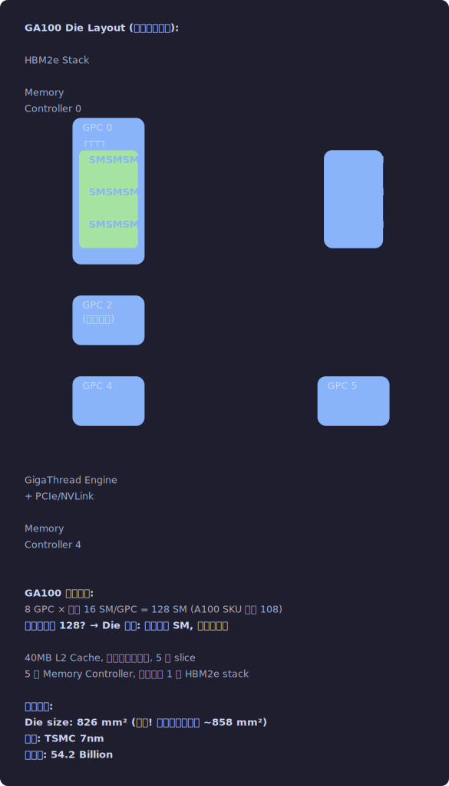</p>


### GPC → TPC → SM 的层级关系

```
GPC (Graphics Processing Cluster):
  物理上一组紧邻的计算单元, 共享 Raster Engine (图形) 和部分互联
  A100: 8 个 GPC, 但 1 个被部分禁用 → 实际 7 个满配 GPC
  
  每个 GPC 包含:
  ├── 2 个 TPC (Texture Processing Cluster)
  │   每个 TPC 包含:
  │   ├── 2 个 SM (Streaming Multiprocessor)
  │   └── 1 个 PolyMorph Engine (图形渲染相关, 计算场景不用)
  └── 1 个 Raster Engine (光栅化, 计算场景不用)

  A100: 8 GPC × 2 TPC × 2 SM = 最多 32 SM/die... 
  等等, 这只有 32 SM? 实际 A100 有 108 SM!
  
  因为 A100 实际每 GPC 有更多 TPC:
  GA100 全配: 8 GPC, 每 GPC 有 8 TPC, 每 TPC 有 2 SM
  → 8 × 8 × 2 = 128 SM (全配)
  → A100 SKU: 108 SM (禁用 20 个有缺陷的)
  → A100 PCIe: 有的是 108 SM, 有的是 104 SM (看 SKU)

为什么要有 GPC/TPC 这个层级?
  1. 物理布局: 靠得近的 SM 共享互联线, 通信更快
  2. 时钟域: 同一 GPC 共享时钟树
  3. 良率管理: 可以按 GPC/TPC 粒度禁用缺陷单元
  4. 电源管理: 可以按 GPC 粒度关闭空闲区域省电
```
<p align="center">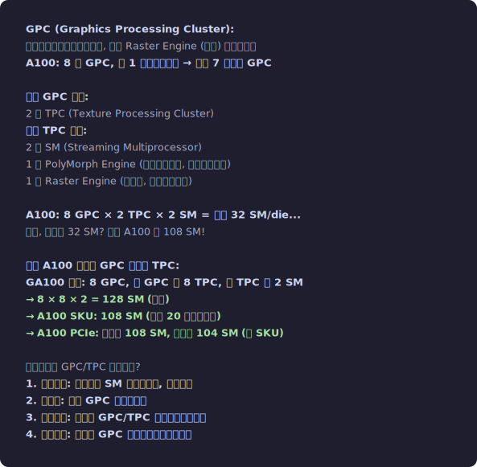</p>


## 1.3 HBM — 高带宽显存的物理结构

> **背景**: 当你调用 `cudaMalloc` 分配 GPU 显存时，数据就存在 HBM 中。
> 理解 HBM 的物理结构有助于理解"为什么合并访问快、随机访问慢"。
>
> 本节首次出现的术语:
> - **DRAM**: 动态随机存储器，靠电容存储数据，容量大但比芯片内的 SRAM 慢
> - **HBM**: High Bandwidth Memory, 多层 DRAM 垂直堆叠的高带宽显存
> - **TSV**: 硅通孔 (Through-Silicon Via)，穿透芯片的垂直导线，连接多层堆叠
> - **Channel**: 独立的数据通路，多个 Channel 可以并行传输数据
> - **Bank**: DRAM 内部的独立存储区域，不同 Bank 可以并行操作
> - **Row Buffer**: Bank 内部当前打开的一行数据的缓存

### HBM 的基本构造

```
HBM (High Bandwidth Memory) 不是传统的 DRAM 芯片。
它是多层 DRAM die 垂直堆叠, 通过硅通孔 (TSV, Through-Silicon Via) 互联,
然后通过硅中介层 (Silicon Interposer) 连接到 GPU die。

物理结构:
┌─────────────┐
│  DRAM Die 7  │ ← 最顶层
├─────────────┤
│  DRAM Die 6  │
├─────────────┤
│  DRAM Die 5  │
├─────────────┤
│  DRAM Die 4  │      TSV (硅通孔): 数千个垂直导线
├─────────────┤      穿透所有 DRAM die, 直径 ~5-10 μm
│  DRAM Die 3  │
├─────────────┤
│  DRAM Die 2  │
├─────────────┤
│  DRAM Die 1  │
├─────────────┤
│  Logic Die   │ ← 底部: 控制逻辑 (ECC, 测试电路)
└──────┬──────┘
       │ (μ-bump 微凸块连接)
┌──────┴──────────────────────────────┐
│        Silicon Interposer            │ ← 硅中介层: 超细线连接 HBM 和 GPU
│  ┌──────┐  ┌──────┐  ┌───────────┐  │
│  │ HBM  │  │ HBM  │  │  GPU Die  │  │
│  │Stack0│  │Stack1│  │ (826mm²)  │  │    通过中介层上的金属线
│  └──────┘  └──────┘  │           │  │    连接 GPU 的 Memory Controller
│  ┌──────┐  ┌──────┐  │           │  │
│  │ HBM  │  │ HBM  │  └───────────┘  │
│  │Stack2│  │Stack3│                  │
│  └──────┘  └──────┘  ┌──────┐       │
│                       │ HBM  │       │
│                       │Stack4│       │
│                       └──────┘       │
└──────────────────────────────────────┘
       │ (C4 bump 连接)
┌──────┴──────┐
│  Package     │ ← 封装基板
│  Substrate   │
└──────────────┘

A100 HBM2e 配置:
  5 个 HBM2e stack (80GB 版本)
  每 stack: 8-Hi (8 层 DRAM die)
  每 stack: 16GB (80GB / 5)
  每 stack 带宽: ~410 GB/s
  总带宽: 5 × 410 = 2039 GB/s (理论峰值, 含 ECC 开销后 ~1935 GB/s)
```
<p align="center">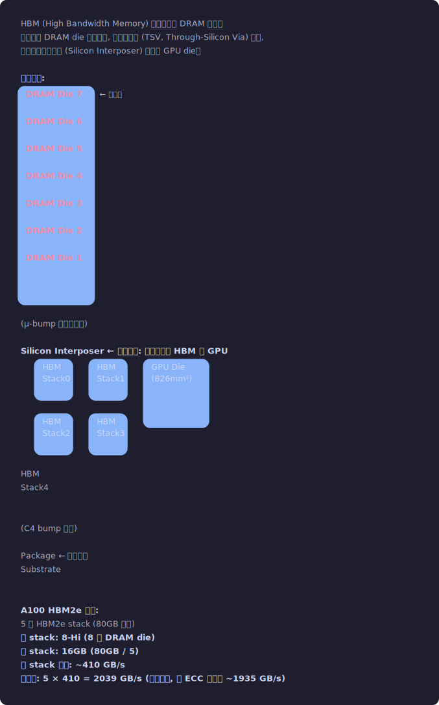</p>


### HBM 的通道结构

```
每个 HBM stack 有独立的内部结构:

HBM2e Stack (8-Hi):
├── 8 个 Channel (每层 DRAM die 提供 1 个 channel)
│   实际是 16 个 Pseudo-Channel (每个 channel 分成 2 个半独立的)
│
│   每个 Pseudo-Channel:
│   ├── 数据宽度: 64 bit
│   ├── 独立的行缓冲区 (Row Buffer)
│   ├── 独立的命令接口
│   └── 但与另一半 channel 共享某些内部资源
│
│   每个 Channel (2 个 Pseudo-Channel):
│   ├── 数据宽度: 128 bit
│   ├── 时钟: 1.215 GHz (HBM2e, A100)
│   ├── DDR (双倍数据率): 有效 2.430 GT/s
│   └── 每 channel 带宽: 128 bit × 2.430 GT/s = 38.9 GB/s
│
└── 每 Stack 总带宽: 8 channels × 38.9 GB/s ≈ 311 GB/s
    (实际稍高, A100 实测 ~410 GB/s/stack, 因为实际时钟可能更高)

DRAM 内部的 Bank 结构:
  每个 Pseudo-Channel:
  ├── 16 个 Bank (HBM2e)
  │   每个 Bank:
  │   ├── Row Buffer: 存储当前打开的行 (~1KB - 2KB)
  │   ├── Bank 是独立的: 不同 Bank 可以并行操作
  │   └── 但同一 Bank 的不同行需要先 Close 再 Open (Row Conflict)
  │
  └── Bank Group: 4 个 Bank 为一组
      同一 Bank Group 内的 Bank 共享某些IO → 有轻微竞争

这意味着什么?
  1. 如果所有请求打在同一个 Bank → 串行化 (Bank Conflict!)
     Row Buffer 命中: ~10ns
     Row Conflict (需要 precharge + activate): ~30-40ns
     
  2. 如果请求分散在不同 Bank/Channel → 高度并行
     16 Bank × 16 Pseudo-Channel = 256 个并行访问点 / Stack
     
  3. GPU Memory Controller 的工作就是:
     - 将来自 SM 的请求路由到正确的 Channel/Bank
     - 重排序请求以最大化 Row Buffer 命中率
     - 管理 Bank Group 间的时序约束
     
  4. 这也解释了为什么合并访问重要:
     连续地址 → 同一行 → Row Buffer 命中 → 快
     随机地址 → 不同行 → Row Conflict → 慢
```
<p align="center">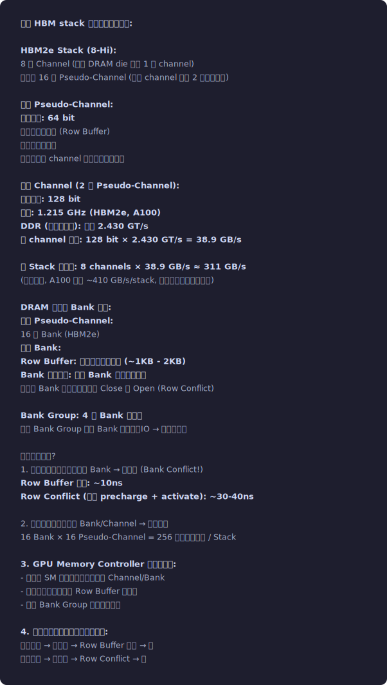</p>


### Memory Controller — GPU 与 HBM 之间的桥梁

```
A100 有 5 个 Memory Controller (MC), 每个连接一个 HBM stack。

每个 Memory Controller:
┌────────────────────────────────────────────┐
│                Memory Controller           │
│                                            │
│  ┌──────────────┐  ┌──────────────┐        │
│  │ Request Queue │  │ Request Queue│  ...   │ ← 来自 L2 的请求
│  │ (Channel 0)  │  │ (Channel 1)  │        │
│  └──────┬───────┘  └──────┬───────┘        │
│         │                 │                │
│  ┌──────┴───────┐  ┌──────┴───────┐        │
│  │  Scheduler   │  │  Scheduler   │  ...   │ ← 请求重排序
│  │  (per-ch)    │  │  (per-ch)    │        │   最大化 Row Buffer 命中
│  └──────┬───────┘  └──────┬───────┘        │   遵守 DRAM 时序约束
│         │                 │                │
│  ┌──────┴───────┐  ┌──────┴───────┐        │
│  │ ECC Engine   │  │ ECC Engine   │  ...   │ ← SECDED ECC
│  └──────┬───────┘  └──────┬───────┘        │   (检1纠1)
│         │                 │                │
│  ┌──────┴─────────────────┴───────┐        │
│  │       Physical Interface       │        │ ← 驱动 HBM 的 IO 电路
│  │   (1024-bit wide per stack)    │        │
│  └────────────────────────────────┘        │
└────────────────────────────────────────────┘

Request 重排序策略:
  FR-FCFS (First Ready, First Come First Served):
  1. 优先服务 Row Buffer 命中的请求 (First Ready)
  2. 在同等条件下, 先到先服务 (FCFS)
  
  这意味着:
  如果大量请求指向同一行 (合并访问) → 都命中 Row Buffer → 极快
  如果请求分散在不同行 → 频繁 Row Open/Close → 变慢
  
  GPU Memory Controller 还会做:
  - Write-to-Read 调度: 批量处理写后再批量处理读, 减少总线翻转
  - Refresh 管理: DRAM 需要定期刷新, MC 要找空闲时间刷新
  - ECC 纠错: 每 256 bit 数据有 16 bit ECC → 实际带宽损失 ~6%
  - Power Management: 在空闲时让 Bank 进入低功耗状态
```
<p align="center">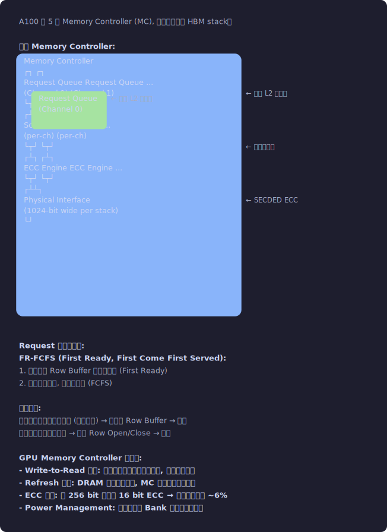</p>


## 1.4 片上互联网络 (NoC / Crossbar)

> 本节解释数据从 SM 到显存的物理传输路径。
> 首次出现的术语:
> - **NoC (Network-on-Chip)**: 片上网络，连接 SM 和 L2 Cache 的数据通路
> - **Crossbar**: 交叉开关网络，允许任意 SM 和任意 L2 Slice 之间通信
> - **MSHR (Miss Status Holding Register)**: L1 Cache 中跟踪"正在等待从显存返回的数据请求"的硬件表。
>   容量有限 (~48-64 条记录/SM)。当 MSHR 满了，新的内存请求必须等待 → Warp 停顿。
> - **L2 Slice**: L2 Cache 被物理划分成多个区域 (Slice)，分布在芯片中央，靠近各个 Memory Controller

### SM 到 L2 的路径

```
SM 发出一个全局内存请求后, 数据经历的物理路径:

SM (LD/ST Unit)
    │
    ▼
SM 的 L1 Cache / Shared Memory (统一片上存储)
    │ (L1 Miss)
    ▼
SM 的 Miss Status Holding Register (MSHR)
    │ 合并相同 cache line 的请求, 减少下游压力
    │ 典型: 每 SM 48-64 个 MSHR entry
    ▼
Crossbar / Network-on-Chip (NoC)
    │ 将请求路由到正确的 L2 Slice
    │
    │ 路由依据: 物理地址的特定 bit 决定目标 L2 Slice
    │ 例如 addr[12:10] 选择 5 个 L2 slice 之一
    │ (地址交织 Interleaving: 使不同地址均匀分布到不同 slice)
    ▼
L2 Cache Slice
    │
    ├── L2 Hit → 返回数据 → NoC → SM (延迟 ~200 cycles)
    │
    └── L2 Miss → Memory Controller → HBM → 返回 (延迟 ~500-800 cycles)

NoC 的结构:
  不是简单的总线! 是一个多级交换网络。
  
  A100 的 NoC (推测, NVIDIA 未完全公开):
  ├── 每个 GPC 内部有本地互联 (SM ↔ SM 较快)
  ├── GPC 之间通过全局 Crossbar 互联
  ├── L2 Cache Slice 分布在 Crossbar 的中央
  └── Crossbar 带宽: 需要支持 108 SM 同时访问 → 数 TB/s
  
  延迟取决于物理距离:
  SM 访问同一 GPC 内的 L2 Slice: 较快
  SM 访问远端 GPC 对应的 L2 Slice: 较慢 (多跳)
  
  这就是为什么某些访问模式会有性能波动:
  如果所有 SM 都访问同一个 L2 Slice → 热点 (Hot Spot) → 排队
  如果访问均匀分布 → 带宽最大化
```
<p align="center">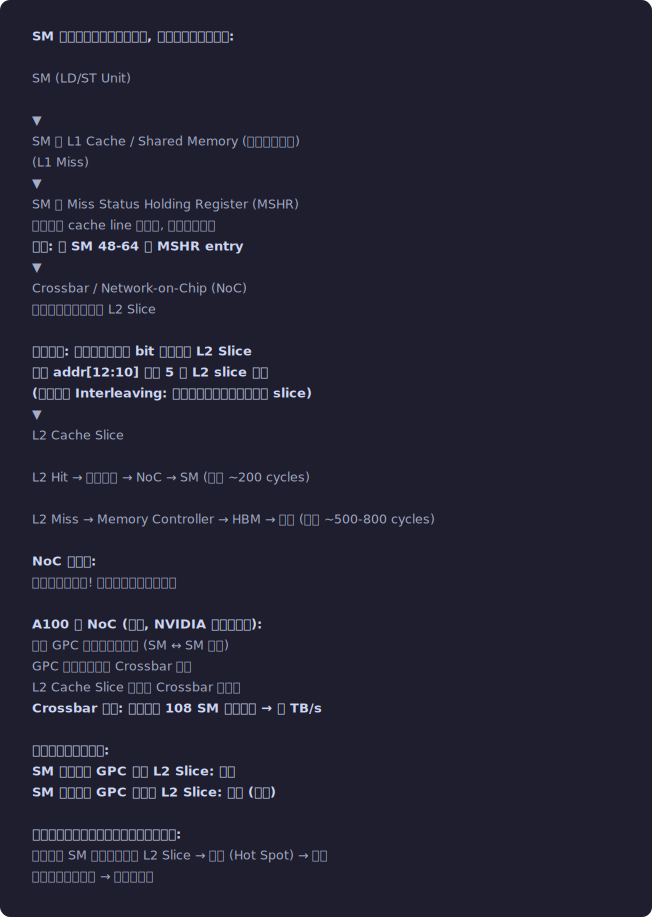</p>


### MSHR — Miss Status Holding Register

```
MSHR 是 L1 Cache 和 NoC 之间的关键硬件:

作用:
  1. 跟踪正在进行的 L1 Cache Miss 请求
  2. 合并 (Coalesce) 指向同一 cache line 的多个请求
  3. 限制同时在飞的请求数 → 防止 NoC 过载

工作方式:
  ┌─────────────────────────────────────┐
  │ MSHR Table (每 SM ~48-64 entries)   │
  │                                     │
  │ Entry 0: addr=0x1000, pending=3     │ ← 3 个 Warp 在等这个 cache line
  │ Entry 1: addr=0x2080, pending=1     │
  │ Entry 2: addr=0x3100, pending=5     │
  │ ...                                 │
  │ Entry 47: (空)                      │
  └─────────────────────────────────────┘
  
  当 Warp 发起一个 L1 Miss:
  1. 检查 MSHR 中是否已有对同一 cache line 的请求
     - 有 → 合并 (只增加 pending 计数, 不发新请求)
     - 没有 → 分配新 MSHR entry, 向 L2 发请求
  
  2. 如果 MSHR 已满 (所有 entry 都在用):
     → 该 Warp Stall! (在 ncu 中表现为 "Stall MIO Throttle")
     → 这是 Memory Bound kernel 的常见瓶颈
  
  3. 当 L2 返回数据:
     → 释放 MSHR entry
     → 唤醒所有等待该 cache line 的 Warp

意义:
  MSHR 数量决定了 SM 能同时追踪多少个在飞的内存请求。
  如果 kernel 的内存访问很散 (每个请求不同 cache line) 且访问量大:
  → 很快耗尽 MSHR → Stall
  → 合并访问可以减少 MSHR 消耗 (多个请求合并为 1 个 entry)
```
<p align="center">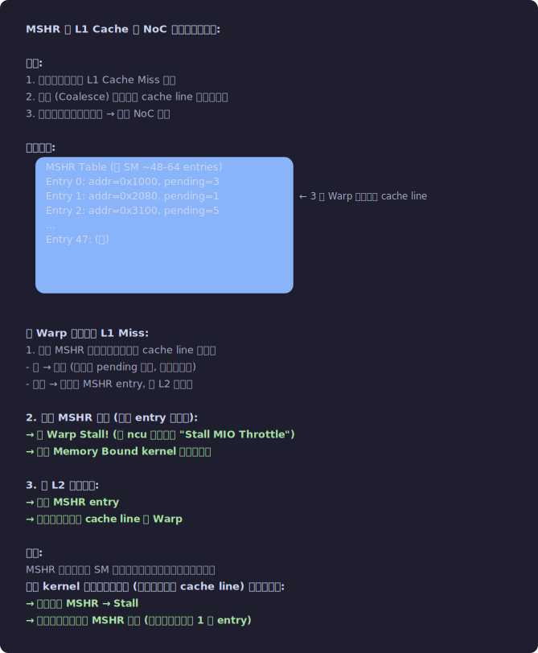</p>


## 1.5 SM 内部 — 每个部件的精确功能

> 前面几节从外向内看了芯片拓扑 (1.2)、显存 (1.3)、互联 (1.4)。
> 现在到了最核心的部分：SM 内部到底有什么？
> SM 是 GPU 的"大脑"——你的 kernel 代码就在这里一条条指令执行。
> 理解 SM 内的每个部件，是理解 ncu 中所有性能指标的基础。

> SM 是 GPU 的核心，理解 SM = 理解 GPU。本节详细拆解 SM 内每个部件。
>
> 首次出现的术语:
> - **Processing Block (子分区)**: SM 内部分成 4 个子单元，每个有自己的 Warp 调度器和执行单元
> - **Register File (寄存器文件)**: SM 上最快的存储，每个线程的局部变量存在这里
> - **Warp Scheduler (Warp 调度器)**: 每周期从就绪的 Warp 中选一个发射指令
> - **Scoreboard (记分板)**: 追踪"哪些寄存器正在等待数据"的硬件表，决定 Warp 能不能执行
> - **FMA (Fused Multiply-Add)**: 一条指令完成 a×b+c，GPU 最基本的计算操作
> - **Register Bank Conflict**: 寄存器文件也分 Bank，两个源操作数在同一 Bank → 多等 1 周期

### Register File — 最大的片上存储

```
Register File 是 SM 上面积最大的单元 (~30% 的 SM 面积)。

物理组织:
  总容量: 65536 × 32-bit = 256 KB / SM
  
  分成 4 个 Partition (每个 Processing Block 一个):
  每个 Partition: 16384 × 32-bit = 64 KB
  
  每个 Partition 的 Register File:
  ┌────────────────────────────────────┐
  │ Register File Partition (64KB)     │
  │                                    │
  │ 物理结构: 多 Bank SRAM             │
  │   Bank 数量: ~16-32 banks (推测)   │
  │   每 bank 有独立的读/写端口        │
  │                                    │
  │ 每周期操作:                         │
  │   读: 最多 ~4 个 32-bit 读 (2条指令 × 2 src) │
  │   写: 最多 ~2 个 32-bit 写         │
  │                                    │
  │ 分配方式:                           │
  │   编译器在编译时确定每线程寄存器数    │
  │   运行时按 Warp 粒度分配连续区域    │
  │   Warp 0: R0-R31, R32-R63, ...     │
  │   Warp 1: R1280-R1311, ...         │
  │   (具体地址由硬件映射)              │
  └────────────────────────────────────┘

Register Bank Conflict:
  和 Shared Memory 类似, Register File 也有 Bank!
  如果一条指令的两个源寄存器在同一 Bank → Register Bank Conflict
  → 需要额外 1 个周期来串行读取
  
  编译器 (ptxas) 会尽力避免:
  - 分配寄存器时考虑 Bank 映射
  - 重排指令顺序使操作数不在同一 Bank
  - 使用 Register Reuse Cache 减少读端口压力
  
  Register Reuse Cache (Volta+):
  ┌──────────────────────────┐
  │ Reuse Cache (per Warp)   │
  │ 缓存最近使用过的寄存器值  │
  │ 容量: ~4-8 entries       │
  │                          │
  │ 如果源寄存器在 cache 中:  │
  │   从 cache 读, 不走 RF   │
  │   → 减少 RF 读端口压力   │
  │   → 避免 Bank Conflict   │
  └──────────────────────────┘
  
  SASS 指令中的 Reuse Flag:
  FFMA R4, R0.reuse, R2, R4;
                ^^^^^ 标记 R0 进入 Reuse Cache
  下一条指令如果也用 R0 → 从 cache 读, 不占 RF 端口
```
<p align="center">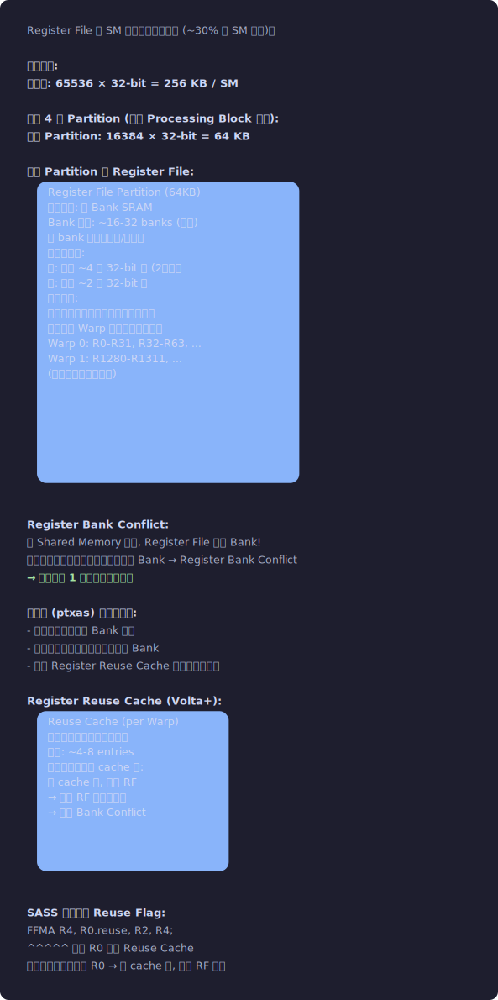</p>


### Warp Scheduler — 每周期做的精确操作

```
每个 Processing Block 有 1 个 Warp Scheduler。
Ampere SM 有 4 个 Processing Block → 4 个 Warp Scheduler。

每个 Scheduler 管理最多 16 个 Warp。
(4 Scheduler × 16 Warp = 64 Warp / SM)

一个 Warp Scheduler 的内部结构:
┌──────────────────────────────────────────────┐
│              Warp Scheduler                  │
│                                              │
│  ┌────────────────────────────┐              │
│  │ Warp State Table           │              │
│  │ (16 entries, 每个 Warp 一个) │              │
│  │                            │              │
│  │ Warp 0: PC=0x1234          │              │
│  │         State=Eligible     │              │
│  │         Barrier_wait=none  │              │
│  │ Warp 1: PC=0x1238          │              │
│  │         State=Stalled_LongSB │            │
│  │ ...                        │              │
│  └────────────┬───────────────┘              │
│               │                              │
│  ┌────────────▼───────────────┐              │
│  │ Scoreboard                 │              │
│  │ (per-Warp 依赖追踪)         │              │
│  │                            │              │
│  │ Warp 0:                    │              │
│  │   R4: pending_write (LDG)  │ ← 寄存器 R4 正在被 LDG 写入  │
│  │   R8: ready               │ ← R8 可用    │
│  │   Barrier[0]: waiting 5    │ ← barrier 0 还有 5 个 Warp 未到达 │
│  │   Barrier[1]: clear       │              │
│  │                            │              │
│  │ 判断 Eligible:              │              │
│  │   下一条指令的所有源寄存器    │              │
│  │   都没有 pending_write      │              │
│  │   且没有在等 barrier        │              │
│  │   → Eligible!             │              │
│  └────────────┬───────────────┘              │
│               │                              │
│  ┌────────────▼───────────────┐              │
│  │ Arbiter (仲裁器)            │              │
│  │                            │              │
│  │ 从所有 Eligible Warp 中     │              │
│  │ 选择一个来执行               │              │
│  │                            │              │
│  │ 选择策略:                   │              │
│  │ - GTO (Greedy-Then-Oldest):│              │
│  │   优先选上次执行的 Warp      │              │
│  │   (利用 I-Cache 局部性)     │              │
│  │   如果它 stall 了,          │              │
│  │   选最老的 eligible Warp    │              │
│  │                            │              │
│  │ - 某些架构用 Round-Robin    │              │
│  │   或混合策略                │              │
│  └────────────┬───────────────┘              │
│               │                              │
│  ┌────────────▼───────────────┐              │
│  │ Instruction Fetch          │              │
│  │                            │              │
│  │ 从 I-Cache 取选中 Warp 的   │              │
│  │ 下一条 SASS 指令            │              │
│  │                            │              │
│  │ I-Cache: ~12-16 KB / SM    │              │
│  │ (所有 4 个 Scheduler 共享)  │              │
│  │                            │              │
│  │ I-Cache Miss:              │              │
│  │   → 从 L1.5 Cache 取      │              │
│  │   → L1.5 Miss → L2 取     │              │
│  │   延迟: ~几十到几百 cycles  │              │
│  │   (大 kernel 可能受         │              │
│  │    I-Cache 压力影响)        │              │
│  └────────────┬───────────────┘              │
│               │                              │
│  ┌────────────▼───────────────┐              │
│  │ Decode + Dispatch          │              │
│  │                            │              │
│  │ 解码 SASS 指令              │              │
│  │ 读取控制码:                 │              │
│  │   Stall Count              │              │
│  │   Yield Flag               │              │
│  │   Read/Write Barrier       │              │
│  │   Reuse Flags              │              │
│  │                            │              │
│  │ 发射到执行单元:              │              │
│  │   FFMA → FP32 Datapath     │              │
│  │   LDG  → LD/ST Unit        │              │
│  │   MUFU → SFU               │              │
│  │   HMMA → Tensor Core       │              │
│  └────────────────────────────┘              │
└──────────────────────────────────────────────┘
```
<p align="center">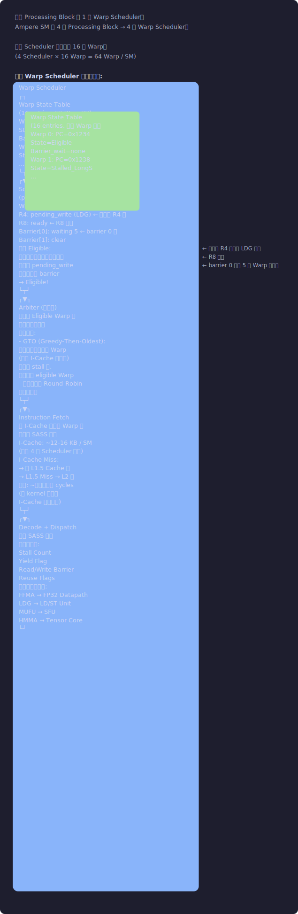</p>


### Scoreboard — 依赖追踪的核心

```
Scoreboard 是 Warp Scheduler 判断 "这个 Warp 能不能执行" 的关键硬件。

NVIDIA GPU 有两种 Scoreboard:

1. Short Scoreboard (短依赖):
   追踪寄存器之间的 RAW (Read After Write) 依赖。
   
   当指令 A 写 R4 (延迟 4 cycles), 指令 B 读 R4:
     如果 A 还没完成 → R4 在 Short Scoreboard 中标记为 pending
     → B 不能发射 (Stall Short Scoreboard)
   
   Short Scoreboard 容量有限 (~6-8 entries per Warp, 推测)
   如果容量满了 → 即使源寄存器就绪也不能发射
   
   编译器通过 Stall Count (SASS 控制码) 来静态管理:
   如果编译器知道下一条指令的依赖恰好在 N 个周期后解除,
   它设置 Stall Count = N → Scheduler 直接等 N 周期, 不查 Scoreboard
   → 减少 Scoreboard 硬件压力

2. Long Scoreboard (长依赖):
   追踪内存访问 (LDG, LDS, TEX 等) 的完成。
   
   LDG R4, [R0];  → Long Scoreboard 标记 R4 为 "等待内存返回"
   ...
   FFMA R6, R4, R2, R6;  → 读 R4 → 检查 Long Scoreboard
     如果 LDG 还没返回 → Stall Long Scoreboard
   
   Long Scoreboard 使用 Barrier 机制 (DEPBAR 指令):
   LDG R4, [R0];  // 设置 Write Barrier #0
   ...
   DEPBAR.LE SB0, 0x0;  // 等待 Barrier #0 完成
   FFMA R6, R4, R2, R6; // 安全使用 R4
   
   每个 Warp 有 6 个 Write Barrier (SB0-SB5)
   编译器负责分配 Barrier 编号, 保证不冲突

在 ncu 中看到的 Stall 原因:
  Stall Short Scoreboard → 通常是计算链太长 (ILP 不足)
  Stall Long Scoreboard  → 通常是等内存 (Memory Bound)
  Stall Barrier          → 等 __syncthreads() (Block 内同步)
  Stall Not Selected     → Warp 就绪但没被选中 (好事: 说明有足够并行度)
  Stall Dispatch         → Dispatch Unit 忙 (通常很少)
  Stall MIO Throttle     → 内存指令队列满 (MSHR 耗尽)
  Stall Math Pipe Throttle → 计算单元满载 (Compute Bound)
```

### LD/ST Unit — 内存访问的执行单元

```
每个 Processing Block 有 4 个 LD/ST (Load/Store) Unit。
(整个 SM 有 16 个 LD/ST Unit)

LD/ST Unit 的职责:
  1. 地址生成 (Address Generation):
     从寄存器读取基地址和偏移, 计算有效地址
     如果是 Unified Memory → 需要查 Page Table
     
  2. 合并 (Coalescing):
     将同一 Warp 32 个线程的请求合并成最少的内存事务
     ┌─────────────────────────────────────┐
     │ Coalescing Logic                    │
     │                                     │
     │ 输入: 32 个地址 (来自 32 个线程)      │
     │ 输出: N 个内存事务 (N = 1-32)        │
     │                                     │
     │ 过程:                                │
     │ 1. 将 32 个地址映射到 128B 段         │
     │ 2. 统计多少个不同的段被触及           │
     │ 3. 每个段生成一个事务                 │
     │                                     │
     │ 完美合并: 32 × 4B 连续 = 128B = 1 事务│
     │ 最差: 32 个不同段 = 32 个事务         │
     └─────────────────────────────────────┘
     
  3. L1 Cache 查询:
     生成的事务先查 L1 Data Cache
     命中 → 返回数据 → 写入目标寄存器
     未命中 → 分配 MSHR entry → 向 L2 发请求
     
  4. Shared Memory 访问:
     LDS/STS 指令走独立的 Shared Memory 端口
     不经过 L1 Cache
     Bank Conflict 检测在这里发生

每个 LD/ST Unit 每周期处理什么?
  全局内存: 1 个 32B sector request
  Shared Memory: 1 个 32B 访问 (无 bank conflict 时)
  
  一条 LDG.128 指令 (每线程 128 bit):
  Warp 32 线程 × 128 bit = 4096 bit = 512 bytes
  需要 512 / 32 = 16 个 sector 或 4 个 128B 事务
  4 个 LD/ST Unit 可以每周期处理 4 个 sector
  → 这条指令需要 16 / 4 = 4 cycles 完成 (仅发射, 不含延迟)
```
<p align="center">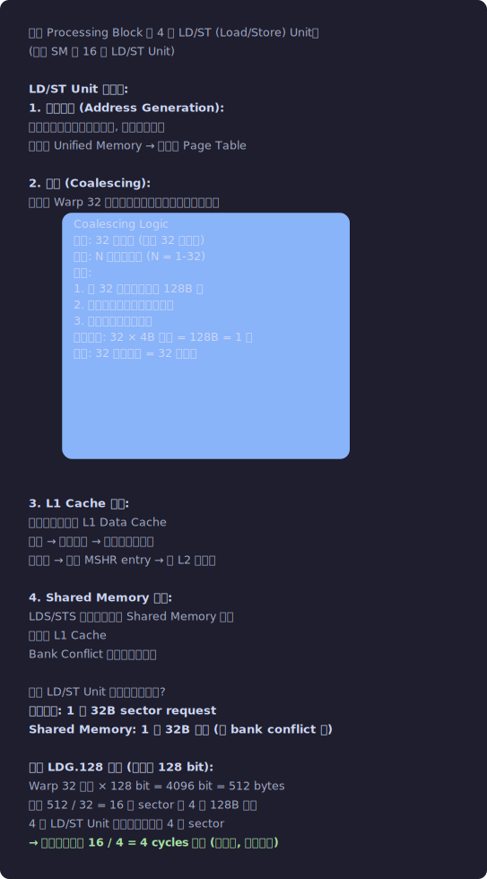</p>


### SFU — Special Function Unit

```
每个 Processing Block 有 4 个 SFU。
(整个 SM 有 16 个 SFU)

SFU 负责执行超越函数, 编译为 MUFU (Multi-Function Unit) 指令:
  MUFU.RCP   → 倒数 (1/x)
  MUFU.RSQ   → 平方根倒数 (1/√x)
  MUFU.SIN   → 正弦
  MUFU.COS   → 余弦
  MUFU.EX2   → 2^x
  MUFU.LG2   → log2(x)
  MUFU.RCP64H → 双精度倒数 (高半部)

SFU 的精度:
  MUFU 指令提供约 22-23 bit 的尾数精度 (接近但不完全是 IEEE 精度)
  __sinf(), __cosf(), __expf() 等就是直接调用 SFU
  sinf(), cosf(), expf() (不带双下划线) 是软件库函数, 更精确但更慢
  
  sinf() 的实现: 参数规约 + SFU + 多项式修正 → ~数十 cycles
  __sinf() 的实现: 直接 SFU → ~28 cycles

SFU 吞吐量:
  一条 MUFU 指令处理 32 个线程 (一个 Warp)
  4 个 SFU / Processing Block
  但每个 SFU 每周期只能处理 1 个线程的操作 (推测)
  → 32 / 4 = 8 cycles / MUFU / Processing Block
  整个 SM: 4 个 PB → 4 × 4 = 16 SFU → 32/16 = 2 cycles / MUFU
  
  和 FP32 Core 对比:
  FFMA: 每 SM 64 ops/cycle (64 Core)
  MUFU: 每 SM 16 ops/cycle (16 SFU)
  → SFU 吞吐只有 FP32 的 1/4

  如果 kernel 中 MUFU 指令占比 > 25% → SFU 可能成为瓶颈
  → ncu 中表现为 "Pipe FMA" 低但 "Pipe ADU" 高
```


## 1.6 Warp 和 Block 的资源分配 — Slot 模型

> 现在你知道 SM 内部有什么硬件了。但一个关键问题还没回答：
> GPU 怎么决定一个 SM 上能同时跑多少个 Block？
> 答案是 Slot（槽位）——每种资源都有固定数量的"位置"，
> Block 上 SM 就是"占位"，所有位置都够才能上，任何一种不够就排队等。
> 这就是 Occupancy 的物理本质。

```
SM 上的资源分配使用 "Slot" (槽位) 的概念:

每个 SM 有以下 Slot:

1. Thread Slot:
   最大 2048 个线程 / SM (Ampere)
   
2. Warp Slot:
   最大 64 个 Warp / SM (= 2048 / 32)
   分配给 4 个 Processing Block, 每个最多 16 个 Warp
   
3. Block Slot:
   最大 32 个 Block / SM (Ampere)
   Block Slot 是最"贵"的 — 每个 Block 需要独立的:
   - Barrier 硬件 (16 个 barrier / Block)
   - Shared Memory 区域
   - Block ID 寄存器
   
4. Register Slot:
   65536 个 32-bit 寄存器 / SM
   按 Warp 粒度分配, 以 256 寄存器为单位
   
5. Shared Memory Slot:
   可配置的总量 (如 164KB)
   按 Block 粒度分配, 以 128 字节为单位

Block 上 SM 的过程 = 分配 Slot:

CTA Scheduler (GigaThread Engine 的一部分) 尝试将 Block 放到 SM:
┌─────────────────────────────────────────────┐
│ 检查 SM X 是否有足够的 Slot:                  │
│                                             │
│ 1. Block Slot: used 28 / max 32 → 还有 4    │ ✓
│ 2. Thread Slot: used 1792 / max 2048        │
│    新 Block 需要 256 → 1792+256=2048 ≤ 2048  │ ✓
│ 3. Warp Slot: used 56 / max 64              │
│    新 Block 需要 8 → 56+8=64 ≤ 64           │ ✓ (刚好!)
│ 4. Register: used 53248 / max 65536         │
│    新 Block 需要 256×48=12288               │
│    53248+12288=65536 ≤ 65536                │ ✓ (刚好!)
│ 5. Shared Mem: used 131072 / max 167936     │
│    新 Block 需要 16384                      │
│    131072+16384=147456 ≤ 167936             │ ✓
│                                             │
│ 所有 Slot 都够 → 分配!                       │
│ 任何一个 Slot 不够 → 等待, 直到有 Block 完成  │
└─────────────────────────────────────────────┘

这就是 Occupancy 的物理本质:
  Occupancy = 实际占用的 Warp Slot / 最大 Warp Slot
  
  被什么限制取决于哪个 Slot 先耗尽:
  - Register Slot 先满 → "Register Limited"
  - Shared Memory Slot 先满 → "Shared Memory Limited"
  - Block Slot 先满 → "Block Slot Limited" (少见, 只在 blockDim 很小时)
  - Thread/Warp Slot 先满 → 直接由 blockDim 和 Block 数决定
```
<p align="center">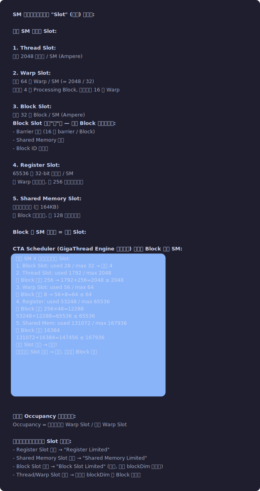</p>


## 1.7 执行流程 — 一条指令从发射到完成

```
以一条 FFMA R4, R0, R2, R4 (FP32 Fused Multiply-Add) 为例:

Cycle 0: Warp Scheduler 选中 Warp 7
  - Arbiter 判定 Warp 7 是 Eligible
  - Instruction Fetch: 从 I-Cache 取 Warp 7 的下一条指令 (128 bit SASS)

Cycle 1: Decode
  - 解码操作码: FFMA
  - 解码源寄存器: R0 (src1), R2 (src2), R4 (src3/acc)
  - 解码目标寄存器: R4 (dest)
  - 读取控制码: Stall=1, Yield=0, Reuse=[R0]
  - 检查 Short Scoreboard: R0, R2, R4 都 ready → OK

Cycle 2: Register Read
  - 从 Register File 读 R0, R2, R4 (3 个读操作)
  - R0 标记 Reuse → 写入 Reuse Cache
  - 如果有 Register Bank Conflict → 额外 1 cycle

Cycle 3-4: FMA Execution (FP32 流水线, 2 stage)
  - Stage 1: 乘法 R0 × R2 (Cycle 3)
    这里处理 Warp 的前 16 个线程 (Thread 0-15)
  - Stage 2: 加法 (R0×R2) + R4 (Cycle 4)
    同时 Stage 1 处理后 16 个线程 (Thread 16-31)

Cycle 5: Register Write
  - 将结果写入 R4 (32 个线程的结果)
  - Short Scoreboard: R4 从 pending 变为 ready
  - 依赖 R4 的其他指令现在变为 Eligible

总延迟: 4 cycles (从发射到结果可用)
吞吐: 每 Scheduler 每周期 1 条 FFMA → 每 SM 4 条 / cycle
      = 4 × 32 threads × 2 FLOP (乘+加) / cycle
      = 256 FLOP/cycle/SM
      
      A100: 108 SM × 256 × 1.41 GHz ≈ 39 TFLOP/s
      等等, 官方 FP32 是 19.5 TFLOPS?
      因为 Ampere 的 FP32 Core 分两种:
      - 纯 FP32 Path: 每 PB 16 个
      - FP32/INT Path: 每 PB 16 个 (这些可以做 FP32 或 INT32, 但不能同时)
      当只做 FP32 时: 每 PB 32 个 → 每 SM 128 个 → 对应 ~39 TFLOPS
      但实际混合使用时 (FP32+INT32 混合): ~19.5 TFLOPS FP32 + 19.5 TOPS INT32
```

```
以一条 LDG.E.128 R4, [R0] (128-bit 全局内存加载) 为例:

Cycle 0: 发射
  Warp Scheduler 选中, Decode 为 LDG

Cycle 1: Address Generation
  LD/ST Unit 从 R0 读取基地址
  32 个线程各生成一个 64-bit 虚拟地址

Cycle 2-3: Coalescing
  合并逻辑将 32 个地址合并为 N 个事务
  理想情况 (连续 float4): 32 × 16B = 512B → 4 个 128B 事务

Cycle 4: TLB Lookup
  虚拟地址 → 物理地址
  GPU 有两级 TLB:
  - L1 TLB: 每 SM ~32-128 entries, 2-4 way set associative
  - L2 TLB: 共享, ~几千 entries
  - TLB Miss → GPU Page Table Walker → 从显存读 Page Table → ~千 cycles!

Cycle 5-6: L1 Cache Probe
  查询 L1 Data Cache
  命中 → Cycle ~30: 数据返回到 R4
  未命中 → 继续到 L2

Cycle 7: MSHR Allocation (L1 Miss 时)
  分配 MSHR entry
  如果 MSHR 满 → Stall (MIO Throttle)

Cycle 8: NoC Transfer
  请求通过 Crossbar 发往 L2 Cache Slice
  路由延迟: ~30-50 cycles (取决于物理距离)

Cycle ~50: L2 Cache Probe
  命中 → 数据回传 → 到达 SM ~Cycle 200
  未命中 → 向 Memory Controller 发请求

Cycle ~200: MC Request (L2 Miss 时)
  Memory Controller 排队请求
  可能需要等: 其他请求先完成, Row Open/Close

Cycle ~300-500: HBM Access
  DRAM Row Activate → Read → Precharge
  数据从 HBM 返回到 MC

Cycle ~500-600: Data Return
  MC → L2 (写入, ~50 cycles)
  L2 → NoC → SM → L1 → Register File

Cycle ~600-800: Warp Resume
  R4 从 pending 变为 ready (Long Scoreboard 清除)
  Warp 变为 Eligible, 等待被 Scheduler 选中继续执行

整个过程中, Warp 一直在 Stall (Long Scoreboard)。
但其他 Warp 可以在这 ~700 cycles 中正常执行!
这就是延迟隐藏: 需要 ~700/50 ≈ 14 个 Warp 来完全隐藏。
```


## 1.8 GPU 电源管理 — 为什么你的 kernel 第一次跑比后面慢

> 你可能注意到: 同一个 kernel 第一次运行比后面慢 10-30%。
> 这不是测量误差——是 GPU 的电源管理在起作用。

### DVFS (Dynamic Voltage and Frequency Scaling)

```
GPU 不是一直跑在固定频率的。它根据负载和温度动态调整:

频率级别:
  Idle:  ~210 MHz (空闲时, 省电)
  Base:  ~1095 MHz (保证能稳定运行的频率)
  Boost: ~1410 MHz (高负载时自动升频, 在功耗/温度允许的范围内)

升频/降频的触发:
  GPU 空闲 → 检测到 kernel launch → 开始升频 → ~数百 μs 达到 Boost
  GPU 满载持续运行 → 芯片温度升高 → 达到温度墙 (~83°C) → 开始降频
  功耗超过 TDP → Power Throttle → 降频

这就解释了为什么:
  - 第一次 kernel 运行慢: GPU 还在从 Idle 升频到 Boost
  - 长时间运行后变慢: 温度上来了, 频率被降下来
  - 冬天比夏天跑得快: 散热好 → 温度低 → 可以维持更高频率更久

对 Benchmark 的影响:
  错误做法: 直接跑 1 次 kernel 计时
  正确做法:
    1. 预热: 先跑几次不计时 (让 GPU 升频到稳态)
    2. 跑 100+ 次取平均
    3. 或者用 nvidia-smi 锁频:
       nvidia-smi -lgc 1410,1410  # 锁定在 Boost 频率
       (需要 root 权限, 且会增加功耗)
```

### 功耗与性能的关系

```
P_dynamic = α × C × V² × f

频率 (f) 和电压 (V) 是绑定的: 频率越高需要越高的电压才能稳定。

降频 10% (1410→1269 MHz):
  V 也降 ~5% → P ∝ V²×f → 降 ~19%
  性能只降 ~10% (如果是 Compute Bound) 或更少 (Memory Bound)

这就是 "Power Cap" 的原理:
  A100 SXM4: TDP = 400W, Boost = 1410 MHz
  A100 PCIe: TDP = 250W, Boost = ~1100 MHz (同一个 die!)
  → PCIe 版便宜但功耗受限 → 频率低 → 性能低 ~20%

实际测量功耗:
  nvidia-smi -q -d POWER  → 实时功耗
  nvidia-smi dmon -s p     → 持续监控

对算子开发的意义:
  如果你的 kernel 从 100W 优化到 80W (减少无效访存),
  GPU 可以把省下的功耗 headroom 用来维持更高频率 → 额外的免费加速!
```

### GPU 时钟域详解

```
一个 GPU 内部有多个独立的时钟域:

SM Clock (~1.4 GHz):
  驱动所有 SM 的计算单元、寄存器文件、Shared Memory
  kernel 的执行速度直接由这个时钟决定
  cudaEventElapsedTime 也基于 SM Clock

Memory Clock (~1.2 GHz for HBM2e):
  驱动 HBM 的 IO 接口
  HBM 带宽 = Memory Clock × 数据宽度 × DDR
  A100: 1215 MHz × 5120 bit × 2 (DDR) = 2039 GB/s (理论峰值)

NVLink Clock:
  驱动 NVLink 的 SerDes (串行/解串行) 接口
  独立于 SM 和 Memory Clock

PCIe Clock:
  由 PCIe 标准定义 (Gen4: 16 GT/s per lane)
  和 GPU 内部时钟无关

Video Clock:
  驱动显示输出 (HDMI/DP), 数据中心 GPU 通常没有

不同时钟域之间的数据传递需要 "跨时钟域同步" (CDC):
  SM → Memory Controller: SM Clock → Memory Clock → 增加 ~几个周期延迟
  这就是为什么实际 HBM 延迟 (~500 cycles SM Clock) 
  比 HBM 自身的访问时间 (~50ns DRAM) 长 → 中间有时钟域转换和排队

用 nvidia-smi 查看当前时钟:
  nvidia-smi -q -d CLOCK  → 各时钟域的当前值和最大值
```


## 1.9 多 GPU 系统拓扑 — NVLink/NVSwitch/PCIe 的精确连接

### DGX A100 的完整拓扑

```
DGX A100: 8 个 A100 GPU, 6 个 NVSwitch, 2 个 AMD Rome CPU

物理连接:
┌─────────────────────────────────────────────────────────────┐
│                      DGX A100                                │
│                                                              │
│  ┌──────┐ ┌──────┐ ┌──────┐ ┌──────┐                       │
│  │ GPU0 │ │ GPU1 │ │ GPU2 │ │ GPU3 │  ← 一组 4 个 GPU     │
│  └──┬───┘ └──┬───┘ └──┬───┘ └──┬───┘                       │
│     │ NVLink │  NVLink │ NVLink │                            │
│  ┌──┴────────┴────────┴────────┴──┐                          │
│  │      NVSwitch 0, 1, 2          │  ← 3 个 NVSwitch        │
│  └──┬────────┬────────┬────────┬──┘    连接所有 8 个 GPU     │
│     │ NVLink │  NVLink │ NVLink │                            │
│  ┌──┴───┐ ┌──┴───┐ ┌──┴───┐ ┌──┴───┐                       │
│  │ GPU4 │ │ GPU5 │ │ GPU6 │ │ GPU7 │  ← 另一组 4 个 GPU    │
│  └──┬───┘ └──┬───┘ └──┬───┘ └──┬───┘                       │
│     │ NVLink │  NVLink │ NVLink │                            │
│  ┌──┴────────┴────────┴────────┴──┐                          │
│  │      NVSwitch 3, 4, 5          │  ← 另外 3 个 NVSwitch   │
│  └────────────────────────────────┘                          │
│                                                              │
│  每个 GPU 有 12 条 NVLink (A100 NVLink 3.0):                │
│    6 条连接到 NVSwitch 组 A (0,1,2)                          │
│    6 条连接到 NVSwitch 组 B (3,4,5)                          │
│    → 任意两个 GPU 之间都有全带宽路径 (600 GB/s 双向)          │
│                                                              │
│  GPU 和 CPU 的连接:                                           │
│    GPU 0-3 通过 PCIe Gen4 连接 CPU 0                         │
│    GPU 4-7 通过 PCIe Gen4 连接 CPU 1                         │
│    (但 GPU 间通信走 NVLink, 不走 PCIe!)                       │
└─────────────────────────────────────────────────────────────┘

带宽层级 (数据从快到慢的路径):
  GPU 内部 HBM:        2039 GB/s (最快)
  GPU↔GPU (NVLink):    600 GB/s  (比 HBM 慢 ~3×)
  GPU↔CPU (PCIe 4.0):  32 GB/s   (比 NVLink 慢 ~20×!)
  CPU↔CPU (UPI):       41.6 GB/s
  
意义:
  1. 数据应尽量留在 GPU 内部 (不要频繁 H2D/D2H)
  2. 多 GPU 通信走 NVLink (不要走 PCIe)
  3. AllReduce 的带宽取决于 NVLink 拓扑, 不是 PCIe
  4. CPU 是瓶颈 → 尽量减少 CPU 参与 (用 GPU Direct)
```
<p align="center">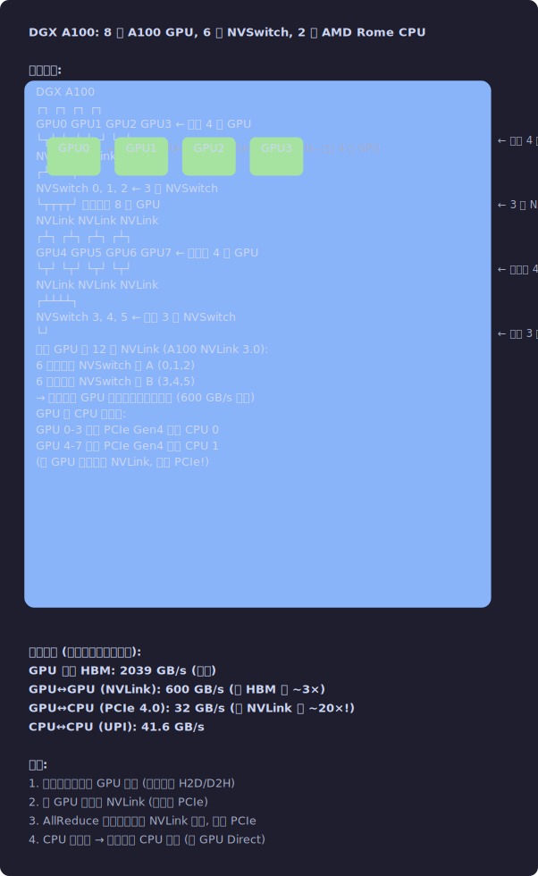</p>


### 查看你的 GPU 拓扑

```bash
# 查看 GPU 间的连接方式
nvidia-smi topo --matrix

# 输出类似:
#         GPU0  GPU1  GPU2  GPU3
# GPU0     X    NV12  NV12  NV12    ← NV12 = NVLink, 12 条
# GPU1    NV12   X    NV12  NV12
# GPU2    NV12  NV12   X    NV12
# GPU3    NV12  NV12  NV12   X
# CPU0    PHB   PHB   PHB   PHB     ← PHB = PCIe Host Bridge

# 如果看到 SYS 或 NODE → 跨 NUMA 节点, 通信更慢
# PIX = 同一 PCIe Switch → 还行
# PHB = 同一 PCIe Host Bridge → 一般
# SYS = 跨 CPU socket → 最慢 (要穿过 UPI/QPI)

# 对 NCCL 性能的影响:
#   NV12 的 AllReduce: ~550 GB/s (接近 NVLink 峰值)
#   PIX 的 AllReduce:  ~25 GB/s (PCIe 4.0 限制)
#   SYS 的 AllReduce:  ~12 GB/s (跨 socket, 更差)
```

### NUMA 对 GPU 编程的影响

```
NUMA (Non-Uniform Memory Access): CPU 有多个 socket, 每个 socket 有本地内存。
访问本地内存快, 访问远端内存慢。

对 CUDA 的影响:
  cudaMallocHost 分配的 Pinned Memory 在哪个 NUMA node?
  如果在 CPU 0 的 node, 但 GPU 连在 CPU 1 的 PCIe → 
  H2D 传输要穿过 UPI → 带宽减半!

最佳实践:
  // 查询 GPU 连接的 NUMA node
  int numaNode;
  cudaDeviceGetAttribute(&numaNode, cudaDevAttrHostNativeAtomicSupported, gpuId);
  
  // 或用 nvidia-smi topo 看
  
  // 绑定 CPU 线程到正确的 NUMA node
  numactl --cpunodebind=0 --membind=0 ./my_gpu_program
  // 确保 Pinned Memory 分配在 GPU 对应的 NUMA node

  // 这在多 GPU 训练中尤为重要:
  // 每个 GPU 的数据加载线程应该绑定到离它最近的 CPU socket
```


## 1.10 速记卡 — A100 关键数字

> **注意**: 以下数字都是 A100 (Ampere, sm_80) 的规格。
> 不同架构的关键差异见下表，具体数字请查询对应 GPU 的白皮书或用 `cudaGetDeviceProperties` 获取。

```
各架构关键差异速览:
┌──────────┬──────────┬──────────┬──────────┬──────────┬──────────┐
│          │ Volta    │ Turing   │ Ampere   │ Hopper   │ Blackwell│
│          │ (sm_70)  │ (sm_75)  │ (sm_80)  │ (sm_90)  │(sm_100)  │
├──────────┼──────────┼──────────┼──────────┼──────────┼──────────┤
│ TF32     │ ✗        │ ✗        │ ✓        │ ✓        │ ✓        │
│ BF16     │ ✗        │ ✗        │ ✓        │ ✓        │ ✓        │
│ FP8      │ ✗        │ ✗        │ ✗        │ ✓        │ ✓        │
│ FP4      │ ✗        │ ✗        │ ✗        │ ✗        │ ✓        │
│ Sparsity │ ✗        │ ✗        │ ✓ (2×)   │ ✓ (2×)   │ ✓ (2×)   │
│ TMA      │ ✗        │ ✗        │ ✗        │ ✓        │ ✓        │
│ SMEM     │ 96 KB    │ 96 KB    │ 164 KB   │ 228 KB   │ 228+ KB  │
│ L2       │ 6 MB     │ 6 MB     │ 40 MB    │ 50 MB    │ 96+ MB   │
│ HBM      │ HBM2     │ GDDR6    │ HBM2e    │ HBM3     │ HBM3e    │
│ Peak BW  │ 900 GB/s │ 616 GB/s │ 2 TB/s   │ 3.35 TB/s│ 8 TB/s   │
│ NVLink   │ 300 GB/s │ ✗        │ 600 GB/s │ 900 GB/s │ 1800 GB/s│
│ FP16 TC  │ 112 TF   │ 65 TF    │ 312 TF   │ 989 TF   │ ~2000 TF │
│ FP8 TC   │ ✗        │ ✗        │ ✗        │ 1979 TF  │ ~4000 TF │
│ Process  │ 12nm     │ 12nm     │ 7nm      │ 4nm      │ 4np      │
└──────────┴──────────┴──────────┴──────────┴──────────┴──────────┘

注意: Turing 的 GDDR6 版本带宽较低是显存类型差异, 不是架构能力差异。
      不同 GPU SKU (如 A100 vs A30) 同架构但规格不同。
```

```
┌────────────────────────────────────────────────────────┐
│              A100 关键规格速记                           │
│                                                        │
│  SM 数量:     108                                      │
│  每 SM:       64 FP32 Core, 4 Tensor Core              │
│              64 Warp (2048 Thread) 最大驻留             │
│              65536 × 32-bit 寄存器                      │
│              192KB L1+Shared (可配)                     │
│              4 个 Warp Scheduler (每个管 16 Warp)       │
│                                                        │
│  算力:        19.5 TFLOPS (FP32)                       │
│              312 TFLOPS (FP16 Tensor Core)             │
│                                                        │
│  显存:        80GB HBM2e, 2039 GB/s                    │
│  L2:         40MB                                      │
│                                                        │
│  延迟:        FMA = 4 cyc, SFU = 28 cyc               │
│              Shared Mem = 5 cyc                        │
│              L2 = 200 cyc, HBM = 500-800 cyc           │
│                                                        │
│  Slot 限制:   32 Block/SM, 64 Warp/SM, 2048 Thread/SM  │
│              65536 Reg/SM, 最大 164KB Smem/SM           │
│                                                        │
│  Warp:        32 线程, SIMT 执行                        │
│  Block:       最大 1024 线程, blockDim 必须是 32 的倍数  │
│  Launch:      ~5μs CPU 端开销                           │
└────────────────────────────────────────────────────────┘
```
<p align="center">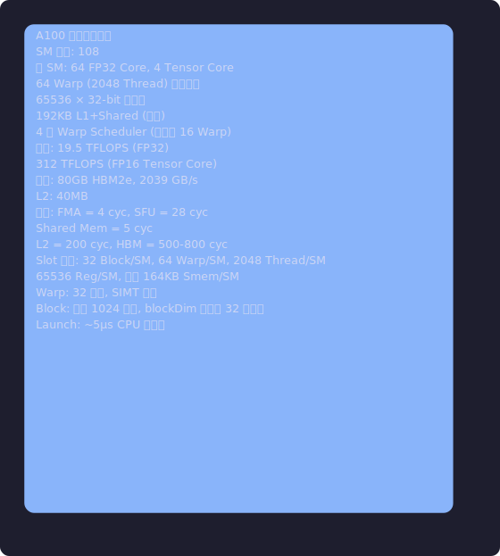</p>


## 1.11 本章总结

```
核心知识链:
  芯片物理拓扑 (Die → GPC → TPC → SM → Processing Block)
  → HBM 存储 (Stack → Channel → Pseudo-Channel → Bank → Row)
  → 片上互联 (SM → MSHR → NoC → L2 Slice → MC → HBM)
  → SM 内部 (Register File → Warp Scheduler → Scoreboard → 执行单元)
  → 资源分配 (Slot 模型: Thread/Warp/Block/Reg/Smem Slot)
  → 指令执行 (发射 → 读寄存器 → 流水线执行 → 写回)

关键数字 (A100 随手能背的):
  108 SM, 64 Warp/SM, 2048 Thread/SM, 65536 Reg/SM
  192KB L1+Smem/SM, 40MB L2, 80GB HBM, 2039 GB/s
  FP32: 19.5 TFLOPS, FP16 TC: 312 TFLOPS
  全局内存延迟: ~500-800 cycles, L2: ~200 cycles, Smem: ~5 cycles
```


## 1.12 Q&A — 常见疑问与概念辨析

### Q: SM 和 "核心" 是什么关系? 一个 SM 等于一个核心吗?

```
SM 是 GPU 的独立调度单元, 类似 CPU 的一个核心。
但 SM 内部有 64 个 CUDA Core (FP32 ALU), 这不是 64 个独立核心!

CUDA Core 没有自己的 PC、调度器、缓存 — 它只是 SM 内的一个功能单元。
正确的层级:
  SM = 独立核心 (有自己的调度器、寄存器文件、Shared Memory)
  CUDA Core = SM 内的一个 ALU (类比 CPU 核心内的一个 FMA 单元)

A100: 108 "核心" (SM), 每个核心内有 64 个 ALU
```

### Q: MSHR 满了会怎样? 这个问题严重吗?

```
MSHR 满 → 新的 L1 Cache Miss 请求无法发出 → 产生该请求的 Warp stall
在 ncu 中表现为 "Stall MIO Throttle"。

这通常发生在:
  1. 大量随机访问 (每个请求不同 cache line → MSHR entry 不能合并)
  2. 访存密集且延迟高 (L2 miss → HBM → 800 cycles → MSHR 长时间被占)

解决方法:
  - 合并访问 → 多个请求命中同一 CL → MSHR 合并为 1 entry
  - 减少同时在飞的请求 → 降低每线程的访存量
  - 提高 L1/L2 命中率 → 请求更快回来 → MSHR 更快释放
```

### Q: Scoreboard 的 "Long" 和 "Short" 有什么本质区别?

```
本质区别是延迟的量级和追踪机制:

Short Scoreboard:
  追踪: 寄存器间的 RAW 依赖 (计算指令的结果)
  延迟: ~4-28 cycles (FMA=4, SFU=28)
  管理方式: 编译器通过 SASS 控制码的 Stall Count 静态管理
  硬件: 简单的计数器, 几 bit

Long Scoreboard:
  追踪: 内存访问的完成 (LDG, LDS, TEX 等)
  延迟: ~5-800 cycles (SMEM=5, L1 hit=28, HBM=800)
  管理方式: 6 个 Write Barrier (SB0-SB5), 通过 DEPBAR 指令显式等待
  硬件: 较复杂, 需要跟踪多个在飞请求的完成状态

"Stall Long Scoreboard" 是最常见的性能瓶颈 → 通常意味着 Memory Bound。
"Stall Short Scoreboard" 较少见 → 通常意味着计算依赖链太长 (ILP 不足)。
```

### 概念辨析: "延迟" vs "吞吐" vs "带宽"

```
延迟 (Latency): 完成一个操作的时间 → 衡量 "一件事多快"
  "全局加载延迟 500 cycles" = 从发出请求到数据可用需要 500 cycles

吞吐 (Throughput): 单位时间完成的操作数 → 衡量 "单位时间做多少事"
  "FP32 吞吐 256 ops/cycle/SM" = 每个 SM 每周期可以完成 256 次 FP32 运算

带宽 (Bandwidth): 吞吐的一种, 专指数据传输量 → 衡量 "管道多粗"
  "HBM 带宽 2039 GB/s" = 每秒最多传输 2039 GB

它们的关系:
  高带宽不等于低延迟! (HBM 带宽很高但延迟 ~100ns)
  高吞吐不等于低延迟! (GPU FP32 吞吐 19.5T 但单条 FMA 延迟 4 cycles)
  流水线提高吞吐但不减少延迟。
  并行 (多 Warp) 隐藏延迟但不减少延迟。
```


## 1.13 自检题

### 题 1: SM 资源容量 [难度: ⭐⭐]

```
A100 SM 的关键资源上限：
  最大线程数: 2048 / SM
  最大 Block 数: 32 / SM
  寄存器: 65536 × 32bit / SM
  Shared Memory: 最大 164KB / SM (可配置)

一个 kernel：blockDim=256，每线程用 64 个寄存器，Shared Memory=0。

计算：
  A. 每个 Block 用多少寄存器？
  B. 一个 SM 最多驻留几个 Block？（受限于寄存器）
  C. 一个 SM 最多驻留几个 Block？（受限于线程数）
  D. 实际驻留几个 Block？（取各种限制的最小值）
  E. 每个 SM 有多少活跃 Warp？（Occupancy）
```

<details>
<summary>答案</summary>

A. 256 × 64 = 16384 寄存器 / Block
B. 65536 / 16384 = 4 Block（寄存器限制）
C. 2048 / 256 = 8 Block（线程限制）
D. min(4, 8, 32) = 4 Block（寄存器是瓶颈！）
E. 4 Block × 8 Warp/Block = 32 Warp / SM → 32/64 = 50% Occupancy

这就是寄存器压力导致 Occupancy 下降的典型案例。
如果减少寄存器到 32/线程 → 8 Block → 64 Warp → 100% Occupancy。
</details>

### 题 2: 内存事务分析 [难度: ⭐⭐]

```
一个 Warp 的 32 个线程访问全局内存，地址分别是（base 是 256B 对齐的）：
  Thread 0: base + 0
  Thread 1: base + 4
  ...
  Thread 31: base + 124

一个 L1 Cache Line = 128B，一个内存事务最少 32B（1 sector）。

A. 这些地址落在几个 Cache Line 内？
B. 产生几次内存事务？
C. 实际传输了多少字节？有效字节是多少？
D. 如果 Thread 0-31 访问的是 base + 0, base + 128, base + 256, ... base + 3968
   （stride=128），又是几次事务？
```

<details>
<summary>答案</summary>

A. 32 × 4B = 128B，从 base+0 到 base+124，全在 1 个 128B Cache Line 内。
B. 1 次 128B 事务（完全合并）。
C. 传输 128B，有效 128B → 100% 效率。
D. 每个线程跨一个 Cache Line → 32 个地址分别命中 32 个不同的 Cache Line
   → 32 次内存事务 → 传输 32×32B=1024B，只用 128B → 效率 12.5%（最坏情况）。

关键洞察：同样访问 128B 的数据，地址模式决定了 1 次 vs 32 次事务。
</details>

### 题 3: ncu 瓶颈诊断 [难度: ⭐⭐⭐]

```
一个 GEMM kernel 在 A100 上的 ncu 输出：

  SOL DRAM:    15%
  SOL L1:      85%
  SOL SM:      22%
  Long Scoreboard: 65% of stall cycles
  Short Scoreboard: 8%
  Not Selected:     12%

A. 这是 Memory Bound 还是 Compute Bound？
B. 为什么 SOL DRAM 只有 15% 但 Long Scoreboard 占 65%？
C. 应该怎么优化？
```

<details>
<summary>答案</summary>

A. Memory Bound（SOL DRAM 15% > SOL SM 22% 的占比，且 Long Scoreboard 主导）。
   实际上 SOL DRAM 低 ≠ 不是 Memory Bound——可能是延迟瓶颈而非带宽瓶颈。

B. SOL DRAM 15% 说明 HBM 带宽利用率低，但 Long Scoreboard 65% 说明 Warp 大量
   时间在等内存。矛盾？不矛盾——这是 **Latency Bound** 的典型特征：
   内存请求不多（带宽空闲），但每个请求回来得很慢（延迟高）。
   可能原因：L1 miss 导致去 L2/HBM 的请求延迟大，但请求不够多到占满带宽。

C. 增加 Occupancy（更多 Warp 同时发请求 → 更多在飞请求 → 隐藏延迟）；
   检查是否 L1 Cache 配置不当（可能太小导致大量 miss）；
   用 Shared Memory Tiling 减少对全局内存的访问次数；
   考虑数据预取（cp.async）让计算和加载重叠。

这是 ncu 分析的核心技能：不是看单一指标，而是看多个指标的关系。
</details>
