# 第三章：内存层级与访问优化 — GPU 性能的命脉

**难度**: ⭐⭐ 进阶 (3.1-3.6) / ⭐⭐⭐ 专家 (3.7-3.12)
**前置知识**: 第1章的 SM 结构; 第2章的 kernel 编写
**读完你能做什么**: 诊断和优化 kernel 的内存访问; 正确使用 Shared Memory; 看懂 Roofline 图
**配套代码**: `02_matrix_mul/` (Shared Memory tiling), `03_reduce/` (Warp Shuffle)
**新手建议**: 3.1-3.4 是最重要的基础 — 合并访问 + Shared Memory + Bank Conflict。掌握这三点就能优化大多数 kernel

> **为什么这一章最重要?**
>
> 绝大多数 CUDA kernel 的性能瓶颈不是计算不够快，而是**等数据**。
> GPU 的计算单元非常强大 (每秒几十万亿次运算)，但从显存读数据
> 需要 500-800 个时钟周期。如果你的代码不断地等待数据到来，
> 再多的计算单元也白费。
>
> 本章教你如何让数据尽可能高效地流向计算单元。
>
> **本章首次出现的关键术语**:
> - **合并访问 (Coalesced Access)**: 同一 Warp 的线程访问连续地址 → 合并为一次传输
> - **Cache Line**: 缓存传输的最小单位 (GPU 上是 128 字节)
> - **Bank Conflict**: Shared Memory 的多个线程访问同一个物理存储 Bank → 串行化
> - **Roofline Model**: 用来判断 kernel 是受计算还是受内存限制的分析工具
> - **算术强度 (Arithmetic Intensity)**: 每传输 1 字节数据做多少次运算


## 3.1 GPU 内存层级全景 — 为什么有层级?

在理解具体数字之前，先理解一个根本问题：为什么存储器要分这么多层?

```
理想的存储器: 又大又快又便宜 → 物理上不可能。

现实的矛盾:
  快的存储 → 必须离计算单元近 → 芯片上空间有限 → 容量小、贵
  大的存储 → 需要高密度 → 离计算单元远 → 访问慢

解决方案: 用多层结构，越靠近计算单元越快越小:
  寄存器 (在计算单元旁边): 极快 (~0 等待)，极小 (~KB)
  Shared Memory (在 SM 内):  很快 (~5 周期)，较小 (~百KB)
  全局显存 HBM (芯片外):    慢 (~500 周期)，但大 (~80GB)

这就像:
  口袋里的零钱 (寄存器): 取用瞬间完成，但只能装几张
  办公桌上的文件 (Shared Memory): 伸手就拿到，能放一摞
  仓库里的货物 (显存): 要派车去拉，但仓库很大
```

精确数据:

```
速度快 ↑                                                  容量大 ↓
───────────────────────────────────────────────────────────────────

寄存器 (Register File)
  延迟: 0 cycle (流水线内) ~ 1 cycle
  带宽: 每 SM ~19.3 TB/s (A100, 理论: 65536 regs × 4B × 1.41GHz)
  大小: 每 SM 256KB (65536 × 32-bit), 全 GPU ~27MB
  作用域: 每个线程私有
  特点: 编译器分配，不可寻址 (不能取指针)
  │
  ▼
Shared Memory / L1 Cache (统一片上存储)
  延迟: ~5 cycles (无 bank conflict)
        ~5 × N cycles (N-way bank conflict)
  带宽: 每 SM ~19 TB/s → 全 GPU ~2 PB/s (108 SMs)
        实测有效带宽: 128 Bytes/cycle/SM (A100)
  大小: 每 SM 192KB (Ampere), 可配置为 Shared/L1 比例
  作用域: Block 内所有线程共享 (Shared Mem) / SM 私有 (L1 Cache)
  特点: SRAM, 程序员显式管理 (Shared) 或硬件管理 (L1)
  │
  ▼
L2 Cache
  延迟: ~200 cycles (命中) / ~300+ cycles (部分命中)
  带宽: ~5-6 TB/s (A100)
  大小: 40MB (A100), 50MB (H100)
  作用域: 全 GPU 共享, 所有 SM 都能访问
  特点: 分 slice, 靠近不同 memory controller
        Ampere+ 支持 L2 Residency Control (锁定数据在 L2)
  │
  ▼
全局显存 (Global Memory / HBM)
  延迟: ~400-800 cycles (取决于队列深度和 bank conflict)
  带宽: 2039 GB/s (A100 80GB), 3350 GB/s (H100)
  大小: 40-80GB (A100), 80GB (H100)
  作用域: 所有线程都能读写, CPU 可通过 PCIe 访问
  特点: HBM2e/HBM3, 高带宽但高延迟
  │
  ▼
系统内存 (CPU RAM, 通过 PCIe/NVLink)
  带宽: ~32 GB/s (PCIe 4.0) 或 ~600 GB/s (NVLink)
  延迟: ~10,000+ cycles (!!!)
```
<p align="center">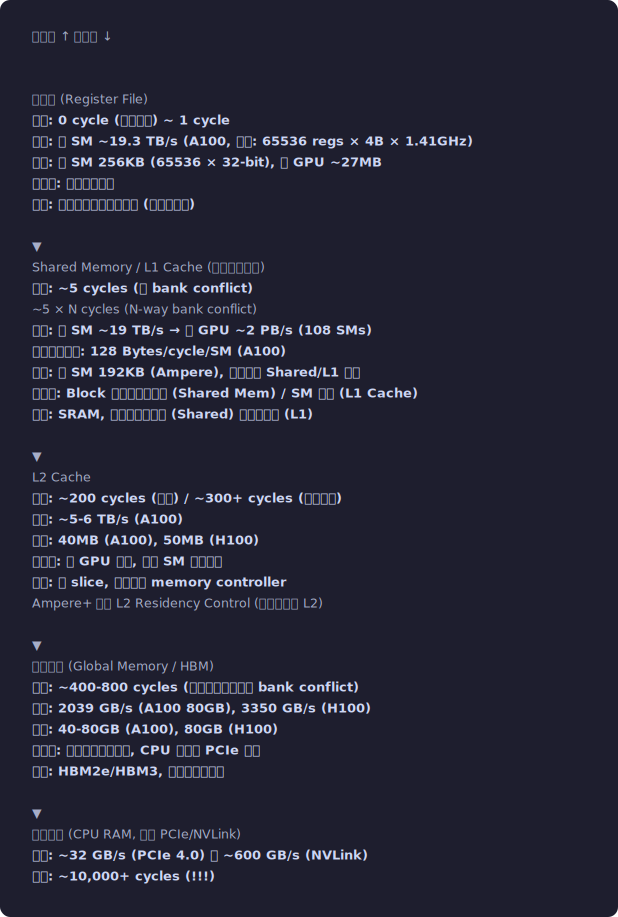</p>


**核心事实**：
- 寄存器 → 全局显存: 延迟差 **400-800×**
- L1 → HBM: 延迟差 **80-160×**
- HBM → CPU: 延迟差 **10-50×**
- 全链路 (寄存器 → CPU RAM): 延迟差 **10,000+×**

算子优化的本质就是让数据尽可能待在快的层级，减少对慢层级的访问。


## 3.2 寄存器 (Registers) — 最快的存储，深入理解

> 上一节我们俯瞰了整个内存层级的全景。现在从最快的一层开始逐个深入。
> 寄存器是离计算单元最近的存储——你在 kernel 中声明的每个 `float` 局部变量
> 就住在这里。理解寄存器的限制，是理解 Occupancy（为什么不能无限多线程）的关键。

### 寄存器分配机制

```cuda
__global__ void kernel(float *data, int n) {
    // 以下所有局部变量都在寄存器中:
    float x = 0.0f;           // 1 个 32-bit 寄存器 (R0)
    float y = x + 1;          // 1 个寄存器 (R1)
    int idx = threadIdx.x;    // 1 个寄存器 (R2)
    double z = 3.14;          // 2 个 32-bit 寄存器 (R3:R4) — double 占 64 bit
    float arr[4];             // 如果编译器能确定索引是常量 → 4 个寄存器
                              // 如果索引是运行时变量 → 可能溢出到 Local Memory!
}
```

### Register Spilling — 性能杀手

```
Local Memory 不是真的"本地"! 它是全局显存中每线程私有的一块区域。
被标记为 "local" 只是因为作用域是线程私有的，物理上它和全局显存一样慢。

编译器什么时候会 spill:
1. 线程需要的寄存器超过了可分配上限
2. 使用了变量索引的数组 (编译器无法确定用哪个寄存器)
3. 调用深度较大的函数嵌套 (需要保存调用链上的寄存器)

检测 spilling:
$ nvcc --ptxas-options=-v kernel.cu
ptxas info    : Used 48 registers, 16 bytes local memory, 4096 bytes smem
                                   ^^^^^^^^^^^^^^^^^^^^^^^^
                                   这就是 spilling! 16 字节 = 4 个 float

如果看到 local memory > 0 且在性能关键路径, 需要优化。
```

### 减少寄存器使用的技巧

```cuda
// 技巧 1: __launch_bounds__ 限制
__global__ void __launch_bounds__(256, 4) kernel() {
    // 256 = maxThreadsPerBlock
    // 4 = minBlocksPerMultiprocessor
    // 编译器据此计算: 每线程最多 65536 / (256*4) = 64 个寄存器
}

// 技巧 2: -maxrregcount 编译选项
// nvcc -maxrregcount=32 kernel.cu
// 全局限制每线程最多 32 个寄存器 (不推荐, 不够灵活)

// 技巧 3: 减少活跃变量
// 优化前: 很多变量同时"活跃" (编译器需要同时保持在寄存器中)
float a = compute_a();  // a 活跃
float b = compute_b();  // a, b 活跃
float c = compute_c();  // a, b, c 活跃
float d = a + b + c;    // 之后 a,b,c 才能释放

// 优化后: 减少同时活跃的变量
float d = compute_a();
d += compute_b();
d += compute_c();       // 只需要 1 个累加寄存器

// 技巧 4: 避免变量索引数组
// 差: 编译器不知道 idx 是什么, 必须把整个数组放在 local memory
float arr[16];
arr[dynamic_idx] = value;

// 好: 如果可能, 用 switch-case 或 #pragma unroll
float arr[4];
#pragma unroll
for (int i = 0; i < 4; i++) {
    arr[i] = input[i];  // 编译器知道 i 是 0,1,2,3 → 用 4 个具名寄存器
}
```

### 寄存器重用缓存 (Register Reuse Cache)

```
NVIDIA GPU (Volta+) 在寄存器文件前有一个小的"重用缓存":
当一条指令的源寄存器在之前的指令中刚用过, 可以从重用缓存读取,
而不需要再次访问寄存器文件 → 降低功耗, 潜在减少冲突

SASS 指令中的 Reuse Flag 就是控制哪些寄存器可以被缓存:
FFMA R4, R0, R2, R4;    // 如果 R0 在上一条指令也用了
    [R0=reuse]           // → 从重用缓存读, 不需要访问寄存器文件端口

这是编译器 (ptxas) 自动优化的, 但理解它有助于读懂 SASS 分析报告。
```


## 3.3 Shared Memory — 深入到硬件级别

> 寄存器很快但是线程私有的——线程之间无法通过寄存器通信。
> Shared Memory 是 Block 内线程的"公共白板"：任何线程都可以读写，
> 速度接近寄存器（~5 cycles），但需要注意 Bank Conflict 这个陷阱。
> 理解 Shared Memory 是写出高效 GEMM、Reduce、Softmax 的基础。

### 物理结构

```
Shared Memory 由 32 个独立的 SRAM Bank 组成。
每个 Bank 宽度 32 bit (4 字节), 每周期可以服务一个读或一个写。

物理布局 (连续 4 字节映射到连续 Bank):
Address:  0    4    8    12   16   20   24   28   ... 124  128  132 ...
Bank:     B0   B1   B2   B3   B4   B5   B6   B7   ... B31  B0   B1  ...

可以理解为: Bank 编号 = (地址 / 4) % 32

每个 Bank 是一个小的 SRAM 模块:
┌──────┐ ┌──────┐ ┌──────┐     ┌──────┐
│Bank 0│ │Bank 1│ │Bank 2│ ... │Bank31│
│ addr │ │ addr │ │ addr │     │ addr │
│  0   │ │  4   │ │  8   │     │ 124  │
│ 128  │ │ 132  │ │ 136  │     │ 252  │
│ 256  │ │ 260  │ │ 264  │     │ 380  │
│ ...  │ │ ...  │ │ ...  │     │ ...  │
└──────┘ └──────┘ └──────┘     └──────┘

32 个 Bank 在同一周期可以并行服务 32 个不同 Bank 的访问
= 32 × 4B × 时钟频率 = 128 Bytes/cycle
```
<p align="center">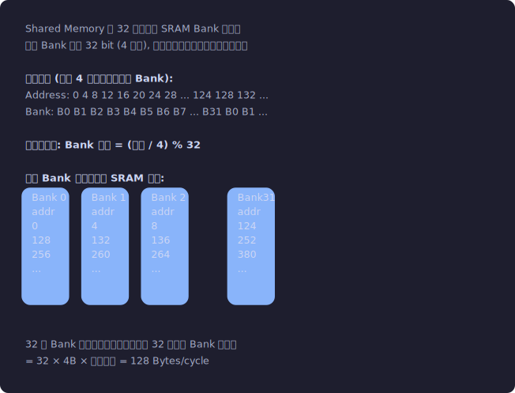</p>


### Bank Conflict 深度分析

> **动手实验**: 运行 `05_bank_conflict/bank_conflict.cu` 亲眼看到 Bank Conflict 的性能影响!
> ```bash
> cd 05_bank_conflict && nvcc -O2 -o bank_conflict bank_conflict.cu && ./bank_conflict
> ```
> 你会看到 stride=1 (无冲突) vs stride=32 (32-way冲突) 的巨大速度差异。

```
无冲突 — 32 个线程访问 32 个不同 Bank (理想情况):

Thread:  T0   T1   T2   T3   ...  T31
Address: 0    4    8    12   ...  124
Bank:    B0   B1   B2   B3   ...  B31
→ 1 个周期完成全部 32 个访问

2-way Bank Conflict:
Thread:  T0   T1   T2   ...  T15  T16  T17  ...  T31
Address: 0    8    16   ...  120  128  136  ...  248
Bank:    B0   B2   B4   ...  B30  B0   B2   ...  B30
→ T0 和 T16 都要 Bank 0, T1 和 T17 都要 Bank 2, ...
→ 需要 2 个周期 (第1轮: T0~T15, 第2轮: T16~T31)

一般规律:
smem[threadIdx.x * S]
当 S 和 32 的 GCD (最大公约数) > 1 时产生冲突
冲突度 = 32 / (32 / GCD(S, 32)) = GCD(S, 32)

例:
- S=1:  GCD(1,32)=1   → 无冲突
- S=2:  GCD(2,32)=2   → 2-way conflict
- S=3:  GCD(3,32)=1   → 无冲突!  (奇数步长通常好)
- S=4:  GCD(4,32)=4   → 4-way conflict
- S=8:  GCD(8,32)=8   → 8-way conflict
- S=16: GCD(16,32)=16 → 16-way conflict
- S=32: GCD(32,32)=32 → 32-way conflict (最坏!)
```

### Bank Conflict 的经典解决方案: Padding

```cuda
// 矩阵转置中的 Bank Conflict:
__shared__ float tile[32][32];
// 访问 tile[threadIdx.y][threadIdx.x] → 按行读, 无冲突 ✓
// 访问 tile[threadIdx.x][threadIdx.y] → 按列读
//   T0 → tile[0][y], T1 → tile[1][y], ... T31 → tile[31][y]
//   地址间隔 = 32 * 4 = 128 字节 → Bank 间隔 = 32 → 全部在同一 Bank!
//   → 32-way conflict ✗

// 解决: 加一列 padding
__shared__ float tile[32][33];  // 33 而不是 32!
// 现在每行 33 个 float = 132 字节
// 访问 tile[threadIdx.x][threadIdx.y]:
//   T0 → tile[0][y] = addr 0*33+y
//   T1 → tile[1][y] = addr 1*33+y  
//   地址间隔 = 33 * 4 字节 → Bank 间隔 = 33 % 32 = 1
//   → 连续 Bank, 无冲突! ✓
// 代价: 浪费约 3% 的 Shared Memory

// Swizzle 模式 (更高级的解决方案):
// 不用 padding, 而是用 XOR 重映射地址:
// 新地址 = 原地址 XOR (行号 * 某个常数)
// cuBLAS 和 CUTLASS 使用这种方式, 零额外内存开销
```

### 动态 Shared Memory 的多数组用法

```cuda
// 如果需要在动态 Shared Memory 中分配多个不同类型的数组:
__global__ void kernel() {
    extern __shared__ char smem_raw[];  // 用 char 声明
    
    // 手动计算偏移 (注意对齐!)
    float *arr_float = (float*)smem_raw;                          // 偏移 0
    int   *arr_int   = (int*)(smem_raw + 256 * sizeof(float));    // 偏移 1024
    double *arr_dbl  = (double*)(smem_raw + 256*4 + 128*4);       // 需要 8 字节对齐!
    
    // 确保 double 起始地址是 8 的倍数
    size_t offset = 256*sizeof(float) + 128*sizeof(int);
    offset = (offset + 7) & ~7;  // 向上对齐到 8
    double *arr_dbl_safe = (double*)(smem_raw + offset);
}

// launch:
size_t smem_size = 256*sizeof(float) + 128*sizeof(int) + aligned_double_size;
kernel<<<grid, block, smem_size>>>(args);
```

### 设置 Shared Memory / L1 Cache 分割

```cuda
// Ampere 默认配置通常由 driver 自动选择
// 但你可以手动设置:

// 方法1: 针对特定 kernel
cudaFuncSetAttribute(kernel, 
    cudaFuncAttributePreferredSharedMemoryCarveout, 
    cudaSharedmemCarveoutMaxShared);  // 尽可能多的 Shared Memory

// 方法2: 需要超过 48KB 的动态 Shared Memory 时必须设置
cudaFuncSetAttribute(kernel,
    cudaFuncAttributeMaxDynamicSharedMemorySize,
    131072);  // 允许最多 128KB 动态 Shared Memory
```


## 3.4 全局内存 — 深入合并访问机制

> 合并访问 (Coalesced Access) 是 GPU 内存优化最重要的概念，没有之一。
> 理解它需要先知道两个概念:
>
> **内存事务 (Memory Transaction)**: GPU 访问显存的最小传输单位。
> 不管你要读 1 字节还是 128 字节，GPU 都会发起一个完整的事务。
> GPU 上一个事务传输 128 字节 (称为一条 Cache Line)。
>
> **合并 (Coalescing)**: 当一个 Warp 的 32 个线程同时请求内存时，
> GPU 硬件会自动把这些请求"合并"成尽可能少的事务。
> 如果 32 个线程访问连续地址 → 合并成 1 个事务 (完美!)
> 如果 32 个线程访问随机地址 → 最多 32 个事务 (极差!)

### 内存事务的完整规则

> **动手实验**: 运行 `06_coalescing/coalescing.cu` 亲眼看到合并 vs 非合并的带宽差异!
> ```bash
> cd 06_coalescing && nvcc -O2 -o coalescing coalescing.cu && ./coalescing
> ```
> 你会看到连续访问的有效带宽可能是随机访问的 10-50 倍。

```
当一个 Warp 发起全局内存访问时:

1. 硬件收集 32 个线程的地址
2. 将这些地址映射到内存段 (Segment):
   - L1 启用时: 128 字节对齐的段 (128-byte cache line)
   - L1 禁用时: 32 字节对齐的段

3. 统计需要多少个不同的段
4. 每个段生成一个内存事务

示例 (128 字节段, L1 启用):

完美合并: 32 个 float, 连续地址
  Thread 0-31 访问 addr+0 ~ addr+124
  全部落在 1 个 128 字节段内
  → 1 次事务, 128 字节传输, 128 字节有用 → 效率 100%

偏移访问: 32 个 float, 起始未对齐
  Thread 0-31 访问 addr+60 ~ addr+184  (跨两个 128 字节段)
  → 2 次事务, 256 字节传输, 128 字节有用 → 效率 50%

stride-2 访问:
  Thread 0→addr+0, Thread 1→addr+8, ... Thread 31→addr+248
  跨 2 个 128 字节段 (0-127, 128-255)
  → 2 次事务, 256 字节传输, 128 字节有用 → 效率 50%

stride-4 访问:
  Thread 0→addr+0, Thread 1→addr+16, ... Thread 31→addr+496
  跨 4 个 128 字节段
  → 4 次事务, 512 字节传输, 128 字节有用 → 效率 25%

完全随机:
  最坏情况: 32 个地址在 32 个不同的段
  → 32 次事务, 4096 字节传输, 128 字节有用 → 效率 3.125%
```

### Sector 级访问 (Volta+)

```
Sector (扇区): 一条 128 字节的 Cache Line 被分成 4 个 32 字节的 Sector。
Volta 架构之前: 即使只需要 4 字节，也必须传输整条 128 字节的 Cache Line。
Volta+: 只传输被实际访问到的 Sector (32 字节为单位) → 大幅减少带宽浪费。

影响:
stride-2 访问:
  Pascal: 加载完整 128 字节 cache line → 浪费 50%
  Volta+: 只加载被访问的 sector → 浪费更少

但 sector 不是万能的:
如果 32 个线程散落在 32 个不同 cache line 中,
即使每个 cache line 只触及 1 个 sector,
仍然需要 32 次事务 (每次 32 字节) = 1024 字节
vs 理想情况的 128 字节 → 效率 12.5%
```

### 向量化加载 — LDG.128

```cuda
// 标量加载: 每线程 1 个 float = 4 字节
float val = data[idx];          // 编译为 LDG.E.32 (32-bit load)

// 向量加载: 每线程 4 个 float = 16 字节
float4 val = ((float4*)data)[idx]; // 编译为 LDG.E.128 (128-bit load)

// 为什么 128-bit load 更好?
// 1. 指令数减少 4×: 1条LDG.128 vs 4条LDG.32
// 2. 一个 Warp 的 LDG.128 = 32 × 16 = 512 字节, 4 个 128B 事务
//    紧凑高效, 没有浪费
// 3. 减少 LD/ST 指令队列的压力

// 使用条件:
// - 起始地址必须 16 字节对齐 (cudaMalloc 保证 256 字节对齐, OK)
// - 数据长度必须是 4 的倍数

// 处理尾部不对齐的元素:
__global__ void vectorized_relu(const float *in, float *out, int n) {
    int idx = blockIdx.x * blockDim.x + threadIdx.x;
    int stride = blockDim.x * gridDim.x;
    
    // 主循环: 向量化
    int n4 = n / 4;
    for (int i = idx; i < n4; i += stride) {
        float4 v = reinterpret_cast<const float4*>(in)[i];
        v.x = fmaxf(v.x, 0.f);
        v.y = fmaxf(v.y, 0.f);
        v.z = fmaxf(v.z, 0.f);
        v.w = fmaxf(v.w, 0.f);
        reinterpret_cast<float4*>(out)[i] = v;
    }
    
    // 尾部: 标量处理
    for (int i = n4 * 4 + idx; i < n; i += stride) {
        out[i] = fmaxf(in[i], 0.f);
    }
}
```

### __ldg() — 只读缓存路径

```cuda
// __ldg() 通过只读纹理缓存路径加载, 不污染 L1 Cache
float val = __ldg(&data[idx]);

// 等价于声明 const __restrict__:
__global__ void kernel(const float * __restrict__ data) {
    // 编译器自动将 data 的读取走只读缓存路径
    float val = data[idx];  // 自动用 LDG (只读加载)
}

// 好处:
// 1. 不占用 L1 Cache 空间 (L1 留给 Shared Memory 或其他数据)
// 2. 只读缓存有独立的带宽 (不和 L1 争用)
// 3. 对 scatter 模式的读取比 L1 更友好
```


## 3.5 L2 Cache — 全局共享缓存

> 前面讲了 SM 内部的存储（寄存器、Shared Memory、L1）。
> 现在跳出 SM，看全局共享的 L2 Cache——它在所有 SM 和 HBM 之间，
> 是最后一道"快速缓冲"。理解 L2 的结构有助于理解为什么某些访问模式
> 在 L2 中有好的命中率而另一些没有。

### L2 的物理组织

```
A100 的 L2 Cache: 40MB
├── 分成多个 Slice, 每个 Slice 靠近一个 Memory Controller
├── 每个 Slice 有自己的 Tag Array 和 Data Array
├── Cache Line 大小: 128 字节 (分 4 个 Sector)
├── 替换策略: 类似 LRU (Least Recently Used)
└── 命中延迟: ~200 cycles, 未命中: ~400-800 cycles

物理布局:
┌──────┐   ┌──────┐   ┌──────┐   ┌──────┐   ┌──────┐
│ HBM  │   │ HBM  │   │ HBM  │   │ HBM  │   │ HBM  │
│Stack0│   │Stack1│   │Stack2│   │Stack3│   │Stack4│
└──┬───┘   └──┬───┘   └──┬───┘   └──┬───┘   └──┬───┘
   │          │          │          │          │
┌──┴───┐   ┌──┴───┐   ┌──┴───┐   ┌──┴───┐   ┌──┴───┐
│L2 sl0│   │L2 sl1│   │L2 sl2│   │L2 sl3│   │L2 sl4│
└──┬───┘   └──┬───┘   └──┬───┘   └──┬───┘   └──┬───┘
   │          │          │          │          │
   └──────────┴──────────┴──────────┴──────────┘
                  Crossbar Switch
                       │
        ┌──────┬──────┬──────┬──────┐
        │ SM0  │ SM1  │ ...  │SM107 │
        └──────┘      └──────┘

地址到 L2 Slice 的映射:
不同地址范围被交织 (interleaved) 到不同 Slice
→ 均匀分布访问压力
→ 但如果所有 SM 访问同一段地址, 会集中在一个 Slice → 热点
```
<p align="center">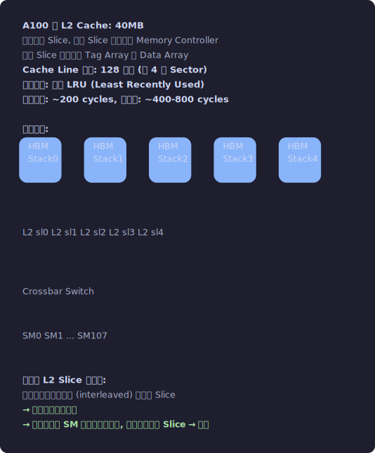</p>


### L2 Residency Control (Ampere+)

```cuda
// 可以"保留" L2 Cache 的一部分给特定数据
cudaDeviceProp prop;
cudaGetDeviceProperties(&prop, 0);
size_t l2_size = prop.l2CacheSize;  // 40MB on A100

// 设置 L2 持久化窗口
cudaStream_t stream;
cudaStreamCreate(&stream);

// 预留 30MB 的 L2 给频繁访问的数据
size_t window_size = 30 * 1024 * 1024;  // 30MB
cudaDeviceSetLimit(cudaLimitPersistingL2CacheSize, window_size);

// 设置特定数据的 L2 访问策略
cudaStreamAttrValue attr;
attr.accessPolicyWindow.base_ptr = (void*)frequently_used_data;
attr.accessPolicyWindow.num_bytes = data_size;
attr.accessPolicyWindow.hitRatio = 1.0f;  // 100% 缓存命中期望
attr.accessPolicyWindow.hitProp = cudaAccessPropertyPersisting;  // 持久化
attr.accessPolicyWindow.missProp = cudaAccessPropertyStreaming;  // 其他数据流过不缓存
cudaStreamSetAttribute(stream, cudaStreamAttributeAccessPolicyWindow, &attr);

// 典型场景: Attention 中的 K/V cache
// K/V 被反复访问 → 锁在 L2 中
// Q 和中间结果 → streaming (用完即丢)
```


## 3.6 Constant Memory 与 Texture Memory — 完整理解

### Constant Memory 的硬件路径

```
Constant Memory:
├── 64KB 总容量 (全局)
├── 每个 SM 有独立的 Constant Cache (~10KB)
├── 特殊的广播机制:
│   一个 Warp 中所有线程读同一地址 → 1 次读取 + 广播 → 1 cycle
│   一个 Warp 中线程读不同地址 → 串行化! 最坏 32 cycles
└── 适用: 所有线程使用相同的小查找表、配置参数

使用场景分析:
✓ 卷积核权重 (如 3×3, 所有线程用同一组权重)
✓ 数学常数 (如 π, e, 预计算的 sin/cos 表)
✓ Kernel 参数 (CUDA 自动把 kernel 参数放在 constant memory)
✗ 每个线程访问不同元素的查找表 (用 __ldg 或 texture 更好)
✗ 大于 64KB 的数据
```
<p align="center">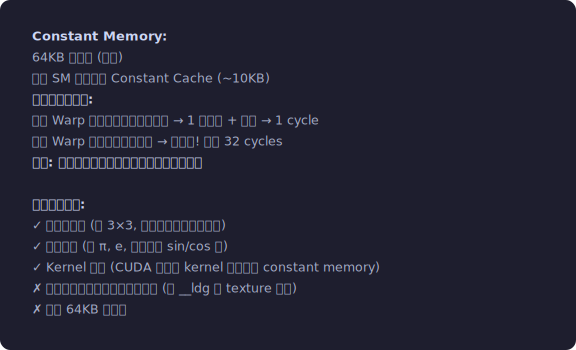</p>


### Texture Memory — 2D 空间局部性优化

```
纹理缓存的特殊性:
1. 使用 Morton Z-order (Z字形) 映射 2D → 1D 地址
   普通行主序:     纹理 Z-order:
   0  1  2  3      0  1  4  5
   4  5  6  7      2  3  6  7
   8  9  10 11     8  9  12 13
   12 13 14 15     10 11 14 15

   Z-order 使得 2D 空间中相邻的元素在内存中也相邻
   → 访问一个 2D 小邻域时, cache 命中率更高

2. 硬件支持:
   - 双线性插值 (bilinear interpolation): 0 额外 cycle
   - 边界处理 (clamp, wrap, mirror): 0 额外 cycle
   - 归一化坐标 [0.0, 1.0]

现代 CUDA 中使用 Texture 的方式:

// 方式1: CUDA Array + Texture Object (推荐)
cudaArray_t cuArray;
cudaChannelFormatDesc desc = cudaCreateChannelDesc<float>();
cudaMallocArray(&cuArray, &desc, width, height);
cudaMemcpy2DToArray(cuArray, 0, 0, h_data, pitch, width*sizeof(float), height, cudaMemcpyHostToDevice);

cudaResourceDesc resDesc = {};
resDesc.resType = cudaResourceTypeArray;
resDesc.res.array.array = cuArray;

cudaTextureDesc texDesc = {};
texDesc.filterMode = cudaFilterModeLinear;  // 双线性插值
texDesc.addressMode[0] = cudaAddressModeClamp;
texDesc.addressMode[1] = cudaAddressModeClamp;

cudaTextureObject_t texObj;
cudaCreateTextureObject(&texObj, &resDesc, &texDesc, NULL);

// Kernel 中:
__global__ void kernel(cudaTextureObject_t tex, float *out) {
    float u = (threadIdx.x + 0.5f) / width;
    float v = (threadIdx.y + 0.5f) / height;
    out[idx] = tex2D<float>(tex, u, v);  // 硬件插值!
}

// 方式2: 简单的只读全局内存 → 用 __ldg() 即可, 不需要 texture
```


## 3.7 异步拷贝 (cp.async) — Ampere+ 的关键特性

> 到目前为止，从全局内存搬数据到 Shared Memory 都要经过寄存器：
> Global → 寄存器 → Shared Memory（两条指令）。
> Ampere 引入了 cp.async，可以绕过寄存器直接搬，省寄存器又省指令。
> 这是实现高效"计算和搬运重叠"（双缓冲/多阶段流水线）的硬件基础。

### 传统的 Global → Shared Memory 拷贝

```
传统方式 (所有架构):
1. 从 Global Memory 加载到寄存器 (LDG 指令)
2. 从寄存器存储到 Shared Memory (STS 指令)

问题:
- 需要经过寄存器 → 占用宝贵的寄存器资源
- 两条指令 → 更多指令槽位
- 加载和存储之间有数据依赖
```

### cp.async — 绕过寄存器

```
Ampere+ 的异步拷贝 (cp.async):
直接从 Global Memory → Shared Memory, 不经过寄存器!

硬件路径:
  传统: Global Mem → L2 → L1 → Register File → Shared Memory
  cp.async: Global Mem → L2 → L1 → Shared Memory (bypass Register)
```

```cuda
#include <cuda_pipeline.h>

__global__ void kernel(const float *global_data) {
    __shared__ float smem[256];
    
    // 异步拷贝: 发起请求后立即返回
    __pipeline_memcpy_async(&smem[threadIdx.x], 
                             &global_data[idx], 
                             sizeof(float));
    
    // 提交当前批次的异步拷贝
    __pipeline_commit();
    
    // ... 可以做其他计算 ...
    
    // 等待异步拷贝完成
    __pipeline_wait_prior(0);  // 等待所有 committed 的拷贝完成
    __syncthreads();
    
    // 现在可以安全使用 smem 中的数据
    float val = smem[threadIdx.x];
}
```

### 配合双缓冲的完整用法

```cuda
// 双缓冲: 计算当前 tile 的同时, 预加载下一个 tile
__global__ void kernel(const float *data, int num_tiles) {
    __shared__ float smem[2][TILE_SIZE];  // 双缓冲
    
    // 预加载第一个 tile (阶段 0)
    __pipeline_memcpy_async(&smem[0][threadIdx.x], &data[0 * TILE_SIZE + threadIdx.x], 4);
    __pipeline_commit();
    
    for (int tile = 0; tile < num_tiles; tile++) {
        int curr = tile % 2;
        int next = (tile + 1) % 2;
        
        // 预加载下一个 tile (如果有的话)
        if (tile + 1 < num_tiles) {
            __pipeline_memcpy_async(&smem[next][threadIdx.x],
                                    &data[(tile+1) * TILE_SIZE + threadIdx.x], 4);
            __pipeline_commit();
        }
        
        // 等待当前 tile 加载完成
        __pipeline_wait_prior(1);  // 等待除最新一批外的所有拷贝完成
        __syncthreads();
        
        // 计算当前 tile
        compute(smem[curr]);
        
        __syncthreads();
    }
}
```

### Hopper 的 TMA (Tensor Memory Accelerator)

```
TMA 是 Hopper 架构引入的专用硬件单元, 用于异步张量数据搬运。
它将 "计算地址 + 发起 load + 处理边界" 全交给硬件, 释放所有线程的计算能力。

传统方式 (cp.async):  每个线程计算自己的地址 → 32 个线程各发 1 条 cp.async
TMA 方式:              1 个线程发 1 条指令 → 硬件搬运整个 tile!
```

**TMA 解决了什么问题：**

```
1. 地址计算开销: 传统方式每个线程都要做:
     row = blockIdx.y * TILE + threadIdx.y
     col = blockIdx.x * TILE + threadIdx.x
     addr = base + row * ldm + col
     if (row < M && col < N) { load } else { zero }
   → 每线程 5+ 条整数指令, 整个 Warp 32×(5+)

   TMA: 硬件自动做地址计算 + 边界判断 → 0 条地址计算指令!

2. 边界条件处理: TMA 自动处理 out-of-bounds, 自动填充零
   → 不需要 if (row < M && col < N) 分支 → 消除 Warp Divergence

3. 多播 (Multicast): 同一 tile 同时送到多个 SM 的 Shared Memory
   → 用于 Thread Block Cluster (多个 Block 共享同一份数据)
   → HBM 只读 1 次, 但 N 个 Block 都收到! 带宽节省 N 倍!
```

**TMA 和 cp.async 的架构层级对比：**

```
cp.async:  SM 的 LD/ST Unit 处理 → 仍占用 LD/ST 指令槽
TMA:       独立的 TMA Unit (SM 外部!) → 零 LD/ST 指令占用
           │                              │
┌── SM ─────────────────────┐ ┌── TMA Unit (独立硬件) ──────┐
│ Warp Scheduler            │ │ 自动计算多维地址映射          │
│ → FP32/INT ALU            │ │ 自动处理 stride/boundary     │
│ → 完全释放做计算!          │ │ 支持 Swizzle/填充模式        │
│                           │ │ 支持 Multicast (多播)        │
│ 对应 SASS:                │ │ 对应 SASS:                  │
│ (无, TMA 不占 SM 资源)     │ │ cp.async.bulk.tensor          │
└───────────────────────────┘ └─────────────────────────────┘
```

**基本 CUDA 代码 (Hopper sm_90+)：**

```cuda
// TMA 需要先创建一个 "描述符" (告诉 TMA 数据布局)
// 使用 CUTLASS 风格的 TMA 描述符 API:
#include <cuda/barrier>

__global__ void gemm_tma(float *C, const float *A, const float *B,
                          int M, int N, int K) {
    // TMA 描述符 (在 Shared Memory 中)
    __shared__ alignas(128) cuda::barrier<cuda::thread_scope_block> bar;

    // 使用 cp.async.bulk (TMA 的 CUDA 暴露接口)
    // 一个线程发起, 搬运整个 128×64 tile:
    if (threadIdx.x == 0) {
        // TMA load: A tile [128×64] from Global → Shared Memory
        asm volatile(
            "cp.async.bulk.tensor.2d.shared::cluster.global.mbarrier::complete_tx::bytes"
            :: "r"(smem_addr), "r"(desc_addr), "r"(coord)
        );
    }

    // 用 mbarrier 等待 TMA 完成 (不等 __syncthreads, 专门为 TMA 设计)
    bar.arrive_and_wait();

    // 计算... (TMA 搬运的数据已经在 SMEM 中了)
}

// 编译:
// nvcc -arch=sm_90a -o gemm_tma gemm_tma.cu
```

**TMA vs cp.async 的量化对比 (Hopper H100, GEMM tile load)：**

```
操作                     地址计算指令    LD/ST指令    占SM资源
────                     ───────────    ────────    ───────
cp.async (Ampere)        32×5 = 160     32 条        占用 LD/ST pipeline
TMA (Hopper)              1×2 = 2        1 条         不占 (独立 TMA Unit)
```

> **关键认识**: TMA 是 Hopper 架构的最大变化之一。它把数据搬运从 SM 的计算单元中剥离出来，交给独立的硬件引擎。这不仅是 "快一点"——它从根本上改变了 kernel 的资源分配方式。更多的 SM 资源可以用于计算而非数据搬运。


## 3.8 Roofline 模型 — 完整的性能分析框架

> **Roofline 模型是什么?**
>
> 一个简单但强大的工具，帮你回答一个关键问题:
> **"我的 kernel 性能不好，是因为计算单元不够快，还是因为数据搬不够快?"**
>
> 它将 kernel 的性能画在一张图上，根据位置判断瓶颈:
> - 在斜线下方 → Memory Bound (被内存带宽限制，计算单元在等数据)
> - 在水平线处 → Compute Bound (计算单元满载，内存带宽有富余)
>
> 判断依据是 **算术强度 (Arithmetic Intensity)**:
> AI = 浮点运算次数 (FLOP) / 内存传输字节数 (Byte)
> 直观理解: "每搬 1 字节数据，能做多少次运算"
> AI 高 → 计算密集 (如矩阵乘法)
> AI 低 → 内存密集 (如向量加法、Softmax)

### 基本 Roofline

```
Performance            Compute Roof
(FLOP/s)              ─────────────────── Peak Compute (19.5 TFLOPS FP32, A100)
     │               ╱
     │              ╱
     │             ╱
     │            ╱
     │           ╱ ← Memory Bandwidth Roof
     │          ╱    (slope = peak bandwidth = 2039 GB/s)
     │         ╱
     │        ╱
     │       ╱
     │      ╱
     │     ╱
     │    ╱
     │   ╱
     │  ╱
     │ ╱
     │╱
     └───────────────────────────────── Arithmetic Intensity (FLOP/Byte)
                    │
                    Ridge Point = Peak Compute / Peak BW
                    A100: 19.5 TFLOPS / 2039 GB/s ≈ 9.6 FLOP/Byte
```
<p align="center">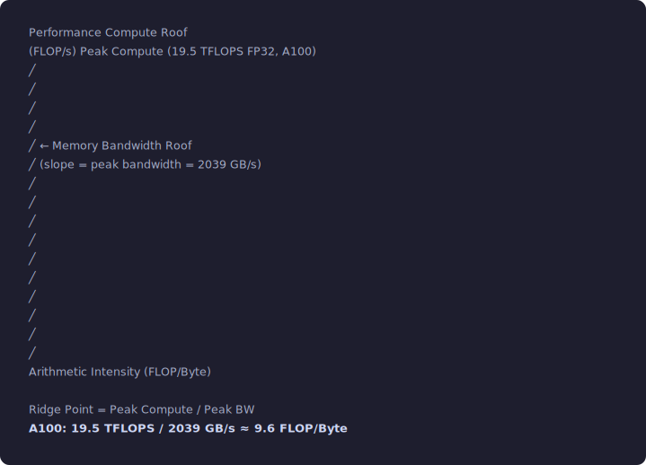</p>


### 计算常见算子的算术强度

```
Elementwise (ReLU, GELU, Add):
  每元素: 1-10 FLOP, 读+写 = 8 字节 (float)
  AI = 1~10 / 8 = 0.125~1.25 FLOP/Byte
  → 远低于 Ridge Point → 强 Memory Bound

Reduce (Sum):
  N 个元素: N 次加法, N × 4 字节读
  AI = N / (N×4) = 0.25 FLOP/Byte
  → Memory Bound

Softmax:
  N 个元素: ~5N FLOP (max + exp + sum + div), ~3N × 4 字节读写
  AI = 5N / (12N) ≈ 0.42 FLOP/Byte
  → Memory Bound

GEMM (M×K × K×N):
  计算: 2MKN FLOP (乘+加)
  数据: (MK + KN + MN) × 4 字节
  AI = 2MKN / (4(MK+KN+MN))
  
  方阵 N×N:
  AI = 2N³ / (4 × 3N²) = N/6
  N=1024: AI = 170 → Compute Bound!
  N=64:   AI = 10.7 → 刚好在 Ridge Point
  N=16:   AI = 2.67 → Memory Bound

这就是为什么小矩阵乘法效率低 — 算术强度不够!

BatchNorm:
  per-element: ~10 FLOP, 读写 ~12 字节
  AI ≈ 0.8 → Memory Bound

LayerNorm:
  类似 BatchNorm
  AI ≈ 0.5-1.0 → Memory Bound

Convolution (直接卷积):
  AI = 2 × Cout × Cin × Kh × Kw / (4 × (Cin×Kh×Kw + Cout))
  3×3 conv, Cin=Cout=256: AI ≈ 1152 / 4100 ≈ 280 → Compute Bound
```

### 多层 Roofline

实际的 GPU 不只有一条带宽上限线。考虑所有内存层级：

```
Performance
     │
     │         ─── Compute Peak (19.5 TFLOPS)
     │        ╱
     │       ╱
     │      ╱ ─── L1/Shared Mem BW (~19 TB/s per SM)
     │     ╱╱
     │    ╱╱
     │   ╱╱ ─── L2 BW (~5 TB/s)
     │  ╱╱╱
     │ ╱╱╱ ─── HBM BW (2 TB/s)
     │╱╱╱
     └────────────── AI

如果你的数据能放进 Shared Memory → 用 Shared Mem 的 roof
如果能放进 L2 → 用 L2 的 roof
否则 → 用 HBM 的 roof

这就是为什么 Tiling 如此重要:
把数据切成能放进 Shared Memory 的小块 → 提升有效带宽 10×+
```
<p align="center">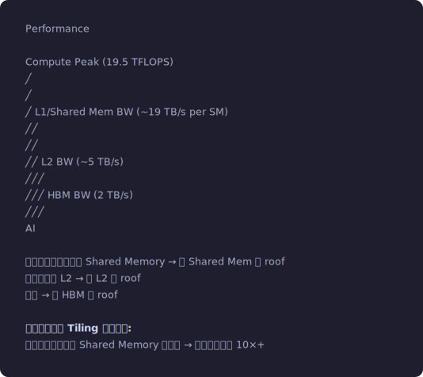</p>


### 实际测量 vs 理论值

```
A100 的理论 vs 实际:

HBM 带宽:
  理论峰值: 2039 GB/s
  实测峰值: ~1800-1900 GB/s (~90% 效率, 用简单 copy kernel)
  实际 kernel: 通常 60-80% 的理论峰值就算优化得不错了

FP32 算力:
  理论峰值: 19.5 TFLOPS
  实测 GEMM: ~18 TFLOPS (~92%)
  
FP16 Tensor Core:
  理论峰值: 312 TFLOPS
  实测 GEMM: ~280 TFLOPS (~90%)

差距来源:
- 指令调度开销
- 内存访问非完美合并
- Warp 停顿
- Block 尾部效应
- L2 Cache 未命中
- Bank Conflict
```


## 3.9 内存优化决策树

```
你的 kernel 性能不佳? 按以下顺序检查:

1. 是否 Memory Bound?
   │ → ncu 看 "Memory Throughput" vs "Compute Throughput"
   │
   ├─ Memory Bound:
   │  ├── 全局内存是否合并访问?
   │  │   → ncu 看 "Global Load/Store Efficiency"
   │  │   → 效率 < 50%? 重新设计访问模式
   │  │
   │  ├── 是否有不必要的全局内存访问?
   │  │   → 能否用 Shared Memory 缓存?
   │  │   → 能否融合多个 kernel 减少中间结果的读写?
   │  │
   │  ├── 是否使用了向量化加载 (float4)?
   │  │   → 减少指令数, 提高带宽利用率
   │  │
   │  ├── Shared Memory Bank Conflict?
   │  │   → ncu 看 "Shared Load/Store Bank Conflicts"
   │  │   → 用 padding 或 swizzle 解决
   │  │
   │  └── L2 Cache 利用率?
   │      → 数据是否有复用? 是否可以调整 tile 大小让数据留在 L2?
   │
   └─ Compute Bound:
      ├── 是否使用了 Tensor Core? (矩阵乘法场景)
      ├── 是否有不必要的计算? (如重复计算可以预计算)
      ├── 是否有大量 SFU 指令? (sin/cos/exp 很慢)
      │   → 可以用多项式近似替代?
      └── 指令级并行 (ILP) 是否充分?
          → 见第8章高级优化
```
<p align="center">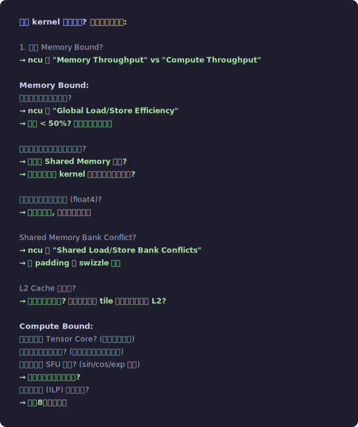</p>


## 3.10 L1 Data Cache 微架构细节

### L1 与 Shared Memory 的统一存储

```
从 Volta 开始, L1 Data Cache 和 Shared Memory 共享同一块物理 SRAM。
这块 SRAM 被称为 Unified Data Cache / Shared Memory。

物理结构 (Ampere, 192KB 总量):
┌──────────────────────────────────────────────────────┐
│  192 KB 片上 SRAM (32 Banks, 每 Bank 6KB)            │
│                                                      │
│  ┌─── Shared Memory 区域 ───┐┌─── L1 Cache 区域 ───┐│
│  │ (程序员显式管理)          ││ (硬件管理)            ││
│  │                          ││                       ││
│  │ 通过 LDS/STS 指令访问    ││ 通过 LDG/STG 指令     ││
│  │ (Load/Store Shared)      ││ 自动缓存              ││
│  │                          ││                       ││
│  │ 由 __shared__ 声明       ││ 对程序员透明           ││
│  └──────────────────────────┘└───────────────────────┘│
│       ↑ 可配置的分界线 ↑                               │
└──────────────────────────────────────────────────────┘

可配置方案 (Ampere, 通过 cudaFuncSetAttribute):
  Shared : L1  =   0KB : 192KB  (全部给 L1)
  Shared : L1  =  64KB : 128KB
  Shared : L1  = 100KB :  92KB
  Shared : L1  = 132KB :  60KB
  Shared : L1  = 164KB :  28KB  (尽量多给 Shared)

底层: 配置通过修改 SM 内的 MMU (Memory Management Unit) 的地址映射实现。
同一个物理 Bank, 根据地址范围判断走 Shared Memory 路径还是 L1 路径。
```
<p align="center">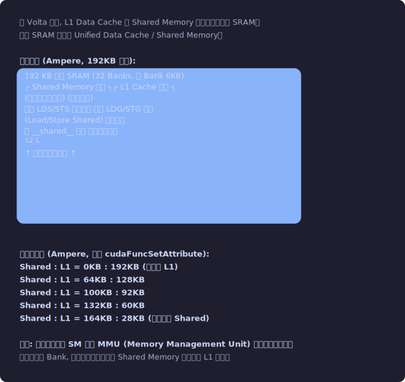</p>


### L1 Cache 的访问细节

```
L1 Data Cache 参数 (Ampere):
  Cache Line: 128 bytes
  组织: ~4-way set associative (推测)
  Tag: 物理地址的高位
  Sector: 每条 Cache Line 分 4 个 32-byte Sector
  
Sector 级缓存 (Volta+):
  不是加载整条 128B Cache Line, 而是只加载被访问的 Sector。
  
  例: 一个 Warp 的 32 个线程各读 1 个 float (4B):
  如果连续地址 (0, 4, 8, ...124) → 触及 1 条 CL 的 4 个 Sector → 加载 128B
  如果 stride-2 (0, 8, 16, ...248) → 触及 2 条 CL → 但每条只加载被触及的 Sector
  
  Volta 之前: 即使只需要 4B, 也加载整条 128B → 浪费 124B
  Volta+: 只加载 32B Sector → 浪费只有 28B
  → stride 访问的带宽浪费显著减少

L1 的写策略:
  全局内存的写 (STG):
    Default: Write-Evict (也叫 Write-No-Allocate)
    写操作不在 L1 分配 Cache Line, 直接发到 L2。
    这避免了写操作污染 L1 (读数据更有可能命中)。
    
  也可以配置为 Write-Back (通过 PTX 的 .wb 修饰):
    ld.global.cg  → Cache at Global level (只缓存在 L2, 不在 L1)
    ld.global.ca  → Cache at All levels (L1 + L2)
    ld.global.cs  → Cache Streaming (流过, 不驻留)
    ld.global.nc  → Non-Coherent (走只读纹理缓存路径 = __ldg)
    
  编译器根据 __restrict__ / const 等修饰符自动选择。
  也可以通过 __ldcg(), __ldca(), __ldcs() 内建函数手动指定。
```

### L2 Cache 内部结构

```
A100 L2 Cache: 40 MB, 分布在芯片中央

物理组织:
  划分为多个 Slice (每个 Slice 靠近一个 Memory Controller):
  
  5 个 Memory Controller → ~5 个主要 L2 Slice 区域
  (实际细分更多, 但逻辑上和 MC 对应)
  
  每个 Slice:
  ├── 容量: ~8 MB
  ├── Cache Line: 128 bytes, 分 4 个 32B Sector
  ├── Set Associativity: ~16-way (推测)
  ├── 替换策略: 类 LRU
  ├── 独立的 Tag Array 和 Data Array
  ├── 有独立的读/写端口
  └── 可以并行处理来自不同 SM 的请求

地址到 Slice 的映射:
  使用地址的特定 bit 进行散列 (hash) 映射:
  
  物理地址: [...高位... | slice_bits | set_index | offset]
  
  slice_bits 决定请求去哪个 L2 Slice。
  通常选择地址的中间几位 (避免低位和高位的不均匀)。
  
  地址交织 (Interleaving):
    连续的 128B Cache Line 交替分配到不同 Slice:
    CL at addr 0x0000 → Slice 0
    CL at addr 0x0080 → Slice 1  
    CL at addr 0x0100 → Slice 2
    ...
    → 连续内存访问均匀分布到所有 Slice → 最大化带宽

  但如果所有 SM 访问同一个地址范围:
    所有请求打到同一个 Slice → "Hot Slice"
    → 带宽降低到单 Slice 的上限
    → 这在 AllReduce 等广播模式中可能发生

L2 ECC (Error Correcting Code):
  A100 对 L2 和 HBM 都启用 ECC:
  SECDED (Single Error Correct, Double Error Detect)
  
  每 256 bit 数据 + 16 bit ECC = 272 bit
  带宽开销: 16/272 ≈ 5.9%
  实际 HBM 带宽: 2039 × (1 - 0.059) ≈ 1919 GB/s (有效数据)
  
  ECC 还增加延迟: 每次读都要做 ECC 校验 (~1-2 cycles)
  
  某些 GPU (如消费级 RTX) 可以关闭 ECC → 更高带宽和容量
  数据中心 GPU (A100/H100) 通常强制启用 ECC
```
<p align="center">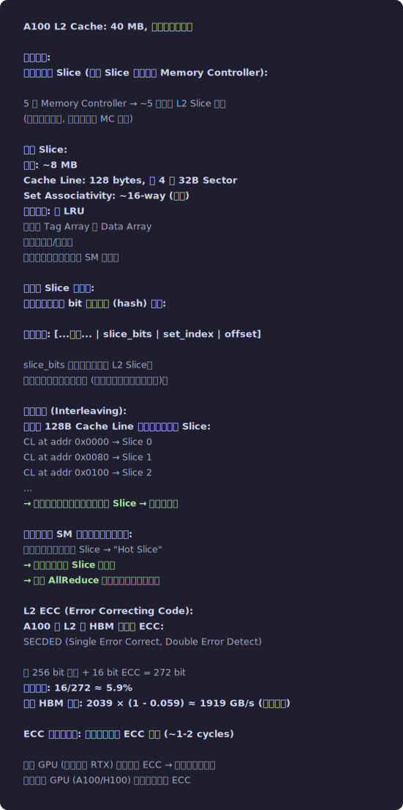</p>


## 3.11 全局内存访问的完整硬件路径

```
一个 Warp 执行 LDG.E.128 R4, [R0] 的完整路径:

1. LD/ST Unit: 地址生成
   32 个线程各从 R0 读取 64-bit 基地址
   + 指令中的立即数偏移 (如果有)
   = 32 个虚拟地址 (Virtual Address, VA)
   
2. TLB Lookup:
   VA → PA (Physical Address) 翻译
   ┌────────────────────────────────┐
   │ L1 TLB (per SM, ~128 entries) │
   │   命中? → PA 就绪 (~1 cycle)  │
   │   未命中 ↓                    │
   │ L2 TLB (共享, ~数千 entries)  │
   │   命中? → PA 就绪 (~10 cycle) │
   │   未命中 ↓                    │
   │ Page Table Walk               │
   │   从显存读多级页表             │
   │   延迟: ~几百-上千 cycles!     │
   │   极其昂贵, 应该避免           │
   └────────────────────────────────┘
   
3. Coalescing Unit:
   将 32 个 PA 映射到 128B 对齐的 Cache Line:
   - 理想情况 (连续 float4): 4 个 CL → 4 个请求
   - 最差情况 (完全随机): 32 个 CL → 32 个请求
   
   每个请求包含:
   ├── Cache Line 地址 (128B 对齐)
   ├── Sector Mask: 哪些 32B Sector 被需要
   ├── Thread Mask: 哪些线程需要这个 CL 的数据
   └── 目标寄存器映射: 数据回来后写到哪个线程的哪个寄存器

4. L1 Cache Probe:
   对每个合并后的请求:
   ├── 查 L1 Tag Array
   ├── 命中 → 从 L1 Data Array 读 Sector → 写入寄存器 (~28 cycles)
   └── 未命中 ↓

5. MSHR 分配:
   ├── 检查 MSHR: 是否已有对同一 CL 的在飞请求?
   │   ├── 有 (MSHR Hit): 合并, 增加 pending warp 列表
   │   └── 没有: 分配新 MSHR entry
   │       ├── MSHR 有空 → 分配, 向 L2 发请求
   │       └── MSHR 满 → Stall! (MIO Throttle)
   │           Warp 在 MIO Throttle 状态等待 MSHR 释放

6. NoC 传输:
   请求从 SM 通过 Crossbar 路由到目标 L2 Slice
   路由选择: 基于 PA 的 slice bit
   延迟: ~30-50 cycles (取决于物理距离和竞争)

7. L2 Cache Probe:
   ├── Tag Array 查询
   ├── 命中 → 读 Data Array → 通过 NoC 返回 SM (~200 cycles 总延迟)
   │   L2 还会根据 Sector Mask 只返回需要的 Sector (省带宽)
   └── 未命中 → 向 Memory Controller 发请求

8. Memory Controller:
   ├── 请求入队 (可能需要排队等待)
   ├── Scheduler 决定执行顺序:
   │   ├── 优先 Row Buffer Hit (已打开的行)
   │   ├── 其次 Row Buffer Miss (需要打开新行)
   │   └── 批量处理同方向请求 (读/写分组)
   ├── 发送 DRAM 命令: ACTIVATE → READ → (PRECHARGE)
   └── 数据从 HBM 返回 (~几十 ns DRAM 访问)

9. 数据回传:
   MC → L2 (写入, 分配 CL, ~10 cycles)
   L2 → NoC → SM L1 (可选写入) → 寄存器
   总延迟: ~500-800 cycles (从 LDG 发射到寄存器可用)

10. Scoreboard 更新:
    目标寄存器从 pending → ready
    等待该寄存器的 Warp 变为 Eligible
    下一个周期 Scheduler 可以选中该 Warp 继续执行
```
<p align="center">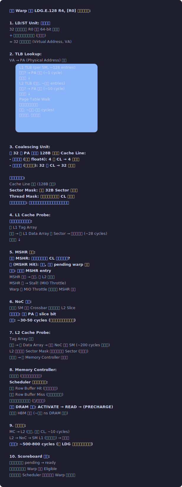</p>


## 3.12 Shared Memory 的 Bank 冲突 — SASS 级分析

```
观察 Bank Conflict 对 SASS 指令的具体影响:

无冲突的 LDS (Shared Load):
  LDS R0, [R2];  // R2 = threadIdx.x * 4 (连续 4B, 无冲突)
  
  SASS 执行:
    Cycle 0: 32 线程各提供地址, 映射到 32 个不同 Bank
    Cycle 1-5: 32 个 Bank 并行读 → 5 cycles 完成
    
  ncu 指标:
    l1tex__data_bank_conflicts_pipe_lsu_mem_shared = 0

2-way 冲突:
  LDS R0, [R2];  // R2 = threadIdx.x * 8 (stride-2, 2-way)
  
  SASS 执行:
    Cycle 0: 32 线程提供地址, T0→Bank0, T1→Bank2, ... T16→Bank0 (冲突!)
    硬件将 32 个访问拆成 2 轮:
      Round 1: T0-T15 (16 个不同 Bank)
      Round 2: T16-T31 (16 个不同 Bank)
    总: 5+5 = 10 cycles (2× 延迟)
    
  ncu 指标:
    l1tex__data_bank_conflicts_pipe_lsu_mem_shared = <非零>

32-way 冲突 (最坏):
  LDS R0, [R2];  // R2 = threadIdx.x * 128 (stride-32, 32-way)
  
  32 轮串行 → 5×32 = 160 cycles (32× 延迟!)
  这等于把 Shared Memory 的并行优势完全消除了。

ncu 中诊断 Bank Conflict:
  Section: Memory Workload Analysis
  Metric: l1tex__data_bank_conflicts_pipe_lsu_mem_shared_op_ld
          l1tex__data_bank_conflicts_pipe_lsu_mem_shared_op_st
  
  如果这个数 > 0, 需要检查 Shared Memory 的访问模式。
  
  快速定位: ncu --metrics l1tex__data_bank_conflicts_pipe_lsu_mem_shared ./prog
```


## 3.13 速记卡 — 随时翻看的关键数字

```
┌────────────────────────────────────────────────────────┐
│            GPU 内存层级速记 (A100)                       │
│                                                        │
│  存储层      延迟         带宽         容量             │
│  ────       ────         ────         ────             │
│  寄存器      0 cycle     ~数十 TB/s    256KB/SM         │
│  Shared Mem  5 cycles    ~19 TB/s     164KB/SM(可配)    │
│  L2 Cache    200 cyc     ~5 TB/s      40MB             │
│  HBM         500-800 cyc 2039 GB/s    80GB             │
│                                                        │
│  关键比值:                                              │
│    HBM vs Shared: 延迟 100-160×, 带宽 ~10×             │
│    随机 vs 合并访问: 有效带宽可差 10-50×                  │
│    有 vs 无 Bank Conflict: 最坏 32× 延迟差异             │
│                                                        │
│  Ridge Point (Memory↔Compute 分界):                    │
│    FP32: 19.5T / 2039G = 9.6 FLOP/Byte                │
│    FP16 TC: 312T / 2039G = 153 FLOP/Byte              │
│                                                        │
│  优化优先级:                                            │
│    1. 减少访存次数 (融合!)                               │
│    2. 确保合并访问                                      │
│    3. 向量化 (float4)                                   │
│    4. 用 Shared Memory 缓存                             │
│    5. 避免 Bank Conflict                                │
└────────────────────────────────────────────────────────┘
```
<p align="center">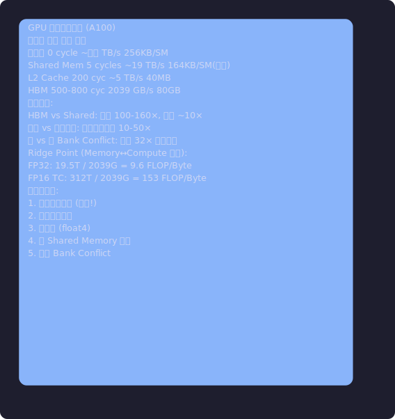</p>


## 3.14 本章总结

```
内存层级的核心矩盾:
  寄存器 (0 cyc, 256KB/SM) → 最快但最小
  Shared Memory (5 cyc, 至多 164KB/SM) → 程序员控制的片上缓存
  L2 Cache (200 cyc, 40MB) → 硬件自动管理
  HBM (500-800 cyc, 80GB, 2039 GB/s) → 大但慢

优化优先级:
  1. 减少访存次数 (算子融合, tiling)
  2. 确保合并访问 (同一 Warp 连续地址)
  3. 向量化加载 (float4 → 减少 LD/ST 指令数)
  4. 用 Shared Memory 缓存复用数据
  5. 避免 Bank Conflict (padding / swizzle)
```


## 3.15 Q&A

### Q: “合并访问” 和 “Cache Line” 是什么关系?

```
合并访问是将多个线程的地址映射到尽可能少的 Cache Line (128B) 的过程。

32 个线程各读 1 个 float (4B):
  连续地址 [0,4,8,...124] → 1 个 CL → 1 次事务 → "完美合并"
  随机地址 → 最多 32 个 CL → 32 次事务 → "零合并"

注意: Volta+ 的 Sector 机制让“部分合并”的情况也不那么糟糕 —
只加载被触及的 32B Sector 而不是整条 128B CL。
```

### Q: Shared Memory 的 Bank Conflict 和 DRAM 的 Bank Conflict 一样吗?

```
名字相同但机制完全不同!

Shared Memory Bank Conflict:
  32 个 SRAM Bank, 每 Bank 宽 4 字节, 每周期可服务 1 次访问。
  同一 Warp 的多个线程访问同一 Bank 的不同地址 → 串行化。
  解决: Padding (加 1 列), Swizzle (地址 XOR 重映射)。
  粒度: 每次 Shared Memory 访问 (LDS/STS 指令)。

DRAM (HBM) Bank Conflict:
  HBM 每个 Pseudo-Channel 有 16 个 Bank, 每个 Bank 有独立的 Row Buffer。
  访问同一 Bank 的不同行 (Row) → 需要 Precharge + Activate → 额外 ~30ns。
  解决: Memory Controller 的请求重排序 (FR-FCFS)。
  粒度: 每次 HBM 访问 (MC 调度级别)。

前者可以被程序员直接解决, 后者很难直接控制 (被 MC 的调度算法掌控)。
```

### 概念辨析: "L1 Cache" vs "Shared Memory" — 它们是同一块硬件!

```
Volta 之前: L1 和 Shared Memory 是物理上分开的两块 SRAM。
Volta+: 它们共享同一块物理 SRAM (可配置分割比例)。

关键区别不是硬件, 而是控制方式:
  Shared Memory: 程序员显式管理 (__shared__, LDS/STS)
                可预测的延迟和布局
                可以做线程间通信
  
  L1 Cache: 硬件自动管理 (透明缓存, LDG/STG 自动缓存)
            不可预测 (可能 hit 可能 miss)
            不能做线程间通信

何时用 Shared Memory: 数据有明确的复用模式, 你能控制加载/使用时机。
何时依赖 L1: 访问模式不规则但有时间局部性 (如随机查表)。
```


## 3.16 练习题

配套代码在 [`theory/exercises/`](./exercises/) 目录下: [`ch03_ex1_coalescing.cu`](./exercises/ch03_ex1_coalescing.cu) / [`ch03_ex2_bank.cu`](./exercises/ch03_ex2_bank.cu) / [`ch03_ex3_roofline.cu`](./exercises/ch03_ex3_roofline.cu)

以下练习配合代码示例动手做, 效果最好。

### 练习 1: 合并访问探索 [难度: ⭐⭐]

```
打开 06_coalescing/coalescing.cu, 做以下修改并观察性能变化:

1. 加一个 stride=4 的测试用例。预测: 带宽是 stride=1 的多少?
   (提示: stride=4 意味着每个 Warp 触及 4 个 128B Cache Line)

2. 把数据类型从 float 改成 float4 (向量化加载)。
   带宽有变化吗? 为什么?
   (提示: float4 = 128 bit 加载, 减少 LD/ST 指令数)

3. 用 ncu 测量三种访问模式的 "Global Load Efficiency":
   ncu --metrics l1tex__t_sectors_pipe_lsu_mem_global_op_ld ./coalescing
   连续访问的 efficiency 应该接近 100%, 随机访问呢?
```

### 练习 2: Bank Conflict 消除 [难度: ⭐⭐⭐]

```
打开 05_bank_conflict/bank_conflict.cu:

1. 加一个 stride=3 的测试用例。预测: 有没有 bank conflict?
   (提示: GCD(3, 32) = 1 → 无冲突! 奇数 stride 通常没问题)

2. 写一个 32×32 矩阵转置的 kernel, 不用 padding。
   用 ncu 查看 bank conflict 数量。
   然后加 padding (__shared__ float tile[32][33]), 再测一次。
   (配合理论: 本章 3.3 节 "Bank Conflict 的经典解决方案: Padding")
```

### 练习 3: Roofline 分析 [难度: ⭐⭐]

```
对 01_vector_add 的向量加法做 Roofline 分析:

1. 计算算术强度:
   每个元素: 1 次加法 (1 FLOP)
   每个元素: 读 2 个 float + 写 1 个 float = 12 字节
   AI = 1 / 12 ≈ 0.083 FLOP/Byte
   这个 AI 和 Ridge Point (A100: 9.6 FLOP/Byte) 比, 说明什么?

2. 计算理论最短时间:
   总数据量 = 3 × 1M × 4B = 12 MB
   A100 带宽 2039 GB/s → 理论最短 = 12MB / 2039GB/s = ?
   和实测时间对比, 你的 kernel 达到了理论极限的百分之几?
```
