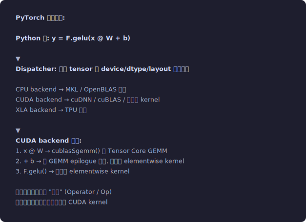
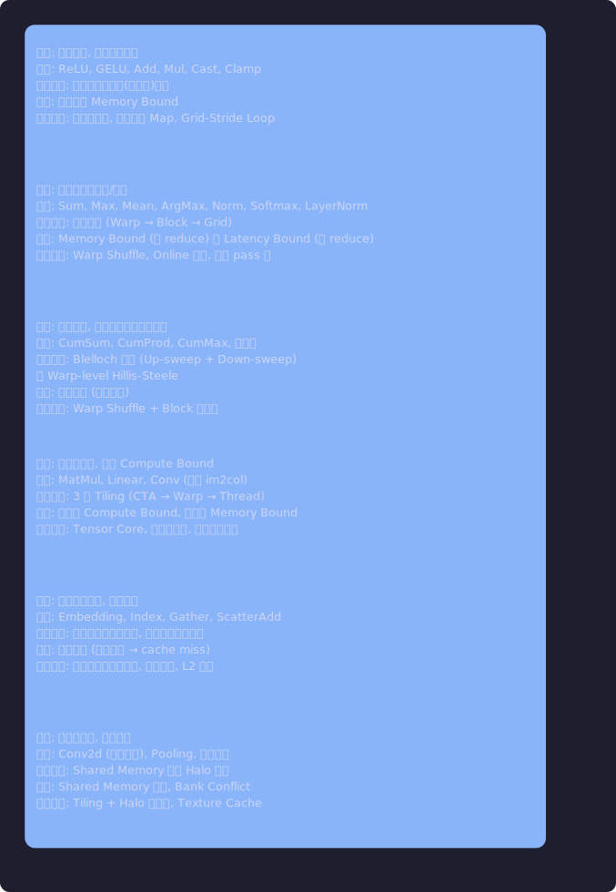
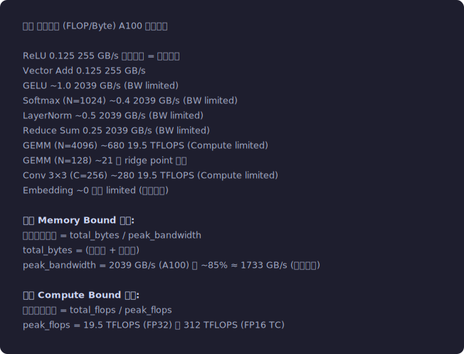
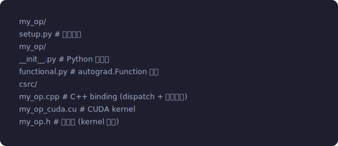
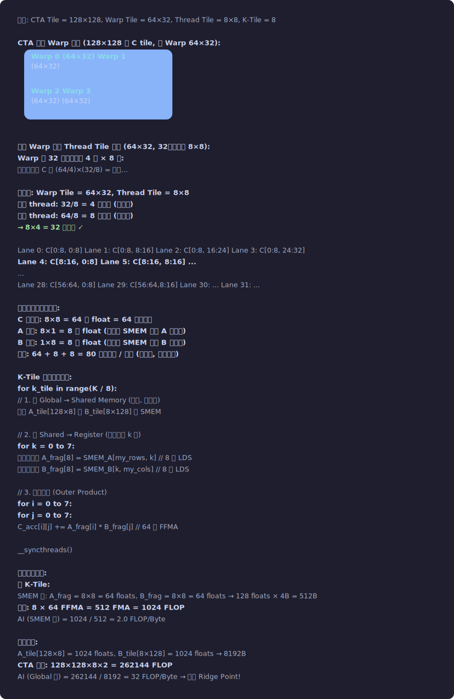

# 第五章：算子开发方法论 — 从需求到高性能 Kernel

**难度**: ⭐⭐ 进阶 (5.1-5.3) / ⭐⭐⭐ 专家 (5.4-5.9)
**前置知识**: 第1-4章的基础; 基本的深度学习概念 (tensor, 前向/反向)
**读完你能做什么**: 独立开发一个 CUDA 算子并接入 PyTorch; 对算子做性能分析和优化
**配套代码**: `04_pytorch_extension/` (自定义 GELU 算子)
**新手建议**: 5.1 (算子分类) → 5.2 (开发流程, 以 GELU 为例) → 5.8 (PyTorch 接入) 是最实用的路径

> **什么是"算子"?**
>
> 在深度学习框架 (如 PyTorch) 中，模型是一张"计算图"——
> 由一个个基本运算节点组成，每个节点就是一个**算子 (Operator)**。
>
> 例: `y = relu(x @ W + b)` 包含 3 个算子:
> - `x @ W` → MatMul 算子 (矩阵乘法)
> - `+ b` → Add 算子 (加法)
> - `relu()` → ReLU 算子 (激活函数)
>
> 每个算子最终调用一个或多个 CUDA kernel 在 GPU 上执行。
> 本章教你如何自己写这些 kernel 并接入框架。
>
> **本章首次出现的术语**:
> - **算术强度 (Arithmetic Intensity)**: 每传输 1 字节数据做多少次运算 → 决定瓶颈在内存还是计算
> - **Memory Bound / Compute Bound**: kernel 是被内存带宽限制还是被计算能力限制
> - **算子融合 (Kernel Fusion)**: 把多个小算子合并成 1 个 kernel → 减少中间数据的内存读写
> - **autograd**: PyTorch 的自动微分系统，自动计算反向传播的梯度

## 5.1 算子在框架中的位置

### 计算图中的算子

```
PyTorch 执行模型:

Python 层: y = F.gelu(x @ W + b)
                │
                ▼
Dispatcher: 根据 tensor 的 device/dtype/layout 选择后端
                │
                ├── CPU backend    → MKL / OpenBLAS 实现
                ├── CUDA backend   → cuDNN / cuBLAS / 自定义 kernel
                └── XLA backend    → TPU 编译
                │
                ▼
CUDA backend 展开:
  1. x @ W       → cublasSgemm() 或 Tensor Core GEMM
  2. + b          → 和 GEMM epilogue 融合, 或独立 elementwise kernel
  3. F.gelu()     → 独立的 elementwise kernel
  
每个步骤都是一个 "算子" (Operator / Op)
每个算子最终调用一个或多个 CUDA kernel
```
<p align="center"></p>


### 算子分类 — 按并行模式

```
┌───────────────────────────────────────────────────────────────────┐
│ 1. Map (映射型): 输出元素 与 输入元素 一一对应                       │
│    特征: 完美并行, 无线程间依赖                                     │
│    示例: ReLU, GELU, Add, Mul, Cast, Clamp                        │
│    并行策略: 每线程处理一个(或几个)元素                               │
│    瓶颈: 几乎总是 Memory Bound                                     │
│    优化方向: 向量化加载, 融合多个 Map, Grid-Stride Loop              │
├───────────────────────────────────────────────────────────────────┤
│ 2. Reduce (归约型): 多个输入 → 一个(或更少)输出                      │
│    特征: 需要线程间通信/聚合                                        │
│    示例: Sum, Max, Mean, ArgMax, Norm, Softmax, LayerNorm          │
│    并行策略: 分层归约 (Warp → Block → Grid)                         │
│    瓶颈: Memory Bound (小 reduce) 或 Latency Bound (大 reduce)     │
│    优化方向: Warp Shuffle, Online 算法, 减少 pass 数                 │
├───────────────────────────────────────────────────────────────────┤
│ 3. Scan (扫描型): 输出[i] 依赖输入[0..i]                           │
│    特征: 顺序依赖, 但可以用特殊并行算法                               │
│    示例: CumSum, CumProd, CumMax, 前缀和                           │
│    并行策略: Blelloch 算法 (Up-sweep + Down-sweep)                  │
│              或 Warp-level Hillis-Steele                           │
│    瓶颈: 指令延迟 (依赖链长)                                        │
│    优化方向: Warp Shuffle + Block 级分段                             │
├───────────────────────────────────────────────────────────────────┤
│ 4. GEMM (矩阵乘型): O(N³) 计算, O(N²) 数据                        │
│    特征: 高算术强度, 可以 Compute Bound                              │
│    示例: MatMul, Linear, Conv (通过 im2col)                        │
│    并行策略: 3 层 Tiling (CTA → Warp → Thread)                     │
│    瓶颈: 大矩阵 Compute Bound, 小矩阵 Memory Bound                  │
│    优化方向: Tensor Core, 寄存器分块, 多阶段流水线                    │
├───────────────────────────────────────────────────────────────────┤
│ 5. Gather/Scatter (不规则访问型): 通过索引间接寻址                    │
│    特征: 随机内存访问, 合并度差                                      │
│    示例: Embedding, Index, Gather, ScatterAdd                      │
│    并行策略: 每线程处理一个元素, 原子操作处理冲突                      │
│    瓶颈: 内存延迟 (随机访问 → cache miss)                            │
│    优化方向: 排序索引提高局部性, 分层原子, L2 锁定                    │
├───────────────────────────────────────────────────────────────────┤
│ 6. Stencil (模板型): 输出依赖邻域输入                                │
│    特征: 空间局部性, 数据复用                                        │
│    示例: Conv2d (直接卷积), Pooling, 图像滤波                       │
│    并行策略: Shared Memory 缓存 Halo 区域                           │
│    瓶颈: Shared Memory 容量, Bank Conflict                          │
│    优化方向: Tiling + Halo 预加载, Texture Cache                    │
└───────────────────────────────────────────────────────────────────┘
```
<p align="center"></p>


### 每类算子的理论性能上限

```
算子              算术强度 (FLOP/Byte)    A100 理论上限
───────────────  ──────────────────────  ─────────────
ReLU              0.125                   255 GB/s 有效带宽 = 理论带宽
Vector Add        0.125                   255 GB/s
GELU              ~1.0                    2039 GB/s (BW limited)
Softmax (N=1024)  ~0.4                    2039 GB/s (BW limited)
LayerNorm         ~0.5                    2039 GB/s (BW limited)
Reduce Sum        0.25                    2039 GB/s (BW limited)
GEMM (N=4096)     ~680                    19.5 TFLOPS (Compute limited)
GEMM (N=128)      ~21                     在 ridge point 附近
Conv 3×3 (C=256)  ~280                    19.5 TFLOPS (Compute limited)
Embedding         ~0                      延迟 limited (随机访问)

对于 Memory Bound 算子:
  理论最短时间 = total_bytes / peak_bandwidth
  total_bytes = (读字节 + 写字节)
  peak_bandwidth = 2039 GB/s (A100) 的 ~85% ≈ 1733 GB/s (实际可达)

对于 Compute Bound 算子:
  理论最短时间 = total_flops / peak_flops
  peak_flops = 19.5 TFLOPS (FP32) 或 312 TFLOPS (FP16 TC)
```
<p align="center"></p>


## 5.2 算子开发完整流程 — 以 GELU 为例

### Step 1: 数学定义与精度分析

```
GELU(x) = x × Φ(x) = x × 0.5 × (1 + erf(x/√2))

近似公式 (tanh 近似, 误差 < 0.001):
GELU(x) ≈ 0.5x(1 + tanh(√(2/π)(x + 0.044715x³)))

需要决定:
  - 用精确的 erf 还是 tanh 近似?
  - PyTorch 默认用 tanh 近似 (训练时) 或 erf (推理时)
  - 精度要求: vs FP64 参考的最大误差 < 1e-5 (FP32)

GELU 的导数 (反向传播需要):
  GELU'(x) = Φ(x) + x × φ(x)
  其中 φ(x) = exp(-x²/2) / √(2π) 是标准正态 PDF
  
  用 tanh 近似的导数:
  令 s = tanh(√(2/π)(x + 0.044715x³))
  GELU'(x) = 0.5(1+s) + 0.5x(1-s²) × √(2/π)(1 + 3×0.044715x²)
```

### Step 2: 计算分析

```
GELU 每元素的运算量:
  tanh 近似: 乘法×5 + 加法×3 + tanh×1 ≈ 15 FLOP (tanh 约 7 FLOP)
  
  数据量: 读 4 字节 (input) + 写 4 字节 (output) = 8 字节
  
  算术强度 = 15 / 8 = 1.875 FLOP/Byte
  
  A100 Ridge Point = 9.6 FLOP/Byte
  1.875 < 9.6 → Memory Bound
  
  → 优化的关键是减少内存访问, 而不是减少计算
  → 向量化 + 融合是主要优化方向
```

### Step 3: 朴素实现

```cuda
__global__ void gelu_naive(const float *input, float *output, int n) {
    int idx = blockIdx.x * blockDim.x + threadIdx.x;
    if (idx < n) {
        float x = input[idx];
        float cdf = 0.5f * (1.0f + tanhf(0.7978845608f * (x + 0.044715f * x * x * x)));
        output[idx] = x * cdf;
    }
}
// 正确, 但: 标量加载, 无融合, 可能的尾部效应
```

### Step 4: 优化实现

```cuda
__global__ void gelu_optimized(
    const float * __restrict__ input,
    float * __restrict__ output,
    int n) {
    
    int idx = (blockIdx.x * blockDim.x + threadIdx.x) * 4;  // 每线程 4 个元素
    int stride = blockDim.x * gridDim.x * 4;
    
    for (int i = idx; i < n - 3; i += stride) {
        // 向量化加载
        float4 in = reinterpret_cast<const float4*>(input)[i / 4];
        
        float4 out;
        // 展开计算 (编译器通常会自动处理, 但显式写更清晰)
        #define GELU_ELEM(v) ({                                    \
            float cdf = 0.5f * (1.0f + tanhf(0.7978845608f *     \
                        ((v) + 0.044715f * (v) * (v) * (v))));    \
            (v) * cdf;                                             \
        })
        out.x = GELU_ELEM(in.x);
        out.y = GELU_ELEM(in.y);
        out.z = GELU_ELEM(in.z);
        out.w = GELU_ELEM(in.w);
        #undef GELU_ELEM
        
        reinterpret_cast<float4*>(output)[i / 4] = out;
    }
    
    // 处理尾部
    for (int i = (n / 4) * 4 + (idx / 4); i < n; i += stride / 4) {
        float x = input[i];
        output[i] = x * 0.5f * (1.0f + tanhf(0.7978845608f * (x + 0.044715f*x*x*x)));
    }
}
```

### Step 5: 性能评估

```
n = 10M 元素 (40MB)

朴素版:
  ncu 报告: Memory Throughput = 65%, 耗时 0.05ms
  有效带宽 = 80MB / 0.05ms = 1600 GB/s → 78% 峰值 → 还行

优化版 (float4):
  ncu 报告: Memory Throughput = 82%, 耗时 0.042ms
  有效带宽 = 80MB / 0.042ms = 1905 GB/s → 93% 峰值 → 优秀!

差距来源分析:
  朴素版: LDG.32 × N → N 条指令
  优化版: LDG.128 × N/4 → N/4 条指令
  → 减少 75% 的 LD/ST 指令, LD/ST pipeline 压力降低

还能进一步吗?
  93% 已经接近极限。剩余 7% 来自:
  - 尾部元素处理
  - tanh 用了 SFU (~28 cycles), SFU 利用率可能不满
  - Warp 调度开销
  → 几乎不值得再优化。花时间在算子融合上收益更大。
```


## 5.3 Reduce 算子 — 7 个版本的完整演进

### V0 → V6 性能对比

```
以 N = 4M, float32, A100 为例:

版本   方法                        带宽利用率   备注
V0     CPU 顺序累加                  -          基准
V1     交错归约 (Interleaved)       ~12%       严重 Warp 分歧
V2     顺序归约 (Sequential Addr)   ~38%       消除分歧
V3     首次加载归约                  ~52%       减少 Block 数
V4     展开最后 Warp                 ~63%       消除不必要的 __syncthreads
V5     完全展开 (template)           ~71%       消除循环控制开销
V6     Warp Shuffle + 多元素/线程    ~88%       最优
```

> **交叉参考**: 如果你对 Warp Shuffle 不熟悉，先看 Ch4.2 节的完整讲解和图解。
> 动手跑 `03_reduce/reduce.cu` 可以看到 Shared Memory 归约 vs Warp Shuffle 的性能差异。

### V1 → V2: 消除 Warp 分歧的本质

```cuda
// V1: 交错归约 (有分歧!)
for (int stride = 1; stride < blockDim.x; stride *= 2) {
    if (tid % (2 * stride) == 0) {
        smem[tid] += smem[tid + stride];
    }
    __syncthreads();
}

// stride=1 时: 偶数线程工作, 奇数线程闲置
//   Warp 0: T0 工作, T1 闲, T2 工作, T3 闲, ... → 50% 效率
//   每个 Warp 内都有分歧!

// stride=2 时: tid%4==0 的工作
//   Warp 0: T0 工作, T1/T2/T3 闲, T4 工作, ... → 25% 效率

// stride=16 时: 只有 tid%32==0 工作
//   Warp 0: T0 工作, T1-T31 全闲 → 3.1% 效率
//   但此时 Warp 1+ 的活跃线程全是 0 → 这些 Warp 可以被跳过? 不行!
//   因为 __syncthreads() 要求所有线程到达

// V2: 顺序归约 (无分歧!)
for (int stride = blockDim.x / 2; stride > 0; stride >>= 1) {
    if (tid < stride) {
        smem[tid] += smem[tid + stride];
    }
    __syncthreads();
}

// stride=128 时: Thread 0-127 工作 (4 个完整 Warp)
//   Warp 0-3 全活跃, Warp 4-7 全不活跃
//   活跃的 Warp 无分歧! 非活跃的 Warp 快速跳过 if → 低开销

// 这就是关键区别:
// V1 的分歧在每个 Warp 内部 (同一 Warp 有活跃和不活跃线程)
// V2 的分歧在 Warp 之间 (一个 Warp 要么全活跃要么全不活跃)
```

### V4: 展开最后一个 Warp

```cuda
// 当 stride ≤ 32 时, 只有一个 Warp 在工作
// 同一 Warp 内不需要 __syncthreads() (Pre-Volta 上锁步保证)
// Volta+ 需要 __syncwarp()

__device__ void warp_reduce(volatile float *smem, int tid) {
    // volatile 确保编译器不缓存 smem 读取
    smem[tid] += smem[tid + 32];  __syncwarp();
    smem[tid] += smem[tid + 16];  __syncwarp();
    smem[tid] += smem[tid + 8];   __syncwarp();
    smem[tid] += smem[tid + 4];   __syncwarp();
    smem[tid] += smem[tid + 2];   __syncwarp();
    smem[tid] += smem[tid + 1];   __syncwarp();
}

// 省掉了 5 次 __syncthreads() (每次 ~20-30 cycles)
// 替换为 __syncwarp() (~几 cycles)
// 节省 ~100-150 cycles / Block
```

### V6: 终极版本

```cuda
template <int BLOCK_SIZE>
__global__ void reduce_v6(const float *input, float *output, int n) {
    float sum = 0;
    
    // 每线程处理多个元素 (Grid-Stride Loop + 向量化)
    int idx = (blockIdx.x * BLOCK_SIZE + threadIdx.x) * 4;
    int stride = BLOCK_SIZE * gridDim.x * 4;
    for (int i = idx; i < n - 3; i += stride) {
        float4 v = reinterpret_cast<const float4*>(input)[i/4];
        sum += v.x + v.y + v.z + v.w;
    }
    // 尾部标量处理略...
    
    // Warp 级归约 (Shuffle)
    sum = warp_reduce_sum(sum);  // 32 → 1
    
    // Block 级归约 (Shared Memory, 只用于 Warp 间通信)
    __shared__ float warp_sums[BLOCK_SIZE / 32];
    int lane = threadIdx.x % 32;
    int warp_id = threadIdx.x / 32;
    if (lane == 0) warp_sums[warp_id] = sum;
    __syncthreads();
    
    // 第一个 Warp 汇总所有 Warp 的结果
    if (warp_id == 0) {
        sum = (lane < BLOCK_SIZE / 32) ? warp_sums[lane] : 0.0f;
        sum = warp_reduce_sum(sum);
        if (lane == 0) atomicAdd(output, sum);
    }
}

// 这个版本:
// 1. float4 向量化 → 减少指令数
// 2. Grid-Stride → 减少 Block 数, 消除尾部效应
// 3. Warp Shuffle → 避免 Shared Memory 的 reduce 阶段
// 4. 只在 Warp 间用 Shared Memory → 最少的 __syncthreads()
// 5. 最后一步用 atomicAdd → Block 间无需额外 kernel
```


## 5.4 Scan (前缀和) — 顺序依赖的并行化

### 为什么 Scan 重要

```
前缀和是很多算法的构建块:
  - Stream Compaction (去除空元素)
  - Radix Sort
  - Histogram 的并行构建
  - 稀疏矩阵的 CSR 格式构建
  - Cumulative Sum/Product (深度学习中也有)
```

### Blelloch 算法 (Work-Efficient Parallel Scan)

```
两个阶段:

Up-Sweep (归约阶段):
  输入: [3, 1, 7, 0, 4, 1, 6, 3]
  
  Step 1 (stride=1): [3, 4,  7, 7,  4, 5,  6, 9 ]
                          ^       ^       ^       ^  (相邻对求和)
  Step 2 (stride=2): [3, 4,  7, 11, 4, 5,  6, 14]
                                 ^               ^  (间隔 2 对求和)
  Step 3 (stride=4): [3, 4,  7, 11, 4, 5,  6, 25]
                                                 ^  (间隔 4 对求和)
  → 最后一个元素 = 总和 (25)

Down-Sweep (分发阶段):
  将最后元素设为 0: [3, 4, 7, 11, 4, 5, 6, 0]
  
  Step 3 (stride=4): [3, 4, 7, 0,  4, 5, 6, 11]
                                ^               ^
  Step 2 (stride=2): [3, 0, 7, 4,  4, 11, 6, 16]
                          ^     ^       ^       ^
  Step 1 (stride=1): [0, 3, 4, 11, 11, 15, 16, 22]
                       ^  ^  ^   ^   ^   ^   ^   ^

  结果: [0, 3, 4, 11, 11, 15, 16, 22] (exclusive prefix sum ✓)
  
  验证: 0, 3, 3+1=4, 4+7=11, 11+0=11, 11+4=15, 15+1=16, 16+6=22 ✓
```

### GPU 实现的三级策略

```
大数组的 Scan 分三级:

Level 1: Block 级 Scan
  每个 Block 对一段数据做 Scan (Blelloch in Shared Memory)
  每个 Block 的最后一个元素 (block sum) 写入辅助数组

Level 2: Block Sum 的 Scan
  对辅助数组做 Scan (如果辅助数组不大, 单个 Block 即可)

Level 3: 最终调整
  每个 Block 将 Level 2 的前缀和加到自己的所有元素上

总共 3 个 kernel launch。CUB 库的 DeviceScan 就是这个策略。
```


## 5.5 Convolution — 三种实现策略

### 策略 1: im2col + GEMM

> **动手实验**: 运行 `14_im2col_conv/im2col_conv.cu` 看 im2col 的完整实现!
> ```bash
> cd 14_im2col_conv && nvcc -O2 -o im2col_conv im2col_conv.cu && ./im2col_conv
> ```
> 代码实现了 im2col 展开 + GEMM 两步, 对比 CPU 直接卷积验证正确性。

```
把卷积转化为矩阵乘法:

输入: [N, C_in, H, W]
权重: [C_out, C_in, Kh, Kw]

im2col 展开:
  对每个输出位置 (oh, ow), 提取输入中的 [C_in, Kh, Kw] 补丁
  展开成一行 → 矩阵 col: [H_out × W_out, C_in × Kh × Kw]

矩阵乘:
  权重 reshape: [C_out, C_in × Kh × Kw]
  输出 = 权重 × col^T → [C_out, H_out × W_out]
  reshape 回 [C_out, H_out, W_out]

优点: 直接复用高度优化的 GEMM
缺点: im2col 增加内存占用 (展开后矩阵可能很大)

cuDNN 在很多情况下使用这种策略
```

### 策略 2: 直接卷积 (Shared Memory Tiling)

```cuda
// 每个 Block 计算输出的一个 tile
// 加载输入 tile + halo 到 Shared Memory
__global__ void conv2d_direct(
    const float *input, const float *weight, float *output,
    int H, int W, int C_in, int C_out, int K) {
    
    // Shared Memory: 输入 tile (包含 halo)
    __shared__ float s_input[TILE_H + K-1][TILE_W + K-1];
    
    // 每个线程计算一个输出元素
    int oh = blockIdx.y * TILE_H + threadIdx.y;
    int ow = blockIdx.x * TILE_W + threadIdx.x;
    
    float sum = 0;
    for (int ci = 0; ci < C_in; ci++) {
        // 协作加载输入 tile (包含 K-1 的 halo)
        load_tile_with_halo(s_input, input, ci, oh, ow, ...);
        __syncthreads();
        
        // 卷积计算 (从 Shared Memory 读取)
        for (int kh = 0; kh < K; kh++)
            for (int kw = 0; kw < K; kw++)
                sum += s_input[threadIdx.y + kh][threadIdx.x + kw] 
                     * weight[co * C_in * K * K + ci * K * K + kh * K + kw];
        __syncthreads();
    }
    output[...] = sum;
}
```

### 策略 3: Winograd 变换

```
Winograd 变换减少乘法次数:

3×3 卷积 + 4×4 输出 tile:
  直接计算: 4×4×3×3 = 144 次乘法
  Winograd:  6×6 = 36 次乘法 (元素乘, 非矩阵乘!)
  加法增加, 但乘法减少 4×

变换步骤:
  1. 输入变换:  d = B^T × input_tile × B    (6×6 变换矩阵)
  2. 权重变换:  g = G × weight × G^T         (预计算)
  3. 元素乘:    m = d ⊙ g                    (Hadamard 乘积)
  4. 输出变换:  output = A^T × m × A         (4×4 变换矩阵)

cuDNN 对 3×3 卷积默认使用 Winograd (当数据类型合适时)
数值稳定性比直接计算差, FP16 下可能有精度问题
```


## 5.6 数值稳定性 — 深入 IEEE 754 浮点

### 浮点表示的关键特性

```
IEEE 754 FP32:
  1 sign + 8 exponent + 23 mantissa
  
  正常数 (Normal): (-1)^s × 1.mantissa × 2^(exponent-127)
  次正常数 (Subnormal): (-1)^s × 0.mantissa × 2^(-126)
  
  关键数值:
    最大正常数: ~3.4 × 10^38
    最小正常正数: ~1.18 × 10^-38
    机器精度 (epsilon): 2^-23 ≈ 1.19 × 10^-7
    
  这意味着:
    1.0 + 1e-8 = 1.0 (精确!) — 1e-8 小于机器精度
    1e20 + 1.0 = 1e20 (精确!) — 1.0 的量级太小

FP16:
  1 sign + 5 exponent + 10 mantissa
  最大值: 65504
  机器精度: 2^-10 ≈ 9.77 × 10^-4
  → 只有 ~3 位有效数字!
  
  1024.0 + 0.5 = 1024.0 (FP16 下!) — 0.5 超出了 1024 的精度范围
  
  这就是为什么 FP16 训练需要 Loss Scaling:
  梯度 ~1e-5 在 FP16 下变成 0!
```

### 算子中的稳定性 — 系统性分析

```
容易出问题的运算:
  1. exp(x): x > 88.7 → INF (FP32), x > 11.1 → INF (FP16)
  2. log(x): x ≤ 0 → NaN/-INF
  3. 1/x:    x ≈ 0 → ±INF
  4. √x:    x < 0 → NaN
  5. 大数累加: 精度逐渐丢失

每个算子的稳定性策略:

Softmax:
  减 max 防止 exp 溢出 (已讨论)

CrossEntropy:
  不要先算 softmax 再算 log! (log(exp(x)/sum) ≈ log(0) 可能)
  用 LogSumExp:
  log_softmax(x_i) = x_i - max - log(sum(exp(x_j - max)))
  更稳定且减少一次 exp 计算

BatchNorm / LayerNorm:
  rsqrt(var + eps):
  - 如果 var = 0 且 eps = 0 → 除零
  - eps 通常取 1e-5 (FP32) 或 1e-3 (FP16)
  - 用 rsqrtf 比 1.0f/sqrtf 快 (~4 cycles vs ~28 cycles)

Attention Score:
  QK^T / √d:
  - FP16 下 Q·K 的内积可能溢出 (d=128 个 ~1.0 相乘累加)
  - 解决: 用 FP32 累加器 (Tensor Core 自动做到)
  - √d 的除法: 预计算 1/√d, 用乘法替代

Gradient Clipping:
  ||g||₂ 的计算涉及大量平方和 → 可能溢出
  解决: 分块计算, 或先除以一个常数再平方
```

### 混合精度的精确规则

```
PyTorch AMP (Automatic Mixed Precision) 的分类:

FP16 安全的操作:
  - 矩阵乘法 (FP16 输入, FP32 累加)
  - 卷积 (同上)
  - Linear
  - Elementwise (ReLU, GELU, Sigmoid, Tanh)

必须 FP32 的操作:
  - Softmax (累加器必须 FP32)
  - LayerNorm / BatchNorm (统计量必须 FP32)
  - Loss 函数 (CrossEntropy 等)
  - 小的累加操作 (如 sum 很多小数)

FP32→FP16 的转换点:
  在 FP16 kernel 的输入处: FP32 → FP16 (可能丢精度)
  在累加器中: 保持 FP32
  在输出时: 看下一个操作是否需要 FP16

Weight Master Copy:
  权重存两份: FP16 (用于前向/反向) + FP32 (用于更新)
  更新: FP32_weight -= lr × FP32_grad
  然后: FP16_weight = FP16(FP32_weight)
  
  为什么不能只用 FP16?
  如果 lr = 1e-4, grad = 1e-3:
    更新量 = 1e-7
    FP16 精度 = ~1e-3
    1e-7 < 1e-3 → 更新被完全舍弃! 权重永远不变!
  FP32 精度 = ~1e-7 → 刚好能捕捉这个更新
```


## 5.7 反向传播的 Kernel 设计

### 前向 vs 反向的设计差异

```
前向传播:
  输入 → 计算 → 输出
  数据流方向清晰, 通常一次遍历

反向传播:
  grad_output → 计算 grad_input, grad_weight, grad_bias
  需要前向保存的中间结果 (saved tensors)
  可能需要重新计算前向中间值 (recomputation / activation checkpointing)
  
  反向通常比前向更复杂:
  1. 需要更多输入 (grad_output + saved tensors)
  2. 可能产生多个输出 (对每个输入的梯度)
  3. 某些操作的反向比前向慢 (如 Softmax)
```

### 反向传播的内存挑战

```
Activation Checkpointing (Gradient Checkpointing):
  问题: 前向保存的激活值占用大量内存
        一个 GPT-3 层: ~3GB 激活值 × 96 层 = ~288GB!
  
  解决: 不保存中间激活, 反向时重新计算前向
  
  tradeoff: 内存 ↓ 33%, 计算 ↑ 33% (多算一次前向)
  
  在 kernel 层面:
    如果算子前向保存了中间值 → ctx.save_for_backward()
    如果使用 checkpointing → 反向时需要重算 → kernel 要支持高效重计算
    
    例: LayerNorm 前向保存 (mean, rstd, input)
    Checkpointing: 反向时重新计算 mean, rstd
    → 反向 kernel 需要把前向的 reduce 操作也包含进来
```


## 5.8 PyTorch 集成 — 完整工程实践

### C++/CUDA Extension 的完整结构

```
my_op/
├── setup.py              # 编译配置
├── my_op/
│   ├── __init__.py       # Python 包入口
│   ├── functional.py     # autograd.Function 封装
│   └── csrc/
│       ├── my_op.cpp     # C++ binding (dispatch + 参数检查)
│       ├── my_op_cuda.cu # CUDA kernel
│       └── my_op.h       # 头文件 (kernel 声明)
```
<p align="center"></p>


### 完整的 C++ Dispatch 层

```cpp
// my_op.cpp — 参数检查 + dispatch
#include <torch/extension.h>

torch::Tensor my_op_forward(torch::Tensor input, torch::Tensor weight) {
    // 1. 参数检查
    TORCH_CHECK(input.is_cuda(), "input must be CUDA tensor");
    TORCH_CHECK(weight.is_cuda(), "weight must be CUDA tensor");
    TORCH_CHECK(input.is_contiguous(), "input must be contiguous");
    TORCH_CHECK(input.scalar_type() == torch::kFloat32 ||
                input.scalar_type() == torch::kFloat16,
                "input must be float32 or float16");
    
    // 2. 计算输出形状
    auto output = torch::empty_like(input);
    
    // 3. Dispatch to CUDA kernel (根据 dtype)
    AT_DISPATCH_FLOATING_TYPES_AND_HALF(
        input.scalar_type(), "my_op_forward", [&] {
            my_op_cuda_forward<scalar_t>(
                input.data_ptr<scalar_t>(),
                weight.data_ptr<scalar_t>(),
                output.data_ptr<scalar_t>(),
                input.size(0), input.size(1));
        });
    
    return output;
}

PYBIND11_MODULE(TORCH_EXTENSION_NAME, m) {
    m.def("forward", &my_op_forward, "My Op Forward");
    m.def("backward", &my_op_backward, "My Op Backward");
}
```

### Triton — Python 级别的 GPU Kernel

```python
import triton
import triton.language as tl

@triton.jit
def gelu_kernel(
    x_ptr, out_ptr, n_elements,
    BLOCK_SIZE: tl.constexpr,
):
    pid = tl.program_id(axis=0)
    offsets = pid * BLOCK_SIZE + tl.arange(0, BLOCK_SIZE)
    mask = offsets < n_elements
    
    x = tl.load(x_ptr + offsets, mask=mask)
    
    # GELU 计算
    cdf = 0.5 * (1.0 + tl.math.tanh(
        0.7978845608 * (x + 0.044715 * x * x * x)))
    out = x * cdf
    
    tl.store(out_ptr + offsets, out, mask=mask)

def gelu_triton(x: torch.Tensor) -> torch.Tensor:
    out = torch.empty_like(x)
    n = x.numel()
    grid = lambda meta: (triton.cdiv(n, meta['BLOCK_SIZE']),)
    gelu_kernel[grid](x, out, n, BLOCK_SIZE=1024)
    return out

# Triton 的优势:
# 1. 纯 Python, 不需要 C++/CUDA 编译
# 2. 自动处理 tiling, shared memory, 向量化
# 3. 自动调优 (BLOCK_SIZE 等参数)
# 4. 性能通常达到手写 CUDA 的 80-95%
# 5. torch.compile 内部就用 Triton 生成 kernel
```


## 5.9 GEMM 优化 — 从朴素到 cuBLAS 级的完整手推

### Register Tiling 的精确数据流

> **动手实验**: 运行 `09_register_tiling/gemm_register.cu` 对比朴素 GEMM 和 Register Tiled GEMM!
> ```bash
> cd 09_register_tiling && nvcc -O2 -arch=sm_70 -o gemm_register gemm_register.cu && ./gemm_register
> ```
> 你会看到 GFLOPS 的显著差异——Register Tiling 的数据复用率提高了 4×。

```
设定: CTA Tile = 128×128, Warp Tile = 64×32, Thread Tile = 8×8, K-Tile = 8

CTA 内的 Warp 布局 (128×128 的 C tile, 每 Warp 64×32):
  ┌───────────────────────────────┐
  │ Warp 0 (64×32) │ Warp 1       │  行方向 128
  │                │ (64×32)      │
  ├────────────────┼──────────────┤
  │ Warp 2         │ Warp 3       │  列方向 128
  │ (64×32)        │ (64×32)      │
  └───────────────────────────────┘

每个 Warp 内的 Thread Tile 布局 (64×32, 32个线程各 8×8):
  Warp 中 32 个线程排成 4 行 × 8 列:
  每线程负责 C 的 (64/4)×(32/8) = 不对...
  
  更精确: Warp Tile = 64×32, Thread Tile = 8×8
  每行 thread: 32/8 = 4 个线程 (列方向)
  每列 thread: 64/8 = 8 个线程 (行方向)
  → 8×4 = 32 个线程 ✓

  Lane 0: C[0:8, 0:8]    Lane 1: C[0:8, 8:16]   Lane 2: C[0:8, 16:24]  Lane 3: C[0:8, 24:32]
  Lane 4: C[8:16, 0:8]   Lane 5: C[8:16, 8:16]  ...
  ...
  Lane 28: C[56:64, 0:8] Lane 29: C[56:64,8:16]  Lane 30: ...           Lane 31: ...

每线程需要的寄存器:
  C 累加器: 8×8 = 64 个 float = 64 个寄存器
  A 片段:   8×1 = 8 个 float (每次从 SMEM 加载 A 的一列)
  B 片段:   1×8 = 8 个 float (每次从 SMEM 加载 B 的一行)
  总计: 64 + 8 + 8 = 80 个寄存器 / 线程 (最小值, 实际更多)

K-Tile 循环内的操作:
  for k_tile in range(K / 8):
    // 1. 从 Global → Shared Memory (异步, 双缓冲)
    加载 A_tile[128×8] 和 B_tile[8×128] 到 SMEM
    
    // 2. 从 Shared → Register (每次一个 k 步)
    for k = 0 to 7:
      每线程加载 A_frag[8] = SMEM_A[my_rows, k]    // 8 个 LDS
      每线程加载 B_frag[8] = SMEM_B[k, my_cols]    // 8 个 LDS
      
      // 3. 外积累加 (Outer Product)
      for i = 0 to 7:
        for j = 0 to 7:
          C_acc[i][j] += A_frag[i] * B_frag[j]    // 64 个 FFMA
    
    __syncthreads()

算术强度分析:
  每 K-Tile:
    SMEM 读: A_frag = 8×8 = 64 floats, B_frag = 8×8 = 64 floats → 128 floats × 4B = 512B
    计算: 8 × 64 FFMA = 512 FMA = 1024 FLOP
    AI (SMEM 级) = 1024 / 512 = 2.0 FLOP/Byte
    
  全局内存:
    A_tile[128×8] = 1024 floats, B_tile[8×128] = 1024 floats → 8192B
    CTA 计算: 128×128×8×2 = 262144 FLOP
    AI (Global 级) = 262144 / 8192 = 32 FLOP/Byte → 远超 Ridge Point!
```
<p align="center"></p>


### Embedding 算子优化

```
Embedding: output[i] = weight_table[indices[i]]

这是纯 Gather 操作: 随机索引 → 随机内存访问 → 不可合并。

朴素实现:
  __global__ void embedding(
      const float *table, const int *indices, float *output,
      int num_indices, int embed_dim) {
      int idx = blockIdx.x * blockDim.x + threadIdx.x;
      int elem = idx / embed_dim;
      int dim = idx % embed_dim;
      if (elem < num_indices) {
          output[elem * embed_dim + dim] = table[indices[elem] * embed_dim + dim];
      }
  }

问题: indices[elem] 对每个 elem 不同 → table 的访问完全随机。

优化方向:
  1. 保证 embed_dim 方向连续:
     同一 Warp 的线程处理同一 elem 的不同 dim → table 的一行连续读取 ✓
     → 至少每行的读取是合并的
     
  2. 向量化: embed_dim 方向用 float4 加载 → 减少指令数
  
  3. L2 Cache 利用:
     如果 vocabulary 不太大 (如 32K × 768 = 96MB > L2):
     → 无法缓存在 L2, 每次都走 HBM
     
     如果用 INT8 量化 weight table: 96MB / 4 = 24MB < L2 (40MB) → 可能命中!
     → 量化 Embedding 不仅省存储, 还能利用 L2

  4. 排序 indices:
     如果可以预排序 indices → 相近的 index 被相邻线程处理
     → 增加 Row Buffer Hit 和 L2 命中率
     → 但改变了输出顺序, 需要逆排序恢复
```


## 5.10 手写 CUDA Kernel vs 调库 — 决策指南

这是实际工作中最频繁的工程判断。错误决策 → 浪费数周。

### 决策流程

```
Q1: 有现成的库实现吗?
  ├── GEMM → cuBLAS (不要手写!)
  ├── Conv → cuDNN
  ├── FFT → cuFFT
  └── 无 → 继续 Q2

Q2: Memory Bound 还是 Compute Bound?
  ├── Memory Bound (elementwise, reduce, norm):
  │     调库不如手写! 库无法跨算子融合
  │     → 手写融合 kernel (3-5x 带宽节省)
  └── Compute Bound (大 GEMM, Conv):
        调库! cuBLAS/cuDNN 的汇编级优化无法超越

Q3: 需要特殊数值处理?
  ├── custom epilogue (GEMM + Bias + custom Act)
  │   → cuBLASLt / CUTLASS epilogue fusion
  └── 深层跨算子融合 → 手写
```

### 具体场景

```
"我想加速 LayerNorm + Dropout + Residual"
  → 手写融合! Memory Bound ×3 → 1 个 kernel: 9 次 HBM → 4 次

"我想写更快的 GEMM"
  → 别手写! cuBLAS 汇编级优化你比不了
  → 替代: 学 CUTLASS (模板库, 可组合 GEMM 片段)

"推理 batch=1 很慢"
  → launch overhead 瓶颈 → CUDA Graph + 融合小 kernel
  → 小矩阵: 手写融合 → 减少 kernel 数量

"cuDNN 没有的激活函数"
  → 手写 elementwise (简单) + 和前后算子融合 (关键)
```

### 手写前自问

```
1. cuBLAS/cuDNN/cuFFT 有吗? → 用库
2. torch.compile 能自动融合吗? → 让编译器做
3. 只需写 epilogue 吗? → CUTLASS/cuBLASLt
4. 确认需手写后: ncu profile → 一次只改一个变量
```

### cuBLAS 调用示例 — 让"用库"不再是空话

教程中多次说"用 cuBLAS 别手写 GEMM"，这里给出实际调用的代码，确保你真正知道怎么用。

**基本 cuBLAS SGEMM 调用：**

```cuda
#include <cublas_v2.h>

// 初始化 cuBLAS (cublasCreate 在程序开头调用一次)
cublasHandle_t handle;
cublasCreate(&handle);

// C = alpha * A × B + beta * C
// cuBLAS 使用列主序 (Fortran order), 所以 C[i][j] 实际存储为 C[j*ldc + i]
float alpha = 1.0f, beta = 0.0f;
cublasSgemm(handle,
    CUBLAS_OP_N, CUBLAS_OP_N,   // A 不转置, B 不转置
    N, M, K,                    // 矩阵维度: C = A[M×K] × B[K×N]
    &alpha,
    d_B, N,                     // B 是 N×K (列主序下: 第一维 = N = leading dim)
    d_A, K,                     // A 是 K×M (列主序下: 第一维 = K = leading dim)
    &beta,
    d_C, N);                    // C 是 N×M (列主序下: 第一维 = N = leading dim)
```

> **常见坑**：cuBLAS 的矩阵是列主序。如果你的数据是 C 风格 row-major（如 `A[i][j] = A[i*K+j]`），传给 cuBLAS 时行列要对调：row-major 的 `A[M×K]` = column-major 的 `A^T [K×M]`。所以 `cublasSgemm` 的参数会交换 M/N/K。

**对比：手写 kernel vs cuBLAS：**

```cuda
// 手写 tiled GEMM (教学用, ~5000 GB/s on A100)
gemm_tiled<<<grid, block>>>(d_A, d_B, d_C, M, K, N);

// cuBLAS (生产用, ~18000 GB/s on A100 ≈ 3.6x faster)
cublasSgemm(handle, CUBLAS_OP_N, CUBLAS_OP_N, N, M, K,
            &alpha, d_B, N, d_A, K, &beta, d_C, N);
```

**为什么 cuBLAS 快这么多？** 它不是"更好的 tiling"，而是：
1. 使用 Tensor Core 做 FP16/BF16（你手写的 FP32 tiled 用不了 TC）
2. 汇编级寄存器分配（编译器做不到的手工寄存器复用）
3. 针对每个 GPU 架构的专门微调（`-gencode arch=compute_80,code=sm_80`）

> **进阶**：如果你需要"GEMM + bias + ReLU"这种组合，不要手写整个 kernel。用 cuBLASLt 的 epilogue fusion：`cublasLtMatmul` + `CUBLASLT_EPILOGUE_RELU_BIAS`，在库层面完成融合，比手写更快且正确性有保障。


## 5.11 本章总结

```
算子开发流程: 数学定义 → 计算分析 (AI) → 朴素实现 → 优化 → Profiling

6 类算子的优化套路:
  Map:    向量化 + 融合 + Grid-Stride Loop
  Reduce: Warp Shuffle + 分层归约 + Online 算法
  Scan:   Blelloch + Decoupled Lookback
  GEMM:   Tiling (CTA/Warp/Thread) + Tensor Core + 双缓冲
  Gather: 合并方向优化 + L2 缓存 + 索引排序
  Stencil: Halo 预加载 + Shared Memory 缓存

数值稳定性: 不是“先写对再优化” 而是“从一开始就要稳定”
  减 max (softmax), FP32 累加器 (混合精度), Kahan 求和, Welford 方差

PyTorch 接入: cpp_extension (CUDA) / Triton (Python) / CUTLASS (C++ template)
```


## 5.12 Q&A

### Q: 如何判断我的算子是 Memory Bound 还是 Compute Bound?

```
方法 1 (理论分析):
  算术强度 AI = 计算量(FLOP) / 数据量(Byte)
  Ridge Point = 峰值算力 / 峰值带宽 (A100: 9.6 FLOP/Byte)
  AI < Ridge → Memory Bound; AI > Ridge → Compute Bound

方法 2 (ncu 实测):
  看 "GPU Speed of Light" section:
  Memory Throughput: 85% → 带宽利用率高 → Memory Bound
  Compute Throughput: 20% → 计算利用率低 → 确认 Memory Bound
  反之: Compute > Memory → Compute Bound

常见误判:
  "我的 kernel 有很多乘法 → 一定是 Compute Bound" → 错!
  elementwise 的乘法再多, AI 也只有 ~1 FLOP/Byte → 还是 Memory Bound。
  只有 GEMM 的 O(N³) 计算 / O(N²) 数据 才能达到 Compute Bound。
```

### Q: 为什么 Reduce 的性能优化空间远大于 Elementwise?

```
Elementwise 已经接近理论极限: 每元素读 1 次写 1 次, 你做不到更少。
向量化 + 融合后就接近 90%+ 带宽利用率, 没多少优化空间。

Reduce 的挑战:
  朴素实现可能只有 ~10% 带宽利用率 (Warp 分歧, 多余同步)。
  优化后可以达到 ~88% → 8.8× 提升!
  优化空间主要来自: 消除分歧, Warp Shuffle, 向量化, 减少同步。
```

### 概念辨析: “算子融合” 和 “编译器优化” 是一回事吗?

```
不完全是。

编译器优化 (nvcc/ptxas): 指令重排、寄存器分配、常量折叠、谓词化等。
  作用范围: 单个 kernel 内部。
  不能融合多个 kernel! (nvcc 不知道两个 kernel 的关系)

算子融合: 将多个逻辑上独立的算子合并成 1 个 kernel。
  作用范围: 跨算子。
  必须由人或框架完成 (手写 / torch.compile / Triton / XLA)。
  效果: 减少中间 tensor 的 HBM 读写 → 对 Memory Bound 算子效果巨大。

实际中最有价值的优化: 先融合, 再优化单个 kernel 内部。
```


## 5.13 练习题

配套代码在 [`theory/exercises/`](./exercises/) 目录下: [`ch05_ex1_gelu_roofline.cu`](./exercises/ch05_ex1_gelu_roofline.cu) / [`ch05_ex2_fused_gelu_dropout.cu`](./exercises/ch05_ex2_fused_gelu_dropout.cu) / [`ch05_ex3_bottleneck.cu`](./exercises/ch05_ex3_bottleneck.cu)

### 练习 1: 为 GELU 做 Roofline 分析 [难度: ⭐⭐]

```
本章 5.2 讲了 GELU 的算术强度 AI ≈ 1.875 FLOP/Byte。

1. 对 04_pytorch_extension/gelu_cuda.cu 中的 gelu_forward_kernel 实测:
   数据量: N = 10M 个 float, 读+写 = 80MB
   用 cudaEventElapsedTime 计时 → 算有效带宽
   和你的 GPU 的理论峰值对比。

2. 把 kernel 改成 float4 向量化版本 (参考本章 5.2 的优化实现)。
   再测一次带宽 → 有提升吗?
   (配合理论: Ch3.4 "__ldg() 和向量化加载")
```

### 练习 2: 算子融合实验 [难度: ⭐⭐⭐]

```
写两个版本的 "GELU + Dropout":

版本 A (未融合): 先调用 gelu kernel, 再调用一个单独的 dropout kernel。
版本 B (融合):   一个 kernel 同时做 GELU + Dropout。

对比两者的耗时。
融合版快多少? 为什么?
(提示: 未融合的中间结果要写回显存再读出来 → 2 次额外的显存访问!
 融合后中间结果留在寄存器中 → 零额外显存访问)
(配合理论: Ch8.2 "算子融合")
```

### 练习 3: 判断瓶颈类型 [难度: ⭐⭐]

```
对以下 3 个 kernel 计算算术强度, 判断是 Memory Bound 还是 Compute Bound:

(a) 向量加法: c[i] = a[i] + b[i]
    FLOP/element = 1, Bytes/element = 12 (read 2 + write 1, 各 4B)
    AI = ?

(b) GELU: y = 0.5*x*(1 + tanh(...))
    FLOP/element ≈ 15, Bytes/element = 8
    AI = ?

(c) 矩阵乘法 (1024×1024): C = A × B
    FLOP = 2 × 1024³, Bytes = 3 × 1024² × 4
    AI = ?

对比你的 GPU 的 Ridge Point (= 峰值算力 / 峰值带宽)。
哪些是 Memory Bound? 哪些是 Compute Bound?
(配合理论: Ch3.8 "Roofline 模型")
```
