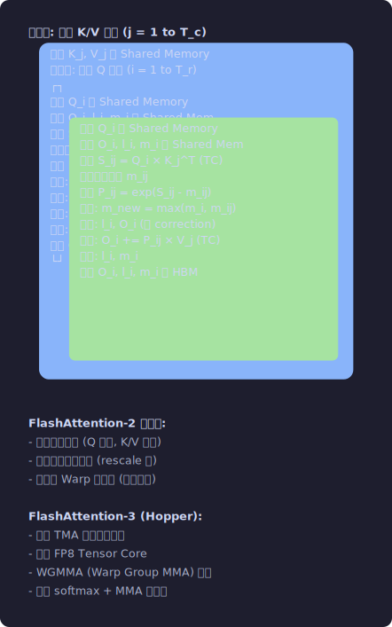
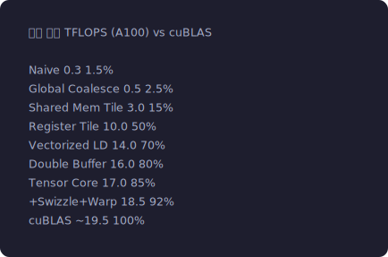

# 第七章：经典算子深度剖析 — Softmax, LayerNorm, FlashAttention

**难度**: ⭐⭐ 进阶 (Softmax/LayerNorm) / ⭐⭐⭐ 专家 (FlashAttention/GEMM 路线图)
**前置知识**: 第3章 (Shared Memory); 第4章 (Warp Shuffle); 第5章 (Reduce 模式)
**读完你能做什么**: 手写高性能 Softmax/LayerNorm; 理解 FlashAttention 的算法原理和反向传播
**配套代码**: `03_reduce/` (Warp Shuffle 归约), `04_pytorch_extension/` (GELU 前向/反向)
**新手建议**: Softmax (7.1) 是最好的学习算子 — 它综合了 reduce、数值稳定性、Warp 原语等核心技术

> **本章首次出现的术语**:
> - **Softmax**: 将一组任意实数转换为概率分布 (每个值变为 0-1 之间, 总和为 1)。
>   在 Transformer 的 Attention 机制中大量使用
> - **数值稳定性**: 浮点运算中避免溢出 (exp 爆到无穷) 和下溢 (梯度变成 0) 的技术
> - **Online 算法**: 不需要先遍历完所有数据再开始计算，而是边读边算、动态修正结果
> - **LayerNorm**: 对一层神经元的输出做归一化 (减均值, 除标准差), Transformer 的基本组件
> - **FlashAttention**: Dao et al. 2022 提出的高效 Attention 算法——
>   利用 Online Softmax 让 Attention 可以分块计算,
>   避免在显存中构建 O(N²) 的注意力矩阵 → 巨大的速度和内存节省
> - **Welford 算法**: 一次遍历数据同时计算均值和方差的数值稳定算法,
>   比"先算均值再算方差"的两遍方法更稳定且更快

## 7.1 Softmax — 从数学到极致优化

> **动手实验**: 运行 `07_softmax/softmax.cu` 对比 3 个版本的 Softmax 性能!
> ```bash
> cd 07_softmax && nvcc -O2 -o softmax softmax.cu && ./softmax
> ```
> 你会看到 3-pass → online → warp-level 的逐步加速。
> 代码中每一行都有详细注释，配合下面的理论讲解一起看。

### 数学定义

```
给定向量 x = [x_0, x_1, ..., x_{N-1}]:

softmax(x_i) = exp(x_i) / Σ_j exp(x_j)

数值稳定版本 (必须用这个!):
m = max(x)
softmax(x_i) = exp(x_i - m) / Σ_j exp(x_j - m)

为什么要减 max?
exp(100) = 2.69e43 → FP32 能表示
exp(200) = 7.23e86 → FP32 溢出 → INF!
exp(100 - 100) = exp(0) = 1 → 没问题!
```

### 朴素 3-Pass 实现

```cuda
// Pass 1: 求最大值 (reduce_max)
__global__ void softmax_naive(float *input, float *output, int N) {
    // 假设一个 Block 处理一行 (长度 N)
    extern __shared__ float smem[];
    int tid = threadIdx.x;
    
    // --- Pass 1: max ---
    float local_max = -INFINITY;
    for (int i = tid; i < N; i += blockDim.x) {
        local_max = fmaxf(local_max, input[i]);
    }
    smem[tid] = local_max;
    __syncthreads();
    // Block-level reduce max (tree reduction)
    for (int s = blockDim.x/2; s > 0; s >>= 1) {
        if (tid < s) smem[tid] = fmaxf(smem[tid], smem[tid+s]);
        __syncthreads();
    }
    float max_val = smem[0];
    __syncthreads();
    
    // --- Pass 2: sum(exp(x - max)) ---
    float local_sum = 0.0f;
    for (int i = tid; i < N; i += blockDim.x) {
        local_sum += expf(input[i] - max_val);
    }
    smem[tid] = local_sum;
    __syncthreads();
    for (int s = blockDim.x/2; s > 0; s >>= 1) {
        if (tid < s) smem[tid] += smem[tid+s];
        __syncthreads();
    }
    float sum_val = smem[0];
    __syncthreads();
    
    // --- Pass 3: normalize ---
    for (int i = tid; i < N; i += blockDim.x) {
        output[i] = expf(input[i] - max_val) / sum_val;
    }
}

// 问题: 3 次遍历数据 → 3N 次全局内存读取
// Softmax 是 Memory Bound → 减少读取次数 = 提升性能
```

### Online Softmax (2-Pass) — Milakov & Gimelshein, 2018

```
核心思想: 在一次遍历中同时追踪 max 和 sum

数学推导:
设已处理 x_0...x_{k-1}:
  m_k = max(x_0...x_{k-1})
  d_k = Σ_{j<k} exp(x_j - m_k)

现在处理 x_k:
  m_{k+1} = max(m_k, x_k)
  
  如果 m_{k+1} ≠ m_k (max 更新了):
    d_{k+1} = d_k × exp(m_k - m_{k+1}) + exp(x_k - m_{k+1})
    // 修正之前的 sum: 因为之前是 exp(x-m_k), 现在需要 exp(x-m_{k+1})
    // exp(x-m_k) × exp(m_k-m_{k+1}) = exp(x-m_{k+1}) ✓
  
  如果 m_{k+1} = m_k:
    d_{k+1} = d_k + exp(x_k - m_k)
  
  统一写法:
    d_{k+1} = d_k × exp(m_k - m_{k+1}) + exp(x_k - m_{k+1})
```

```cuda
// Online Softmax: 只需 2 次遍历
__global__ void softmax_online(float *input, float *output, int N) {
    extern __shared__ float smem[];
    int tid = threadIdx.x;
    
    // --- Pass 1: 同时计算 max 和 sum (online) ---
    float local_max = -INFINITY;
    float local_sum = 0.0f;
    for (int i = tid; i < N; i += blockDim.x) {
        float x = input[i];
        float old_max = local_max;
        local_max = fmaxf(local_max, x);
        local_sum = local_sum * expf(old_max - local_max) + expf(x - local_max);
    }
    
    // Block-level online reduce (需要同时 reduce max 和 sum)
    // 存储 (max, sum) 对
    smem[tid] = local_max;
    smem[tid + blockDim.x] = local_sum;
    __syncthreads();
    
    for (int s = blockDim.x/2; s > 0; s >>= 1) {
        if (tid < s) {
            float m1 = smem[tid], d1 = smem[tid + blockDim.x];
            float m2 = smem[tid+s], d2 = smem[tid+s + blockDim.x];
            float new_max = fmaxf(m1, m2);
            smem[tid] = new_max;
            smem[tid + blockDim.x] = d1 * expf(m1-new_max) + d2 * expf(m2-new_max);
        }
        __syncthreads();
    }
    float max_val = smem[0];
    float sum_val = smem[blockDim.x];
    __syncthreads();
    
    // --- Pass 2: normalize ---
    for (int i = tid; i < N; i += blockDim.x) {
        output[i] = expf(input[i] - max_val) / sum_val;
    }
}

// 2 次遍历 vs 3 次遍历 → 节省 33% 的内存访问!
```

### Warp-Level Softmax (极短序列优化)

```cuda
// 当 N ≤ 32 (一个 Warp 处理整行) 时, 不需要 Shared Memory!
__device__ float warp_reduce_max(float val) {
    for (int offset = 16; offset > 0; offset >>= 1)
        val = fmaxf(val, __shfl_down_sync(0xffffffff, val, offset));
    return __shfl_sync(0xffffffff, val, 0);  // 广播 lane 0
}

__device__ float warp_reduce_sum(float val) {
    for (int offset = 16; offset > 0; offset >>= 1)
        val += __shfl_down_sync(0xffffffff, val, offset);
    return __shfl_sync(0xffffffff, val, 0);
}

// 每行 N ≤ 32: 一个 Warp 处理一行
__global__ void softmax_warp(float *input, float *output, int rows, int N) {
    int row = (blockIdx.x * blockDim.x + threadIdx.x) / 32;
    int lane = threadIdx.x % 32;
    if (row >= rows) return;
    
    float x = (lane < N) ? input[row * N + lane] : -INFINITY;
    float m = warp_reduce_max(x);
    float e = (lane < N) ? expf(x - m) : 0.0f;
    float s = warp_reduce_sum(e);
    if (lane < N) output[row * N + lane] = e / s;
}
// 零 Shared Memory, 零 __syncthreads(), 极致高效!
```


## 7.2 LayerNorm — 归一化算子

> Softmax 教会了你 Reduce + 数值稳定性 + Online 算法。
> LayerNorm 综合了同样的技巧——但更复杂：需要一次遍历同时算均值和方差，
> 而不是只算一个 max 和一个 sum。Welford 算法正是为此而生的。
> 掌握 LayerNorm 后，你就具备了写 Transformer 中大部分算子的能力。

### 数学定义

```
给定输入 x (shape: [B, N]), 对最后一维归一化:

μ = (1/N) Σ x_i                    (均值)
σ² = (1/N) Σ (x_i - μ)²           (方差)
y_i = γ × (x_i - μ) / √(σ² + ε) + β  (归一化 + 仿射变换)

其中 γ, β 是可学习参数 (shape: [N])
ε 是数值稳定性常数 (通常 1e-5)
```

### 朴素实现分析

```
朴素实现需要 3 次遍历:
Pass 1: 计算均值 μ (reduce_sum)          → N 次读
Pass 2: 计算方差 σ² (reduce_sum of (x-μ)²) → N 次读
Pass 3: 归一化 y = γ(x-μ)/σ + β          → N 次读 + N 次写
总计: 3N 次读 + N 次写 = 4N 次内存访问
```

### Welford 算法 — 一次遍历计算均值和方差

```
Welford's online algorithm:
count = 0
mean = 0
M2 = 0

for each x:
    count += 1
    delta = x - mean
    mean += delta / count
    delta2 = x - mean   // 注意: 用更新后的 mean!
    M2 += delta × delta2

variance = M2 / count

数值上比 "先算 Σx, 再算 Σx², 然后 var = Σx²/n - (Σx/n)²" 更稳定!
(后者涉及两个大数相减, 可能灾难性抵消)
```

```cuda
// 使用 Welford 算法的 LayerNorm
__global__ void layernorm_fwd(
    const float *input, float *output,
    const float *gamma, const float *beta,
    int N, float eps) {
    
    // 每个 Block 处理一行
    extern __shared__ float smem[];
    int tid = threadIdx.x;
    int row = blockIdx.x;
    const float *x = input + row * N;
    float *y = output + row * N;
    
    // --- Welford online mean+var ---
    float count = 0, mean = 0, M2 = 0;
    for (int i = tid; i < N; i += blockDim.x) {
        float val = x[i];
        count += 1;
        float delta = val - mean;
        mean += delta / count;
        float delta2 = val - mean;
        M2 += delta * delta2;
    }
    
    // 并行合并 Welford 统计量 (非平凡!)
    //
    // Welford 合并公式的推导:
    //
    // 问题: 线程 A 处理了 3 个元素 [1, 5, 3], 得到 (n_a=3, mean_a=3, M2_a=8)
    //       线程 B 处理了 1 个元素 [7],     得到 (n_b=1, mean_b=7, M2_b=0)
    //       如何合并得到整体的 mean 和 M2, 而不用重新遍历原始数据?
    //
    // Step 1: 合并 mean (加权平均, 直观)
    //   mean_ab = (n_a * mean_a + n_b * mean_b) / (n_a + n_b)
    //          = (3*3 + 1*7) / 4 = 4
    //
    // Step 2: 合并 M2 (平方偏差和, 需要修正)
    //   回顾 M2 的含义: M2 = Σ(x_i - mean)², 即每个元素到当前组 mean 的平方距离之和
    //
    //   如果简单相加: M2_a + M2_b = 8 + 0 = 8
    //   但真实值: 每个 x 到新 mean=4 的距离平方和
    //     x=[1,5,3]: (1-4)²=9, (5-4)²=1, (3-4)²=1 → Σ=11
    //     x=[7]:     (7-4)²=9                         → Σ=9
    //     总和 = 20, 不是 8!
    //
    //   为什么 M2_a + M2_b ≠ 真实的 M2_ab?
    //     因为 M2_a 是到旧 mean_a=3 的距离, 而 M2_ab 是到新 mean_ab=4 的距离。
    //     需要把每组的旧 M2 "平移"到新 mean。
    //
    // Step 3: 平移公式 (平行轴定理)
    //   对于组 A: Σ(x_i - mean_ab)² = Σ(x_i - mean_a)² + n_a*(mean_a - mean_ab)²
    //                                = M2_a + n_a*(mean_a - mean_ab)²
    //   对于组 B: 同理 = M2_b + n_b*(mean_b - mean_ab)²
    //
    //   令 delta = mean_b - mean_a (两组旧 mean 的差)
    //   则: mean_a - mean_ab = mean_a - (n_a*mean_a + n_b*mean_b)/(n_a+n_b)
    //                         = (n_a*mean_a + n_b*mean_a - n_a*mean_a - n_b*mean_b)/(n_a+n_b)
    //                         = -n_b*(mean_b - mean_a)/(n_a+n_b)
    //                         = -n_b*delta/(n_a+n_b)
    //
    //   同理: mean_b - mean_ab = n_a*delta/(n_a+n_b)
    //
    //   代入:
    //   M2_ab = [M2_a + n_a*(-n_b*delta/(n_a+n_b))²] + [M2_b + n_b*(n_a*delta/(n_a+n_b))²]
    //         = M2_a + M2_b + [n_a*n_b² + n_b*n_a²]*delta²/(n_a+n_b)²
    //         = M2_a + M2_b + n_a*n_b*(n_a+n_b)*delta²/(n_a+n_b)²
    //         = M2_a + M2_b + delta² * n_a * n_b / (n_a + n_b)
    //
    // 验证: M2_ab = 8 + 0 + (7-3)² * 3*1 / 4 = 8 + 16*3/4 = 8 + 12 = 20 ✓
    //
    // 合并公式:
    // mean_combined = (count_a * mean_a + count_b * mean_b) / (count_a + count_b)
    // M2_combined = M2_a + M2_b + delta² * count_a * count_b / (count_a + count_b)
    // 其中 delta = mean_b - mean_a
    
    smem[tid*3+0] = count;
    smem[tid*3+1] = mean;
    smem[tid*3+2] = M2;
    __syncthreads();
    
    for (int s = blockDim.x/2; s > 0; s >>= 1) {
        if (tid < s) {
            float c_a = smem[tid*3+0], m_a = smem[tid*3+1], M2_a = smem[tid*3+2];
            float c_b = smem[(tid+s)*3+0], m_b = smem[(tid+s)*3+1], M2_b = smem[(tid+s)*3+2];
            float c_new = c_a + c_b;
            float delta = m_b - m_a;
            float m_new = (c_a * m_a + c_b * m_b) / c_new;
            float M2_new = M2_a + M2_b + delta * delta * c_a * c_b / c_new;
            smem[tid*3+0] = c_new;
            smem[tid*3+1] = m_new;
            smem[tid*3+2] = M2_new;
        }
        __syncthreads();
    }
    
    float final_mean = smem[1];
    float final_var = smem[2] / smem[0];
    float inv_std = rsqrtf(final_var + eps);
    __syncthreads();
    
    // --- 归一化 ---
    for (int i = tid; i < N; i += blockDim.x) {
        y[i] = gamma[i] * (x[i] - final_mean) * inv_std + beta[i];
    }
}
// 只需 2 次遍历 (1次算统计量 + 1次归一化) vs 朴素的 3 次
```

### LayerNorm 的反向传播

```
LayerNorm 反向的复杂性远超前向:

前向: y = γ(x-μ)/σ + β

反向:
∂L/∂x = (γ/σ) × [∂L/∂y - mean(∂L/∂y) - (x-μ)/σ² × mean(∂L/∂y × (x-μ)/σ)]

需要:
1. ∂L/∂γ = Σ ∂L/∂y × (x-μ)/σ   → N 元素的 reduce
2. ∂L/∂β = Σ ∂L/∂y               → N 元素的 reduce
3. ∂L/∂x (上面的公式)             → 需要 3 个中间 reduce

反向比前向需要更多的 reduce 操作 → 性能更差
这就是为什么 "Pre-Norm" (先 LayerNorm 再 Attention/FFN) 在
某些实现中比 "Post-Norm" 更快 — 可以和其他操作融合
```


## 7.3 FlashAttention — 革命性的注意力算子

> Softmax (7.1) 的 Online 版本让你不用两次遍历数据就能算 softmax。
> FlashAttention 把这个思想推向极致：不仅 softmax 不需要两遍,
> 整个 Attention（QK^T → softmax → ×V）都可以分块计算，
> 中间的 N×N 注意力矩阵永远不需要完整构建在显存中。
> 这是 2022 年以来大模型训练最重要的底层优化之一。

### 标准 Attention 的问题

```
Attention(Q, K, V) = softmax(QK^T / √d) × V

标准实现:
1. S = QK^T          → 矩阵乘, 输出 [N, N] 的注意力矩阵
2. P = softmax(S)    → 逐行 softmax
3. O = PV            → 矩阵乘

问题: S 和 P 都是 [N, N] 的矩阵!
  N = 序列长度 = 2048 或更大
  [N, N] = [2048, 2048] = 4M 个元素 = 16MB (FP32)
  
  N = 16384: [16384, 16384] = 268M 元素 = 1GB !!!
  
  这个 O(N²) 的中间矩阵必须存在 HBM 中 → 巨大的内存读写量
  而且 Softmax 需要先算完一整行的 QK^T 才能归一化 → 无法分块?
```

### FlashAttention 的核心思想

> **动手实验**: 运行 `13_flash_attention/flash_attention.cu` 看简化版 FlashAttention!
> ```bash
> cd 13_flash_attention && nvcc -O2 -o flash_attention flash_attention.cu && ./flash_attention
> ```
> 代码中每一步都有注释解释"修正因子"的含义。输出会对比标准 Attention 验证正确性,
> 并展示 O(N²) vs O(N) 的内存差异。

> **前置知识**: 下面的算法基于本章 7.1 节的 Online Softmax (V2)。
> 如果你还没读 7.1, 请先回去看 — 特别是"当 max 更新时, sum 乘以修正因子"的公式。
> FlashAttention 就是把这个 Online 修正技巧扩展到 softmax(QK^T) × V 上。

```
关键洞察 (Dao et al., 2022):
利用 Online Softmax 将 Attention 分块计算, 避免 O(N²) 的中间矩阵!

将 K, V 沿序列维度分成块:
K = [K_1, K_2, ..., K_T],  V = [V_1, V_2, ..., V_T]

对每一行 q (Q 的一行):
  初始化: m = -∞, l = 0, o = 0

  for j = 1 to T:
    // 计算局部注意力分数
    s_j = q × K_j^T / √d          → 小矩阵乘 [1, d] × [d, B_c] = [1, B_c]
    
    // Online Softmax 更新
    m_new = max(m, max(s_j))
    
    // 修正之前的累加结果
    correction = exp(m - m_new)
    l = l × correction + sum(exp(s_j - m_new))
    o = o × correction + exp(s_j - m_new) × V_j   ← 关键: 输出也在线更新!
    
    m = m_new
  
  // 最终归一化
  output = o / l

整个过程:
- S 矩阵从未完整构建! 只有 [B_r, B_c] 的小块
- B_r, B_c 选择为能放进 SRAM (Shared Memory) 的大小
- IO 复杂度: O(N²d²/M) vs 标准的 O(N²d + N²)
  其中 M = SRAM 大小 ≈ 100-200 KB

当 M 足够大时 (GPU Shared Memory 满足), 
FlashAttention 的 HBM 访问量比标准实现少很多!
```

### FlashAttention 的分块数据流

```
外循环: 遍历 K/V 的块 (j = 1 to T_c)
  ┌─────────────────────────────────────────┐
  │ 加载 K_j, V_j 到 Shared Memory          │
  │                                         │
  │ 内循环: 遍历 Q 的块 (i = 1 to T_r)       │
  │   ┌───────────────────────────────────┐ │
  │   │ 加载 Q_i 到 Shared Memory         │ │
  │   │ 加载 O_i, l_i, m_i 到 Shared Mem  │ │
  │   │                                   │ │
  │   │ 计算 S_ij = Q_i × K_j^T (TC)     │ │
  │   │ 计算行最大值 m_ij                  │ │
  │   │ 计算 P_ij = exp(S_ij - m_ij)     │ │
  │   │ 更新: m_new = max(m_i, m_ij)     │ │
  │   │ 修正: l_i, O_i (乘 correction)   │ │
  │   │ 累加: O_i += P_ij × V_j (TC)     │ │
  │   │ 更新: l_i, m_i                   │ │
  │   │                                   │ │
  │   │ 写回 O_i, l_i, m_i 到 HBM        │ │
  │   └───────────────────────────────────┘ │
  └─────────────────────────────────────────┘

FlashAttention-2 的改进:
- 交换内外循环 (Q 在外, K/V 在内)
- 减少非矩阵乘操作 (rescale 等)
- 更好的 Warp 并行化 (减少通信)

FlashAttention-3 (Hopper):
- 利用 TMA 加速数据搬运
- 利用 FP8 Tensor Core
- WGMMA (Warp Group MMA) 指令
- 异步 softmax + MMA 流水线
```
<p align="center"></p>


### 为什么 FlashAttention 这么重要？

```
性能提升:
Standard Attention:  HBM 读写 = O(N²d)  (S 和 P 矩阵)
FlashAttention:     HBM 读写 = O(N²d²/M)

当 d=128, M=100KB:
  标准: ~N² × 128 × 4 字节 (读写 S 和 P)
  Flash: ~N² × 128² / 100KB ≈ 标准 × d/M ≈ 标准 × 0.05
  → HBM 访问量减少 ~20×!

内存节省:
  标准: 需要 O(N²) 额外内存 (S, P 矩阵)
  Flash: 只需 O(N) 额外内存 (行统计量 m, l)
  → 可以处理更长的序列!

实际加速 (A100, N=2048, d=64):
  Standard PyTorch Attention: ~30ms
  FlashAttention-2: ~5ms
  → 6× 加速

长序列的意义:
  N=8192: 标准方法需要 ~2GB 存 attention matrix
  FlashAttention: 几乎不额外占用显存
  → 使得训练 100K+ 序列长度成为可能
```


## 7.4 GEMM — 矩阵乘法从零到 cuBLAS 级别

### 优化层级路线图

```
实现            每秒 TFLOPS (A100)  vs cuBLAS
──────────     ─────────────────  ─────────
Naive            0.3               1.5%
Global Coalesce  0.5               2.5%
Shared Mem Tile  3.0               15%
Register Tile    10.0              50%
Vectorized LD    14.0              70%
Double Buffer    16.0              80%
Tensor Core      17.0              85%
+Swizzle+Warp    18.5              92%
cuBLAS           ~19.5             100%
```
<p align="center"></p>


### Level 1→2: 合并访问 + Shared Memory Tiling

```cuda
// 分块: 每个 Block 计算 C 的一个 TILE×TILE 块
// 沿 K 维度循环加载 A, B 的子块到 Shared Memory

#define TILE 32
__global__ void gemm_tiled(float *A, float *B, float *C, int M, int K, int N) {
    __shared__ float As[TILE][TILE], Bs[TILE][TILE];
    
    int row = blockIdx.y * TILE + threadIdx.y;
    int col = blockIdx.x * TILE + threadIdx.x;
    float sum = 0.0f;
    
    for (int t = 0; t < K; t += TILE) {
        // 合并加载到 Shared Memory
        As[threadIdx.y][threadIdx.x] = A[row * K + t + threadIdx.x];
        Bs[threadIdx.y][threadIdx.x] = B[(t + threadIdx.y) * N + col];
        __syncthreads();
        
        // 在 Shared Memory 中计算
        for (int k = 0; k < TILE; k++) {
            sum += As[threadIdx.y][k] * Bs[k][threadIdx.x];
        }
        __syncthreads();
    }
    C[row * N + col] = sum;
}

// 分析:
// 每个 TILE×TILE block 的全局内存读取: 2 × TILE² (A块 + B块)
// 计算量: TILE² × TILE × 2 (每个 C 元素做 TILE 次 FMA)
// 算术强度 = TILE³×2 / (2×TILE²×4) = TILE/4
// TILE=32 → AI=8, 接近 ridge point!
```

### Level 3: 寄存器分块 (Register Tiling)

```
核心思想: 每个线程不只算 1 个 C 元素, 而是算 TM×TN 个

每线程计算 C 的 TM×TN 子块:
  需要 TM×TN 个累加寄存器
  每次从 Shared Memory 加载:
    A 的 TM 个元素 (一列的 TM 行)
    B 的 TN 个元素 (一行的 TN 列)
  做 TM×TN 次 FMA

为什么这更快?
  从 Shared Memory 加载 TM+TN 个元素 → 做 TM×TN 次乘加
  复用率 = TM×TN / (TM+TN)
  
  TM=TN=1 → 复用率 = 1/2 → 差
  TM=TN=4 → 复用率 = 16/8 = 2 → 好
  TM=TN=8 → 复用率 = 64/16 = 4 → 很好!

但寄存器代价:
  TM=TN=8 → 64 个 FP32 累加寄存器 + 8+8 个数据寄存器 = 80 个寄存器
  → Occupancy 下降, 但通常值得
```

### Level 4+: 向量化 + 双缓冲 + Tensor Core

```
向量化 (float4):
  用 LDG.128 一次加载 4 个 float → 减少指令数

双缓冲 (Ping-Pong):
  Shared Memory 分两份: buf[0] 和 buf[1]
  当计算 buf[0] 的数据时, 同时从 Global Memory 加载到 buf[1]
  → 计算和传输重叠

Tensor Core 版本:
  使用 WMMA 或 MMA PTX 替代标量 FMA
  一条 MMA 指令 = 一个小矩阵乘
  配合 ldmatrix 高效传输数据到寄存器
```


## 7.5 FlashAttention 反向传播

### 为什么反向比前向更难

```
前向回顾:
  S  = QK^T / √d                          ← [N, N] 的分数矩阵
  P  = softmax(S)                           ← [N, N] 逐行归一化 (P[i,:] 是概率分布)
  O  = P × V                                ← [N, d] 加权求和

  因为 P 是 O(N²), FlashAttention 前向不显式存储 P。
  而是对每行 i 保存两个标量:
    m_i  = max(S[i,:])                      ← 当前行的最大值 (用于数值稳定)
    lse_i = log(Σ_j exp(S[i,j] - m_i)) + m_i  ← log-sum-exp ("log 归一化因子")
  
  有了它们, 反向时你可以重建 P 的任意元素:
    P[i,j] = exp(S[i,j] - lse_i)            ← 不需要整个 P 存在显存中!
  
  前向只存 O(N×d + 2N) → 比存 P 的 O(N²) 少了 ~N 倍显存。
  代价是: 反向需要重新计算 S 和 P 的每一小块。

反向的数学推导 (从 dO 到 dQ, dK, dV):

  给定 dO (loss 对 O 的梯度, shape [N,d])。

  Step 1 — dV: O = P × V, 所以 dV = P^T × dO
    链式法则: ∂L/∂V = ∂L/∂O × ∂O/∂V, 而 ∂O/∂V 的 Jacobian 恰好是 P^T。
    含义: dO 按 attention 权重"分配"回 V 的每一行。

  Step 2 — dP: O = P × V, 所以 dP = dO × V^T
    链式法则: ∂L/∂P = ∂L/∂O × ∂O/∂P = dO × V^T。
    含义: dO 和 V 做外积, 得到每个 attention 权重对 loss 的敏感程度。

  Step 3 — dS (Softmax 反向, 最复杂的一步):
    P = softmax(S) 的反向公式:
      dP_i/dS_j = P_i * (δ_{ij} - P_j)    ← δ 是 Kronecker delta (i=j 时为 1)
    
    所以:
      dS_i = Σ_j dP_j × (∂P_j/∂S_i) = P_i × (dP_i - Σ_j P_j × dP_j)
    
    写成向量形式:
      dS = P ⊙ (dP - rowsum(dP ⊙ P))     ← ⊙ 是逐元素乘法 (Hadamard)
    
    含义: 每个位置的梯度 = 该位置的 attention 权重 × (直接梯度 - 行内加权平均梯度)
    行内加权平均的作用: 因为 softmax 有"总和为 1"的约束, 每个元素的变化会影响整行的分布。

  Step 4 — dQ 和 dK: S = QK^T / √d, 所以
    dQ = dS × K / √d   (dS 对 Q 的梯度 = dS × K, 因为 S=QK^T → ∂S/∂Q = K^T)
    dK = dS^T × Q / √d  (dS 对 K 的梯度 = dS^T × Q)

  总结: 反向需要 4 次矩阵乘法 (dP, dV, dQ, dK) + softmax 反向的 elementwise 操作。
  大部分计算量和前向一样是 O(N²d), 但常数因子 ~2-2.5×。

FlashAttention 反向的额外挑战:
  1. 前向没存 P → 需要重新计算 S 和 P (但可以用 lse_i 重建)
  2. dQ 和 dK 需要对多个块累加 (因为 Q 和 K 被分成多块, 每块产生部分梯度)
  3. 块的粒度必须满足 SRAM 大小限制, 而且前向和反向的块划分需要一致
```

### FlashAttention-2 反向的分块算法

```
外循环: 遍历 K/V 的块 j
  内循环: 遍历 Q 的块 i
  
  对每个 (i, j) 块:
    1. 重新计算: S_ij = Q_i × K_j^T / √d       (Tensor Core GEMM)
    2. 重建:     P_ij = exp(S_ij - lse_i)        (elementwise, 从保存的 lse)
    3. 计算 dV_j 的贡献: dV_j += P_ij^T × dO_i   (Tensor Core GEMM)
    4. 计算 dP_ij = dO_i × V_j^T                  (Tensor Core GEMM)
    5. Softmax 反向: dS_ij = P_ij ⊙ (dP_ij - D_i)
       其中 D_i = rowsum(dO_i ⊙ O_i) (预计算并保存)
    6. 计算 dQ_i 的贡献: dQ_i += dS_ij × K_j / √d (Tensor Core GEMM)
    7. 计算 dK_j 的贡献: dK_j += dS_ij^T × Q_i / √d (Tensor Core GEMM)

每个内循环有 5 次 GEMM + 若干 elementwise!
  → 反向 ~2-2.5× 前向的计算量
  → 但依然只需 O(N) 额外显存 (不存 P)
```

**逐步骤理解 (以一个 (i,j) 块为例)**：

```
前向已经计算过并保存了:
  O_i (输出块), lse_i (每行 log-sum-exp), m_i (每行 max)

现在反向拿到 dO_i (loss 对 O_i 的梯度), 需要计算对 Q_i, K_j, V_j 的梯度。

Step 1: 重新算 S_ij = Q_i × K_j^T / √d
  → 这和前向一样, 是一次小矩阵乘, 结果 [Br, Bc]
  → 为什么重新算? 因为前向没存 S (太大了), 只存了 lse 的摘要
  → Q_i 和 K_j 需要从 HBM 重新加载

Step 2: 重建 attention 权重 P_ij = exp(S_ij - lse_i)
  → 前向保存的 lse_i 包含了归一化信息
  → P_ij[i,j] = exp(S_ij[i,j] - lse_i[i]) = exp(S_ij[i,j]) / Σ_k exp(S_ij[i,k])
  → 这恢复的就是前向 softmax(QK^T/√d) 的结果, 但只在 SRAM 中, 不写回 HBM

Step 3: dV_j += P_ij^T × dO_i
  → dO_i: [Br, d], P_ij^T: [Bc, Br], 结果: [Bc, d]
  → 含义: 把 dO_i 的每一列用 attention 权重"分配"回 V_j 的对应行
  → += 因为 V_j 会被多个不同的 Q 块 (不同 i) 用到 → 每个 (i,j) 累加一部分贡献
  → 所有 i 遍历完后, dV_j 的完整梯度才算完

Step 4: dP_ij = dO_i × V_j^T
  → dO_i: [Br, d], V_j^T: [d, Bc], 结果: [Br, Bc]
  → 含义: dO_i 和 V_j 做外积, 每个位置 (p,q) 是 dO 的第 p 行和 V 的第 q 行的点积
  → 这个矩阵的大小 [Br, Bc] 和前向的 S_ij 一样大

Step 5: Softmax 反向 (核心公式)
  dS_ij = P_ij ⊙ (dP_ij - D_i)
  → 其中 D_i = rowsum(dO_i ⊙ O_i) 是预计算好的 [Br, 1] 向量
  → D_i 的含义: 这是 softmax 反向的"均值修正项"
  → ⊙ 是逐元素乘法, D_i 会广播到每一列
  → dS_ij: [Br, Bc], 这就是 loss 对原始分数 S_ij 的梯度

  D_i 的作用 (为什么需要它):
    Softmax 有个约束: 每行加起来等于 1。
    所以 dP 中有一部分的"变化"其实是行列别的约束导致的,
    而不是 Q, K 本身的变化导致的。D_i 把这部分扣除掉。
    数学上: D_i = Σ_j P_ij × dP_ij (对 j 求和), 就是 dP 在 P 下的加权平均。

Step 6: dQ_i += dS_ij × K_j / √d
  → S = QK^T/√d, 所以 ∂L/∂Q = ∂L/∂S × ∂S/∂Q = dS × K / √d
  → 结果: [Br, d] (和 Q_i 同样大小)
  → += 因为 Q_i 会被每个 K 块 (不同 j) 贡献 → 所有 j 遍历完后才完整

Step 7: dK_j += dS_ij^T × Q_i / √d
  → 结果: [Bc, d] (和 K_j 同样大小)
  → += 同理, 每个 Q 块贡献一次

六个步骤都完成后, 沿 K/V 方向继续循环到下一块 j。
当所有 j 遍历完时, dQ_i 的累加完成 → 可以写回 HBM。
```

**一个完整的内循环的数据流**:

```
      dO_i [Br,d]                Q_i [Br,d]               K_j [Bc,d]           V_j [Bc,d]
          │                         │                        │                    │
    ┌─────┴────────┐          ┌─────┴─────┐                  │                    │
    │              │          │           │                  │                    │
    ▼              ▼          │           │                  │                    │
  dV += P^T×dO   dP = dO×V^T  │           │                  │                    │
  ┌───┐          ┌───┐        │           │                  │                    │
  │   │          │   │        └─────┬─────┘                  │                    │
  │   │          │   │              │                        │                    │
  │   │          │   ▼              ▼                        │                    │
  │   │          │  P_ij = exp(S_ij - lse_i)                 │                    │
  │   │          │   │   ↑                                    │                    │
  │   │          │   │   │ S_ij = Q_i × K_j^T / √d            │                    │
  │   │          │   │   │ ┌────────────────────┘             │                    │
  │   │          │   │   │ │                                  │                    │
  │   │          │   ▼   ▼ ▼                                  ▼                    ▼
  │   │          │  dS = P ⊙ (dP - D_i)          dQ += dS × K / √d    dK += dS^T × Q / √d
  │   │          │                                 ▲                     ▲
  │   │          │                                 │                     │
  └───┴──────────┴─────────────────────────────────┴─────────────────────┘

  所有操作都在 SRAM 中 (Q/K/V/dO 块大小 ≤ SRAM 容量)。
  唯一的 HBM 读写:
    读取: Q_i, K_j, V_j, dO_i, lse_i, D_i (每次内循环)
    写入: dQ_i (外循环 j 结束后), dV_j (内循环 i 结束后), dK_j (外循环 i 结束后)
```

**FlashAttention-2 反向的关键优化**:

```
  1. dQ 需要在 Shared Memory 中累加:
     多个 K 块 (j=1..T_c) 贡献到同一个 dQ_i 块
     → 在 SMEM 中分配一个 dQ_i 缓冲区, 每次 +=, 所有 j 遍历完后一次写回 HBM
     → 省了 T_c-1 次 HBM 读写 (因为只有最后一次需要写回)
     → 但 SMEM 缓冲区占用了 SRAM 空间 → 分块大小 Br/Bc 需要相应调整

  2. 外循环遍历 K/V (不是 Q):
     → K_j, V_j 在外循环加载, 内循环不重载
     → Q_i 和 dO_i 在内循环重复加载 (每次 j 都重新载入)
     → 这比反过来 (Q 在外) 减少了总 HBM 访问量, 因为 K/V 通常多于 Q

  3. D_i = rowsum(dO_i ⊙ O_i) 预计算:
     → 这是 softmax 反向的"修正项", 对所有 j 都相同
     → 单独用一个 kernel 预计算所有 i 的 D_i → O(Nd) 而不是 O(N²d)
     → 避免在反向主循环的每次迭代中重复计算

  4. 前后块匹配:
     → 前向用什么样的分块, 反向就必须用同样的分块 (否则 P_ij 对不上)
     → 前向存的 lse_i 是按前向分块计算的, 反向重建必须用同样的 Q_i 和 K_j
```

**显存对比**: 

```
                           前向保存       反向额外分配
                           ────────       ───────────
标准 Attention               O(N²+Nd)         O(N²+Nd)
FlashAttention (前向)        O(Nd)             —
FlashAttention (反向)         —               O(Nd)
  → 相比标准方法, 训练一个 N=4096 的 Attention 层可以省 ~500MB 的中间张量
```


## 7.6 Softmax 的 SASS 指令级分析

```
Warp-level softmax (N ≤ 32) 的关键路径:

源码:
  float m = warp_reduce_max(x);
  float e = expf(x - m);
  float s = warp_reduce_sum(e);
  float y = e / s;

编译后的 SASS (简化):

  // 加载 x
  LDG.E R0, [R2];                  // 全局加载

  // Warp reduce max
  SHFL.BFLY R4, R0, 0x10, 0x1f;   // shfl_down 16
  FMNMX R0, R0, R4, !PT;          // max(R0, R4)
  SHFL.BFLY R4, R0, 0x8, 0x1f;    // shfl_down 8
  FMNMX R0, R0, R4, !PT;
  SHFL.BFLY R4, R0, 0x4, 0x1f;    // shfl_down 4
  FMNMX R0, R0, R4, !PT;
  SHFL.BFLY R4, R0, 0x2, 0x1f;    // shfl_down 2
  FMNMX R0, R0, R4, !PT;
  SHFL.BFLY R4, R0, 0x1, 0x1f;    // shfl_down 1
  FMNMX R0, R0, R4, !PT;
  SHFL.IDX R5, R0, RZ, 0x1f;      // 广播 lane 0 的 max 给全 Warp
  
  // exp(x - max)
  FSUB R6, R_orig, R5;             // x - max
  MUFU.EX2 R6, R6;                 // 快速 exp2 (需要先 ×log2(e))
  // 实际: expf = FMUL(x, LOG2E) → MUFU.EX2
  
  // Warp reduce sum (类似 max, 用 FADD 替代 FMNMX)
  SHFL.BFLY R4, R6, 0x10, 0x1f;
  FADD R6, R6, R4;
  // ... 5 轮 ...
  SHFL.IDX R7, R6, RZ, 0x1f;      // 广播 sum
  
  // 归一化
  MUFU.RCP R8, R7;                 // 1/sum (用 SFU 的倒数)
  FMUL R9, R_exp, R8;              // exp(x-m) / sum
  
  // 写回
  STG.E [R10], R9;

关键指令统计:
  SHFL: 10 条 (max 5 + sum 5)
  FMNMX: 5 条 (max reduce)
  FADD: 5 条 (sum reduce)
  MUFU: 2 条 (EX2 + RCP)
  FMUL: 2 条
  FSUB: 1 条
  LDG: 1 条
  STG: 1 条
  SHFL.IDX: 2 条 (广播)
  
  总: ~30 条指令 / Warp → 对于 Memory Bound 的 softmax, 这些计算指令是 "免费" 的
```


## 7.7 本章总结

```
经典算子优化的核心思想:

Softmax:
  3-pass → 2-pass (Online Softmax) → Warp-level (N≤32)
  减少 pass 数 = 减少访存次数 → 对 Memory Bound 算子效果巨大
  FlashAttention 就是 Online Softmax 的极致应用

LayerNorm:
  Welford 算法: 一次遍历同时算 mean + variance
  Welford 合并公式: 并行归约时正确合并统计量
  反向比前向复杂 2×+ (多个 reduce + 重新计算前向中间值)

FlashAttention:
  核心: Online Softmax 让 Attention 可分块计算
  前向: O(N²d²/M) HBM 访问 vs 标准的 O(N²d)
  反向: 重新计算 P (从保存的 logsumexp) + 5 次 GEMM
  意义: 让 100K+ 序列长度成为可能

GEMM:
  7 级优化: 朴素 → 合并 → SMEM Tile → Reg Tile → 向量化 → 双缓冲 → TC
  Register Tiling 是从“能用”到“高效”的分水岭
```


## 7.8 Q&A

### Q: FlashAttention 为什么更快, 它减少了计算量吗?

```
没有! FlashAttention 的计算量和标准 Attention 完全相同。
它快的原因是: 减少了 HBM 访问量。

标准 Attention: 要把 N×N 的 S 和 P 矩阵写入 HBM, 再读出来
  HBM 访问: O(N²d + N²) → N=4096, d=128: ~128MB

FlashAttention: 不存 S/P, 全在 SRAM (Shared Memory) 中计算
  HBM 访问: O(N²d²/M) → M=100KB: ~8MB
  减少 ~16× 的 HBM 访问!

因为 Attention 是 Memory Bound (矩阵很小, AI 不高),
减少 HBM 访问 直接转化为性能提升。
这也说明: 算法优化 (减少 IO) 比微观优化 (快几个 cycle) 重要得多。
```

### Q: 为什么 Softmax 的 Online 版本只需要 2 遍遍历而不是 1 遍?

```
理论上可以 1 遍 (Online): 同时追踪 max, sum, 并累加归一化后的值。
但输出必须写回内存 — 而你在计算过程中不断修正之前的输出:
  每次 max 更新 → 之前已写的所有输出都要乘以修正因子
  → 需要对已写的数据重新读写 → 实际上更慢!

所以实用的“Online”是:
  Pass 1: Online 同时计算 max 和 sum (1 次遍历读)
  Pass 2: 用最终的 max 和 sum 归一化并写出 (1 次遍历读+写)
  = 2 遍遍历 (2N 读 + N 写) vs 朴素的 3 遍 (3N 读 + N 写)

FlashAttention 的 1-pass 可以做到因为: 它不是写 softmax 输出,
而是直接累加 softmax(S) × V → 只维护 O 的 running sum,
修正因子只应用在 O (d 维, 小) 而不是 S (N 维, 大)。
```

### 概念辨析: “Tiling” 在不同上下文的含义

```
GEMM 中的 Tiling: 将大矩阵切分成小块, 小块放入 SMEM/Register
  目的: 提高数据复用率, 减少全局内存访问

FlashAttention 中的 Tiling: 将 Q/K/V 沿序列维度分块
  目的: 避免构建 O(N²) 的中间矩阵, 保持在 SRAM 中计算

Convolution 中的 Tiling: 将输入的空间分块 + Halo 区域
  目的: SMEM 缓存 + 空间局部性利用

L2 级 Tiling: 调整访问模式让工作集适合 L2 大小
  目的: 提高 L2 命中率

本质相同: 将大问题拆成能放入快存储的小问题。
不同之处: 切分的维度、目标存储层级、和算法的配合方式不同。
```


## 7.9 练习题

配套代码在 [`theory/exercises/`](./exercises/) 目录下: [`ch07_ex1_stability.cu`](./exercises/ch07_ex1_stability.cu) / [`ch07_ex2_warp_softmax64.cu`](./exercises/ch07_ex2_warp_softmax64.cu)（练习 3 为思考题，无配套代码）

### 练习 1: Softmax 数值稳定性 [难度: ⭐⭐]

```
打开 07_softmax/softmax.cu:

1. 在 CPU 参考实现 (softmax_cpu) 中, 去掉“减 max”的步骤:
   直接写 y[i] = exp(x[i]) / sum(exp(x[j]))
   将输入数据改为很大的值 (x[i] = 100.0 + rand)。
   观察: 输出是不是全是 NaN 或 INF?
   然后恢复“减 max” → 输出正常。
   (配合理论: 本章 7.1 数学定义中“为什么要减 max”)

2. 将输入数据类型从 float 改成 double, 重新对比三个 GPU 版本的精度。
   V1 和 V2 的精度一样吗? (理论上应该一样, 因为都是精确的 softmax)
```

### 练习 2: 实现 Warp-level Softmax 的变种 [难度: ⭐⭐⭐]

```
基于 07_softmax/softmax.cu 中的 V3 (softmax_warp):

1. 修改为支持 cols ≤ 64:
   一个 Warp 的 32 个线程处理 64 个元素 → 每个线程处理 2 个元素。
   先局部累加, 再 Warp Shuffle 归约。
   (提示: 每线程加载 x[lane] 和 x[lane+32], 求局部 max 和 sum)

2. 加上计时, 和 cols=64 时的 V1/V2 对比。
   V3 应该仍然最快 — 因为无 Shared Memory 无 __syncthreads()。
   (配合理论: 本章 7.1 "Warp-Level Softmax" + Ch4.2 "Shuffle width 参数")
```

### 练习 3: FlashAttention 的核心 — Online Softmax 配合矩阵乘 [难度: ⭐⭐⭐]

```
这是一个思考题 (不需要写代码, 但写了更好):

标准 Attention: O = softmax(QK^T) × V
问题: 如果不存储 softmax(QK^T) 这个 N×N 矩阵, 怎么算 O?

提示: 在 Online Softmax (V2) 中, 你维护了 running max (m) 和 running sum (d)。
      如果同时维护一个 running output: o = P × V 的部分和,
      每次 max 更新时, o 也乘以修正因子 exp(m_old - m_new)...

这就是 FlashAttention 的核心思想! 详见本章 7.3 节。
```
