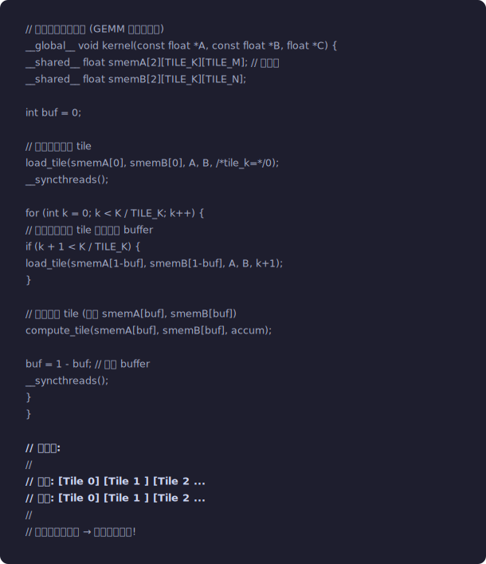
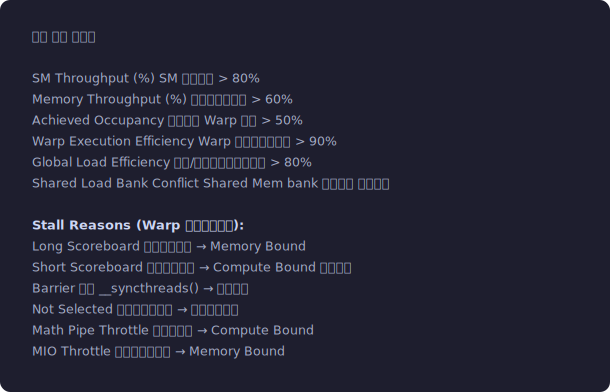
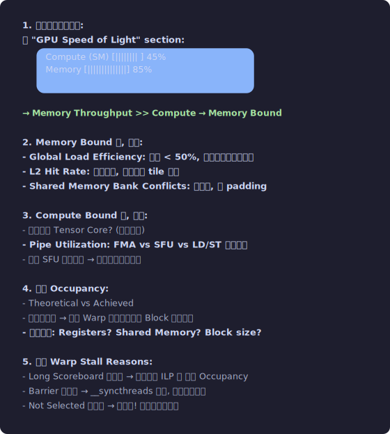
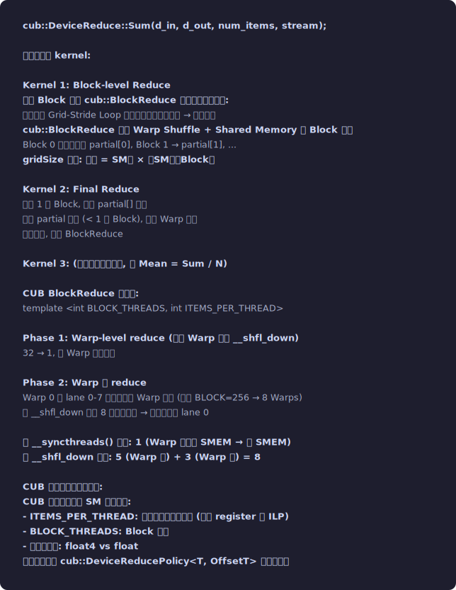

# 第八章：高级优化技术 — 从 80% 到 95% 硬件效率

**难度**: ⭐⭐⭐ 专家
**前置知识**: 第1-7章全部; 至少写过一个优化到 60%+ 带宽利用率的 kernel
**读完你能做什么**: 使用 ILP、双缓冲、持久化内核、量化算子等高级技术; 设计 Multi-GPU 算子
**配套代码**: 无 (本章是方法论, 建议在自己的项目中实践)
**新手建议**: 8.1 (ILP) 和 8.2 (算子融合) 对所有水平的开发者都有价值。其余章节在你遇到具体瓶颈时再读

> **本章首次出现的术语**:
> - **ILP (Instruction-Level Parallelism, 指令级并行)**: 同一个线程的多条独立指令可以
>   同时在流水线中执行。通过增加独立指令，减少流水线空闲
> - **双缓冲 (Double Buffering)**: 用两块 Shared Memory 轮流使用——
>   一块正在被计算使用，另一块同时从显存加载新数据 → 计算和加载重叠
> - **持久化内核 (Persistent Kernel)**: 一个 kernel 启动后不退出，内部循环领取任务 →
>   消除反复 launch 的开销
> - **量化 (Quantization)**: 用更少的 bit 表示数据 (如 FP16→INT8→INT4) →
>   减少显存占用和传输量，常用于推理加速
> - **Warp 特化 (Warp Specialization)**: 不同 Warp 执行不同任务——
>   部分 Warp 专门搬数据，部分 Warp 专门做计算
> - **AllReduce**: 分布式训练的核心通信操作——所有 GPU 各出一份梯度，汇总后每人都拿到总和

## 8.1 指令级并行 (ILP: Instruction-Level Parallelism)

### 问题: 指令间的数据依赖

```
考虑这段代码:
  float a = x[i];       // LDG: ~400 cycles 延迟
  float b = a * 2.0f;   // 必须等 a 加载完成才能执行!
  float c = b + 1.0f;   // 必须等 b 计算完成!
  → 严重的串行依赖链

如果 SM 上没有足够多的其他 Warp 可以切换, 执行单元就空闲了。
```

### 解决: 增加独立指令

```cuda
// 低 ILP: 串行依赖链
float a0 = input[idx];
float b0 = a0 * scale;
float c0 = b0 + bias;
output[idx] = c0;
// 每条指令都依赖上一条 → GPU 做不了任何重叠

// 高 ILP: 多条独立的加载
float a0 = input[idx];           // LDG #1 → 发射, 不等完成
float a1 = input[idx + stride];  // LDG #2 → 立即发射 (不依赖 a0!)
float a2 = input[idx + stride*2]; // LDG #3
float a3 = input[idx + stride*3]; // LDG #4

// 现在 4 条加载都在飞行中, 等它们回来的时候:
float b0 = a0 * scale;  // a0 可能已经回来了 (400 cycles 可以发很多指令)
float b1 = a1 * scale;
float b2 = a2 * scale;
float b3 = a3 * scale;

output[idx]            = b0 + bias;
output[idx + stride]   = b1 + bias;
output[idx + stride*2] = b2 + bias;
output[idx + stride*3] = b3 + bias;
```

### ILP 的量化分析

```
假设:
  FP32 FMA 延迟 = 4 cycles
  LDG 延迟 = 400 cycles
  Warp Scheduler 每周期发射 1 条指令

无 ILP (纯串行依赖):
  LDG → 等 400 cycles → FMA → 等 4 cycles → STG
  → 每个元素 ~404 cycles

有 ILP (4路展开):
  LDG×4 → 4 cycles 发射完所有加载
  → 等待期间发射其他 Warp 的指令 (TLP)
  → 400 cycles 后, 4 个数据都回来了
  → FMA×4 → STG×4
  → 每个元素 ~100 cycles (理想情况)

ILP + TLP 结合 = GPU 延迟隐藏的完整机制:
- ILP: 同一个 Warp 内的独立指令可以填充流水线
- TLP: 不同 Warp 间的切换隐藏长延迟

当 Occupancy 不高时, ILP 尤其重要!
低 Occupancy = 少 Warp = 少 TLP → 需要更多 ILP 来补偿
```

### 编译器的循环展开 (#pragma unroll)

```cuda
// 编译器不知道 N 的大小, 默认不展开:
for (int k = 0; k < N; k++) {
    sum += A[k] * B[k];
}

// 告诉编译器展开:
#pragma unroll 4  // 展开 4 次
for (int k = 0; k < N; k++) {
    sum += A[k] * B[k];
}
// 编译后类似:
// sum += A[k] * B[k];
// sum += A[k+1] * B[k+1];
// sum += A[k+2] * B[k+2];
// sum += A[k+3] * B[k+3];
// k += 4;

// 完全展开 (N 必须是编译时常量):
#pragma unroll
for (int k = 0; k < 16; k++) {  // 16 是编译时常量
    sum += A[k] * B[k];
}
// 编译器将 16 条 FMA 完全展开, 无循环开销

// 注意: 过度展开 → 寄存器压力增大 → 可能 spilling → 反而变慢
```


## 8.2 算子融合 (Kernel Fusion)

> **动手实验**: 运行 `10_fused_kernel/fused_kernel.cu` 亲眼看到融合的威力!
> ```bash
> cd 10_fused_kernel && nvcc -O2 -arch=sm_70 -o fused_kernel fused_kernel.cu && ./fused_kernel
> ```
> 对比 3 个独立 kernel vs 1 个融合 kernel vs 融合+向量化。
> 你会看到: 融合版的有效带宽接近显存峰值，未融合版只有 1/3。

### 为什么融合如此重要

```
以 Transformer 中常见的操作序列为例:

未融合 (每个操作一个 kernel):
  1. MatMul:    QK^T          → 写 [N,N] 到 HBM         16MB
  2. Scale:     /√d           → 读+写 [N,N] from/to HBM  32MB
  3. Mask:      + mask        → 读+写 [N,N]              32MB
  4. Softmax:   行级 softmax  → 读+写 [N,N]              32MB
  5. Dropout:   随机 mask     → 读+写 [N,N]              32MB
  6. MatMul:    × V           → 读 [N,N]+[N,d], 写 [N,d] 20MB
  总 HBM 访问: ~164 MB

融合后 (FlashAttention):
  1 个 kernel:
    QK^T → scale → mask → softmax → dropout → ×V
    全部在 Shared Memory / 寄存器中完成
  HBM 访问: 读 Q,K,V + 写 O ≈ 8MB
  → 减少 ~20× 的 HBM 访问!
```

### 融合的类型

```
1. Elementwise 融合 (最简单):
   y = relu(batchnorm(conv(x)))
   → 3 个 elementwise 操作合成 1 个 kernel
   
2. Reduce + Elementwise 融合:
   LayerNorm = reduce(计算统计) + elementwise(归一化)
   → 1 个 kernel
   
3. GEMM + Epilogue 融合:
   y = relu(bias + matmul(x, w))
   → GEMM kernel 在写回时顺便做 bias+relu
   cuBLAS/CUTLASS 支持这种 "epilogue fusion"

4. 跨算子融合 (最复杂):
   FlashAttention 融合了 GEMM+Softmax+GEMM
   需要特殊的算法设计 (Online Softmax)
```

### PyTorch 中的融合方式

```python
# 方式 1: torch.compile (PyTorch 2.0+)
@torch.compile
def fused_gelu_dropout(x, p=0.1):
    return F.dropout(F.gelu(x), p=p)
# torch.compile 自动融合 gelu + dropout

# 方式 2: 手写 CUDA Extension (最灵活)
# 见第4课代码示例

# 方式 3: Triton (Python 写 GPU kernel)
import triton
import triton.language as tl

@triton.jit
def fused_kernel(x_ptr, y_ptr, n, BLOCK: tl.constexpr):
    pid = tl.program_id(0)
    offsets = pid * BLOCK + tl.arange(0, BLOCK)
    mask = offsets < n
    x = tl.load(x_ptr + offsets, mask=mask)
    y = tl.where(x > 0, x, 0.5 * x * (1 + tl.math.tanh(x)))  # 近似 GELU
    tl.store(y_ptr + offsets, y, mask=mask)
```


## 8.3 数据预取 (Software Prefetching)

### 全局内存预取

```cuda
// 手动预取: 在需要数据之前发起加载, 用其他计算填充等待时间
__global__ void kernel(float *data, float *output, int N) {
    int idx = blockIdx.x * blockDim.x + threadIdx.x;
    int stride = blockDim.x * gridDim.x;
    
    // 预取第一批数据
    float next_val = data[idx];
    
    for (int i = idx; i < N - stride; i += stride) {
        float curr_val = next_val;
        next_val = data[i + stride];  // 预取下一批 (和 curr 的计算重叠)
        
        float result = expensive_compute(curr_val);
        output[i] = result;
    }
    // 处理最后一批
    output[N - stride + idx] = expensive_compute(next_val);
}
```

### Shared Memory 双缓冲预取

```cuda
// 经典的双缓冲模式 (GEMM 中广泛使用)
__global__ void kernel(const float *A, const float *B, float *C) {
    __shared__ float smemA[2][TILE_K][TILE_M];  // 双缓冲
    __shared__ float smemB[2][TILE_K][TILE_N];
    
    int buf = 0;
    
    // 预加载第一个 tile
    load_tile(smemA[0], smemB[0], A, B, /*tile_k=*/0);
    __syncthreads();
    
    for (int k = 0; k < K / TILE_K; k++) {
        // 预加载下一个 tile 到另一个 buffer
        if (k + 1 < K / TILE_K) {
            load_tile(smemA[1-buf], smemB[1-buf], A, B, k+1);
        }
        
        // 计算当前 tile (使用 smemA[buf], smemB[buf])
        compute_tile(smemA[buf], smemB[buf], accum);
        
        buf = 1 - buf;  // 切换 buffer
        __syncthreads();
    }
}

// 时间线:
// ─────────────────────────────────────────────────
// 加载: [Tile 0] [Tile 1            ] [Tile 2    ...
// 计算:          [Tile 0] [Tile 1   ] [Tile 2    ...
// ─────────────────────────────────────────────────
// 加载和计算重叠 → 隐藏内存延迟!
```
<p align="center"></p>


### cp.async 多阶段流水线 (Ampere+)

```cuda
// 3 阶段流水线 (比双缓冲更深)
// 需要 3 个 Shared Memory buffer
__shared__ float smem[3][TILE_SIZE];

// Stage 0, 1: 预加载前两个 tile
cp_async_load(smem[0], global_data, tile_0);
cp_async_commit();
cp_async_load(smem[1], global_data, tile_1);
cp_async_commit();

for (int i = 0; i < num_tiles; i++) {
    int compute_buf = i % 3;
    int load_buf = (i + 2) % 3;
    
    // 预加载 tile i+2
    if (i + 2 < num_tiles) {
        cp_async_load(smem[load_buf], global_data, tile_{i+2});
        cp_async_commit();
    }
    
    // 等待 tile i 加载完成
    cp_async_wait(2);  // 等待除最新 2 批外的所有拷贝
    __syncthreads();
    
    // 计算 tile i
    compute(smem[compute_buf]);
    __syncthreads();
}
```


## 8.4 编译器优化指导

### 常用编译选项

```bash
# 指定目标架构 (必须匹配你的 GPU!)
nvcc -arch=sm_80 ...       # A100
nvcc -arch=sm_89 ...       # RTX 4090
nvcc -arch=sm_90 ...       # H100

# 多架构编译 (fat binary, 体积大但兼容多种 GPU)
nvcc -gencode arch=compute_80,code=sm_80 \
     -gencode arch=compute_89,code=sm_89 ...

# 优化级别
nvcc -O0 ...   # 无优化 (调试用)
nvcc -O2 ...   # 默认优化
nvcc -O3 ...   # 激进优化 (通常和 O2 差别不大)

# 查看寄存器和 shared memory 使用
nvcc --ptxas-options=-v ...

# 使用快速数学
nvcc --use_fast_math ...
# 等价于: --ftz=true --prec-div=false --prec-sqrt=false --fmad=true
# 精度: 牺牲约 1-2 ULP 的精度换取速度
# 注意: __expf(), __logf() 等本身就是快速版本

# 生成 line info (用于 profiler)
nvcc -lineinfo ...
```

### __restrict__ 和 const — 帮助编译器优化

```cuda
// 没有 __restrict__:
__global__ void kernel(float *a, float *b, float *c) {
    c[i] = a[i] + b[i];
    c[j] = a[j] + b[j];
    // 编译器不确定 c 和 a/b 是否有重叠 (aliasing)
    // 不敢优化: 写 c[i] 后必须重新加载 a[j] (可能被修改了)
}

// 有 __restrict__:
__global__ void kernel(float * __restrict__ a, 
                       float * __restrict__ b, 
                       float * __restrict__ c) {
    c[i] = a[i] + b[i];
    c[j] = a[j] + b[j];
    // 编译器知道 a, b, c 不重叠
    // 可以放心: a[j] 在写 c[i] 后不会变
    // → 可以提前加载 a[j] (ILP 优化)
    // → 可以走只读缓存路径 (LDG vs LD)
}
```

### 内联 PTX — 极端优化手段

```cuda
// 有时需要直接插入 PTX 指令来访问编译器无法生成的特殊指令

// 例: 读取时钟计数器 (用于 kernel 内部计时)
__device__ uint64_t clock64_device() {
    uint64_t clock;
    asm volatile("mov.u64 %0, %%clock64;" : "=l"(clock));
    return clock;
}

// 例: 强制使用 LDG (只读全局加载)
__device__ float ldg(const float *ptr) {
    float val;
    asm volatile("ld.global.nc.f32 %0, [%1];" : "=f"(val) : "l"(ptr));
    return val;
}

// 例: 线程屏障提示 (nanosleep, 减少忙等功耗)
asm volatile("nanosleep.u32 %0;" :: "r"(100));  // 睡 100 ns
```


## 8.5 Nsight Compute 实战 — 性能分析工具箱

### 关键指标速查表

```
指标                          含义                     健康值
───────────────────          ──────────────           ───────
SM Throughput (%)            SM 忙碌比例              > 80%
Memory Throughput (%)        显存带宽利用率            > 60%
Achieved Occupancy           实际活跃 Warp 比例        > 50%
Warp Execution Efficiency    Warp 中有效线程比例       > 90%
Global Load Efficiency       有效/实际全局加载字节比   > 80%
Shared Load Bank Conflict    Shared Mem bank 冲突次数 越少越好

Stall Reasons (Warp 停顿原因分布):
  Long Scoreboard            等待全局内存 → Memory Bound
  Short Scoreboard           等待计算完成 → Compute Bound 或依赖链
  Barrier                    等待 __syncthreads() → 同步开销
  Not Selected               就绪但没被选中 → 有充足并行度
  Math Pipe Throttle         计算管道满 → Compute Bound
  MIO Throttle               内存指令队列满 → Memory Bound
```
<p align="center"></p>


### 常用 ncu 命令

```bash
# 快速概览
ncu --set basic ./my_program

# 完整分析 (生成报告文件)
ncu --set full -o profile_report ./my_program

# 只分析特定 kernel
ncu --kernel-name "my_kernel" --set full ./my_program

# 查看 source 级别的信息 (需要 -lineinfo 编译)
ncu --set source -o src_report ./my_program

# 对比两次运行
ncu-ui profile_before.ncu-rep profile_after.ncu-rep
```

### 分析流程

```
1. 首先确定瓶颈类型:
   看 "GPU Speed of Light" section:
   ┌────────────────────────────────────┐
   │ Compute (SM) [||||||||    ] 45%    │
   │ Memory       [||||||||||||||] 85%  │
   └────────────────────────────────────┘
   → Memory Throughput >> Compute → Memory Bound
   
2. Memory Bound 时, 查看:
   - Global Load Efficiency: 如果 < 50%, 有严重的不合并访问
   - L2 Hit Rate: 如果很低, 考虑调整 tile 大小
   - Shared Memory Bank Conflicts: 如果高, 加 padding
   
3. Compute Bound 时, 查看:
   - 是否用了 Tensor Core? (对矩阵乘)
   - Pipe Utilization: FMA vs SFU vs LD/ST 的利用率
   - 如果 SFU 利用率高 → 优化超越函数调用
   
4. 查看 Occupancy:
   - Theoretical vs Achieved
   - 如果差距大 → 有些 Warp 提前结束或者 Block 分配不均
   - 限制因素: Registers? Shared Memory? Block size?
   
5. 查看 Warp Stall Reasons:
   - Long Scoreboard 占主导 → 需要更多 ILP 或 更高 Occupancy
   - Barrier 占主导 → __syncthreads 太多, 考虑减少同步
   - Not Selected 占主导 → 好消息! 说明并行度足够
```
<p align="center"></p>


## 8.6 性能优化清单 (Checklist)

```
□ 基础检查:
  □ 合并内存访问? (同一 Warp 连续地址)
  □ 向量化加载? (float4/int4)
  □ __restrict__ / const 修饰?
  □ 合理的 blockSize? (128/256)

□ Shared Memory:
  □ 是否有数据复用可以放 Shared Memory?
  □ Bank Conflict 检查和修复 (padding/swizzle)
  □ 动态 Shared Memory 大小配置

□ 寄存器:
  □ Register spilling 检查 (--ptxas-options=-v)
  □ __launch_bounds__ 设置
  □ 减少同时活跃变量

□ 并行度:
  □ Occupancy 是否足够? (CUDA Occupancy Calculator)
  □ ILP: 循环展开, 独立加载
  □ Grid-Stride Loop

□ 算法优化:
  □ 能否融合多个 kernel?
  □ 在线算法 (如 Online Softmax) 减少遍历次数?
  □ 双缓冲/多阶段流水线?
  □ 是否可以用 Tensor Core?

□ 数值精度:
  □ 数值稳定性 (减 max, Kahan 求和)
  □ 混合精度: FP16 计算 + FP32 累加
  □ 中间结果精度检查

□ 高级:
  □ L2 Residency Control (热点数据)
  □ CUDA Graph (减少 launch 开销)
  □ cp.async (Ampere+ 异步拷贝)
  □ 跨 Block 通信 (Cooperative Groups / Cluster)
```


## 8.7 持久化内核 (Persistent Kernels)

### 传统 Kernel vs 持久化 Kernel

```
传统模式:
  每个 kernel launch 处理一个任务, 结束后资源释放, 下一个 kernel 再分配。
  
  问题 1: kernel launch 开销 (~5-10 μs) 在小任务中占比大
  问题 2: 每次 launch 都要重新分配 Block 到 SM → 无法保持状态
  
持久化模式:
  启动一个 kernel, 它包含一个无限循环 (或长循环)。
  Block 分配到 SM 后不释放, 持续从全局队列中领取工作。
  
  gridDim = SM 数量 × 每 SM 的 Block 数 (刚好填满 GPU)
  kernel 内部:
    while (有工作) {
        从全局任务队列取任务 (原子操作)
        处理任务
        写回结果
    }
```

### 实现细节

```cuda
__device__ int task_counter = 0;  // 全局任务计数器

__global__ void persistent_kernel(
    float **task_inputs, float **task_outputs, int *task_sizes, int num_tasks) {
    
    // 每个 Block 循环领取任务
    while (true) {
        __shared__ int my_task;
        if (threadIdx.x == 0) {
            my_task = atomicAdd(&task_counter, 1);
        }
        __syncthreads();
        
        if (my_task >= num_tasks) break;  // 所有任务完成
        
        // 处理当前任务
        float *input = task_inputs[my_task];
        float *output = task_outputs[my_task];
        int n = task_sizes[my_task];
        
        process_one_task(input, output, n);
        __syncthreads();
    }
}

// 适用场景:
// 1. 大量小任务 (如 batched small GEMM)
// 2. 任务大小不均匀 (动态负载均衡)
// 3. 需要保持 SM 上的状态 (如 Shared Memory 中的查找表)
//
// FlashAttention 使用了持久化 kernel 的思想:
//   一个 Block 处理多个 Q 的行, 循环处理 K/V 的块
```

### Split-K GEMM 与持久化

```
标准 GEMM: 每个 Block 沿 K 维度完整累加
  如果 M, N 很小但 K 很大 → Block 数少 → SM 利用率低

Split-K: 将 K 分成多份, 多个 Block 并行累加同一个 C tile
  1. 每个 Block 累加 K 的一部分
  2. 用原子操作或额外的 reduce kernel 合并部分结果
  
  持久化版本:
    每个 Block 从 K 的不同起点开始
    处理完自己的份额后, 领取下一个 C tile
    → 完美的负载均衡
```


## 8.8 量化算子优化 (INT8/INT4/FP8)

### 量化的数学基础

```
对称量化 (Symmetric Quantization):
  x_q = round(x / scale)
  x_dequant = x_q × scale
  scale = max(|x|) / (2^(bits-1) - 1)
  
  INT8: scale = max(|x|) / 127
  INT4: scale = max(|x|) / 7

非对称量化 (Asymmetric Quantization):
  x_q = round((x - zero_point) / scale)
  x_dequant = x_q × scale + zero_point
  scale = (max(x) - min(x)) / (2^bits - 1)
  zero_point = round(-min(x) / scale)

Per-Tensor vs Per-Channel vs Per-Group:
  Per-Tensor: 整个张量一个 scale → 精度最差, 最快
  Per-Channel: 每个输出通道一个 scale → 精度好, 适合权重
  Per-Group: 每 G 个元素一个 scale → 精度最好, 如 GPTQ (G=128)
```

### INT8 GEMM 的实现

```cuda
// INT8 矩阵乘法: C_fp32 = A_int8 × B_int8 × scale_A × scale_B

// Tensor Core 直接支持:
// mma.sync.aligned.m16n8k32.row.col.s32.s8.s8.s32
//   A: int8, B: int8, C/D: int32 累加器

// 流程:
// 1. 量化: FP16 权重 → INT8 (离线, 一次性)
// 2. 量化: FP16 激活 → INT8 (在线, 每次推理)
//    scale_act = max(|activation|) / 127
//    act_int8 = round(activation / scale_act)
// 3. INT8 GEMM (Tensor Core)
//    result_int32 = act_int8 × weight_int8
// 4. 反量化: result_fp16 = result_int32 × scale_act × scale_weight

// 性能:
//   INT8 Tensor Core: 624 TOPS (A100) vs FP16: 312 TFLOPS
//   → 理论 2× 加速!
//   实际: 1.5-1.8× (反量化开销 + 内存带宽同时节省)
```

### Weight-Only Quantization (W4A16)

```
最流行的 LLM 推理量化方案:
  权重: INT4 (每个权重只占 4 bit)
  激活: FP16 (保持全精度)
  
  为什么这样有效?
  LLM 推理的瓶颈是内存带宽 (需要加载巨大的权重矩阵):
    LLaMA-70B 权重: ~140GB (FP16) → 68次传输才能 batch=1 推理一个 token
    INT4 量化后: ~35GB → 17次传输
    → 内存带宽节省 4×
  
  计算过程:
  1. 从显存加载 INT4 权重 (紧凑存储: 2 个 INT4 打包在 1 个 byte)
  2. 在 kernel 内反量化: INT4 → FP16
  3. FP16 矩阵乘 (Tensor Core)
  
  反量化是 "免费" 的:
    因为瓶颈在内存带宽, 计算单元本来就在等数据
    反量化的计算可以和加载下一批数据重叠

GPTQ / AWQ / GGML 等量化方法的 kernel 都是这个模式:
  加载 INT4 → 解包 → 反量化 → FP16 MMA
```


## 8.9 Warp 特化 (Warp Specialization)

### 概念

```
传统模式: 所有 Warp 执行相同的代码路径
  每个 Warp: 加载 → 计算 → 存储 → 加载 → 计算 → 存储

Warp 特化: 不同 Warp 执行不同的代码路径
  Producer Warp: 加载 → 加载 → 加载 → ... (专门做数据搬运)
  Consumer Warp: 计算 → 计算 → 计算 → ... (专门做计算)
  
  通过 Shared Memory + Barrier 通信

好处:
  1. 寄存器分配更高效: Producer 不需要计算用的寄存器
  2. 指令缓存更友好: 两种 Warp 的代码路径更短
  3. 更好的流水线利用: 专做一件事 → 更少的 pipeline bubble
```

### 手动实现 Warp 特化

```cuda
__global__ void warp_specialized_kernel(
    const float *input, float *output, int n) {
    
    __shared__ float smem[2][TILE_SIZE];  // 双缓冲
    __shared__ int ready[2];               // 信号量
    
    int warp_id = threadIdx.x / 32;
    int lane = threadIdx.x % 32;
    
    if (warp_id == 0) {
        // ===== Producer Warp: 专门负责加载 =====
        for (int tile = 0; tile < num_tiles; tile++) {
            int buf = tile % 2;
            
            // 等待 Consumer 消费完上一轮的 buf
            if (tile >= 2) {
                while (atomicAdd(&ready[buf], 0) != 0) {}  // 忙等
            }
            
            // 加载数据到 Shared Memory
            for (int i = lane; i < TILE_SIZE; i += 32) {
                smem[buf][i] = input[tile * TILE_SIZE + i];
            }
            __threadfence_block();
            
            // 通知 Consumer 数据就绪
            if (lane == 0) atomicExch(&ready[buf], 1);
        }
    } else {
        // ===== Consumer Warps: 专门负责计算 =====
        for (int tile = 0; tile < num_tiles; tile++) {
            int buf = tile % 2;
            
            // 等待 Producer 加载完成
            while (atomicAdd(&ready[buf], 0) != 1) {}
            
            // 计算
            for (int i = lane; i < TILE_SIZE; i += 32 * (blockDim.x/32 - 1)) {
                float val = smem[buf][i];
                output[tile * TILE_SIZE + i] = expensive_compute(val);
            }
            __threadfence_block();
            
            // 通知 Producer 可以覆写
            if (lane == 0 && warp_id == 1) atomicExch(&ready[buf], 0);
        }
    }
}

// 注意: 上面是简化示例。实际中用 cuda::barrier (Hopper) 或
// Cooperative Groups 的 barrier 来做更高效的同步。
```

### Hopper 的硬件支持

```
Hopper 为 Warp 特化提供了硬件级支持:

1. TMA (Tensor Memory Accelerator):
   Producer Warp 只需发一条 TMA 指令, 硬件完成整个 tile 的搬运
   → Producer Warp 几乎不消耗调度器资源

2. Async Barrier (mbarrier):
   硬件屏障, 支持异步到达/等待
   比软件 atomicExch 的忙等快得多

3. Shared Memory 的直接访问 (Cluster):
   同一 Cluster 内的 Block 可以直接读写彼此的 Shared Memory
   → Producer Block 可以加载数据到其他 Block 的 SMEM

4. WGMMA:
   直接从 Shared Memory 执行矩阵乘 (B 矩阵)
   Consumer Warp 不需要 ldmatrix 来搬 B → 节省指令和寄存器
```


## 8.10 Thread Block Cluster (Hopper)

### 新的线程层级

```
传统层级:
  Grid → Block → Warp → Thread

Hopper 新增 Cluster:
  Grid → Cluster → Block → Warp → Thread

Cluster: 2-16 个相邻 Block 的组合
  - 保证被调度到物理上相邻的 SM
  - 可以直接访问彼此的 Shared Memory (Distributed Shared Memory)
  - 有 Cluster 级同步: cluster.sync()

声明:
__global__ void __cluster_dims__(2, 1, 1)  // 2×1×1 = 2 个 Block 为一个 Cluster
kernel(args) {
    namespace cg = cooperative_groups;
    cg::cluster_group cluster = cg::this_cluster();
    
    // 直接读取其他 Block 的 Shared Memory!
    int other_block_rank = 1 - cluster.block_rank();
    float *other_smem = cluster.map_shared_rank(my_smem, other_block_rank);
    float val = other_smem[threadIdx.x];  // 跨 Block 读!
    
    cluster.sync();  // Cluster 级同步
}
```

### Distributed Shared Memory 的意义

```
传统: 每个 Block 最多 ~228KB Shared Memory (Hopper)
      如果算法需要更大的片上缓存 → 只能依赖 L2

Cluster: 16 个 Block 的 DSMEM = 16 × 228KB ≈ 3.6MB 片上存储!
         这比 L2 Cache 更快 (DSMEM ~5-10 cycles vs L2 ~200 cycles)

应用: FlashAttention-3 利用 Cluster 让多个 Block 共享 K/V 数据
      不需要每个 Block 各自加载一份 K/V → 减少全局内存访问
```


## 8.11 CUB — NVIDIA 的设备级原语库内部原理

### CUB DeviceReduce 的实际实现

```
cub::DeviceReduce::Sum(d_in, d_out, num_items, stream);

内部分三个 kernel:

Kernel 1: Block-level Reduce
  每个 Block 使用 cub::BlockReduce 归约一段连续数据:
  ├── 每线程用 Grid-Stride Loop 加载多个元素到寄存器 → 局部累加
  ├── cub::BlockReduce 使用 Warp Shuffle + Shared Memory 做 Block 归约
  ├── Block 0 的结果写到 partial[0], Block 1 → partial[1], ...
  └── gridSize 选择: 通常 = SM数 × 每SM活跃Block数

Kernel 2: Final Reduce
  只有 1 个 Block, 归约 partial[] 数组
  如果 partial 很小 (< 1 个 Block), 直接 Warp 归约
  如果较大, 再用 BlockReduce

Kernel 3: (如果输出需要变换, 如 Mean = Sum / N)

CUB BlockReduce 的内部:
  template <int BLOCK_THREADS, int ITEMS_PER_THREAD>
  
  Phase 1: Warp-level reduce (每个 Warp 内用 __shfl_down)
    32 → 1, 每 Warp 一个结果
  
  Phase 2: Warp 间 reduce
    Warp 0 的 lane 0-7 各持有一个 Warp 结果 (假设 BLOCK=256 → 8 Warps)
    用 __shfl_down 在这 8 个值中归约 → 最终结果在 lane 0
  
  总 __syncthreads() 次数: 1 (Warp 结果写 SMEM → 读 SMEM)
  总 __shfl_down 次数: 5 (Warp 内) + 3 (Warp 间) = 8

CUB 选择参数的自动调优:
  CUB 在编译时根据 SM 架构选择:
  - ITEMS_PER_THREAD: 每线程处理几个元素 (影响 register 和 ILP)
  - BLOCK_THREADS: Block 大小
  - 向量化宽度: float4 vs float
  这些参数存在 cub::DeviceReducePolicy<T, OffsetT> 的特化中。
```
<p align="center"></p>


### CUB DeviceScan 的三遍策略

```
Inclusive Prefix Sum: output[i] = sum(input[0..i])

三个阶段:

Phase 1: Block-level Scan + Save Block Aggregates
  每个 Block 独立做 Blelloch Scan
  同时保存 Block 的总和到 block_aggregates[]
  
Phase 2: Scan of Block Aggregates
  对 block_aggregates[] 做 Prefix Scan
  结果: block_prefixes[b] = sum of all blocks before b
  
Phase 3: Final Adjustment
  每个 Block 将 block_prefixes[b] 加到自己的所有元素上

Decoupled Lookback (CUB 的创新优化):
  传统三遍方法需要 3 个 kernel launch。
  Decoupled Lookback 用 1 个 kernel + 原子操作实现:
  
  每个 Block 维护一个状态 (用原子操作发布):
  enum { INVALID, PARTIAL, PREFIX };
  
  Block b 完成本地 Scan 后:
  1. 发布 PARTIAL 状态 + 本地 aggregate
  2. 向前回溯: 检查 Block b-1 的状态
     - 如果 b-1 是 PREFIX → 直接得到前缀和 → 发布自己的 PREFIX
     - 如果 b-1 是 PARTIAL → 累加 b-1 的 aggregate, 继续查 b-2
     - 如果 b-1 是 INVALID → 忙等
  3. 得到前缀后, 调整本地元素并发布 PREFIX
  
  → 只需 1 个 kernel! 平均 lookback 距离很短 (~几个 Block)
  → 但最坏情况 Block 0 一直没完成 → 所有 Block 都在等 → 串行化
  → 实际中因为 Block 几乎同时执行, lookback 很少超过 2-3 步
```


## 8.12 Multi-GPU 算子设计

### AllReduce 的环形实现

```
8 个 GPU, 每个有一份梯度 g[i], 需要得到 sum(g[0..7])。

Ring AllReduce (NCCL 的核心算法之一):

Phase 1: Reduce-Scatter (每个 GPU 负责求总和的 1/8)
  将梯度切成 8 块: chunk[0..7]
  
  Step 0: GPU0 → GPU1: chunk[0]
          GPU1 → GPU2: chunk[1]
          ...
  Step 1: GPU1 收到 GPU0 的 chunk[0], 和自己的 chunk[0] 相加
          GPU1 → GPU2: 部分和 of chunk[0]
          ...
  经过 7 步后: GPU0 持有 chunk[7] 的全局和
               GPU1 持有 chunk[0] 的全局和
               ...

Phase 2: All-Gather (广播各自的 1/8 给所有人)
  Step 0: GPU0 → GPU1: sum of chunk[7]
          GPU1 → GPU2: sum of chunk[0]
          ...
  经过 7 步后: 每个 GPU 都有完整的 sum(g[0..7])

通信量: 每个 GPU 发送 2 × (N-1)/N × data_size ≈ 2 × data_size
  (其中 N=GPU 数量, 当 N 大时接近 2×)
  
  带宽利用率: 2 × data_size / (2 × (N-1) × step_time)
  Ring AllReduce 是带宽最优的!
  
NCCL 的实际实现:
  使用 kernel 内的 DMA (通过 NVLink) 直接搬运数据
  多个 Ring 并行使用多条 NVLink
  Tree AllReduce: 对延迟更优 (log N 步), 对带宽稍差
  NCCL 自动选择 Ring/Tree/其他算法
```

### Tensor Parallel 的通信算子

```
Tensor Parallelism 将一个大矩阵切分到多个 GPU:

Column Parallel Linear:
  权重 W 按列切分: W = [W0, W1, ..., W7]  (8 GPU)
  每个 GPU: Y_i = X × W_i  (独立 GEMM, 无通信)
  最终: Y = [Y0, Y1, ..., Y7]
  
  前向: 无通信 (或一次 AllGather)
  反向: 一次 ReduceScatter

Row Parallel Linear:
  权重 W 按行切分: W = [W0; W1; ...; W7]
  输入 X 按列切分: X = [X0, X1, ..., X7]
  每个 GPU: Y_partial_i = X_i × W_i
  最终: Y = sum(Y_partial_i)  → 一次 AllReduce

通信开销:
  AllReduce (d_model × batch): 对于 d=12288, batch=2048, FP16:
    数据量 = 12288 × 2048 × 2 = 48MB
    NVLink 600 GB/s → ~80 μs
    GEMM 计算时间 (12288² × 2048): ~几 ms
    → 通信/计算比 ~1-3% → 可接受
    
  当 batch 很小 (推理, batch=1):
    数据量 = 12288 × 1 × 2 = 24KB
    NVLink 延迟 ~5 μs (小消息 latency dominant)
    GEMM 时间 ~几十 μs
    → 通信/计算比 ~10-30% → 显著!
    → 需要通信/计算重叠 (Pipeline Parallelism)
```


## 8.13 本章总结

```
高级优化的核心原则:
  从宏观到微观: 算法优化 > 算子融合 > 内存优化 > 指令级优化

关键技术:
  ILP: 增加独立指令 → 填充流水线气泡
  融合: 多 kernel → 1 kernel → 减少中间 HBM 访问
  预取: 双缓冲/多阶段流水线 → 计算与加载重叠
  持久化内核: 1 次 launch + 循环领任务 → 减 launch 开销
  量化: INT8/INT4 → 减内存占用 + 利用 L2 + 提高有效带宽
  Warp 特化: Producer/Consumer → 寄存器/指令更高效利用
  Cluster: Hopper DSMEM → 跨 Block 共享片上存储

CUB 内部:
  DeviceReduce: Block 归约 + 部分和归约 (2-3 kernel)
  DeviceScan: Decoupled Lookback (1 kernel, 原子操作协调)

Multi-GPU:
  Ring AllReduce: 带宽最优 (2× 数据量)
  Tensor Parallel: Column/Row Parallel, 通信/计算比随 batch 变化
```


## 8.14 Q&A

### Q: 什么时候用 Persistent Kernel? 有什么风险?

```
适用场景:
  1. 大量小任务 (如 batched small GEMM, N < 128)
  2. 任务大小不均匀 (动态负载均衡)
  3. 需要 SM 上保持状态 (如 K/V cache 常驻 SMEM)

风险:
  1. 资源独占: 持久化 kernel 占满所有 SM, 其他 kernel 无法执行
     → 不适合多任务并发场景
  2. 死锁风险: 如果任务队列的原子操作有 bug → 所有 Block 卡死
  3. 调试困难: 内部循环 + 原子操作 → 难以定位问题
  4. Tail 问题: 最后几个任务可能只有少数 Block 在工作

FlashAttention 的 "persistent" 比纯籹的持久化更安全:
它只是每个 Block 处理多个 Q 行 (通过简单的循环),
不涉及复杂的全局任务队列。
```

### Q: W4A16 量化既然反量化有计算开销, 为什么还能加速?

```
因为 LLM 推理是 Memory Bound!

batch=1 时, 每生成一个 token 需要加载整个模型的权重:
  LLaMA-70B FP16: ~140GB → HBM 2039 GB/s → ~69ms/token
  LLaMA-70B INT4: ~35GB  → HBM 2039 GB/s → ~17ms/token
  加速 ~4×!

反量化的开销:
  每个 INT4 → FP16 只需要 1 次乘法 + 1 次加法 (~2 FLOP)
  这些计算和下一批数据的加载重叠执行 (流水线)
  → 反量化几乎“免费”!

关键洞察: 当瓶颈是带宽而不是计算时,
减少数据量 (量化) 直接提升性能, 即使增加了一些计算。
```

### 概念辨析: "计算与通信重叠" 到底是什么重叠?

```
重叠的前提: 不同的硬件单元可以同时工作。

SM 内部:
  FP32 Core 做计算 的同时 LD/ST Unit 做内存访问
  → 计算和访存的指令可以同时执行 (不同执行单元)

SM 与 DMA:
  Compute Engine 跑 kernel 的同时 Copy Engine 做 cudaMemcpyAsync
  → 计算和数据传输的重叠 (不同硬件引擎)

GPU 与 GPU:
  GPU 0 做计算的同时 NVLink 传输梯度到 GPU 1
  → 计算和通信的重叠 (不同硬件引擎)

Kernel 内部 (最细粒度):
  双缓冲: 计算 tile[0] 的同时, cp.async 加载 tile[1]
  → 同一 SM 内的计算和内存请求重叠
  这就是流水线的本质: 不同阶段的不同数据同时处理

不能重叠的情况:
  同一 Warp 的下一条指令依赖上一条的结果 (数据依赖)
  → 必须等待 → 这就是为什么 ILP 重要 (找到独立指令填空)
```


## 8.15 CUDA Graph — 消除 Kernel Launch 开销

### 问题: Launch Overhead

```
每个 kernel launch 涉及:
  1. CPU 端: 参数打包、校验
  2. Driver: 构建 command buffer, 校验参数合法性
  3. Submit: 把命令提交到 GPU 的推送缓冲区
  4. GPU: 解析命令, 调度执行

单个 launch 开销: ~5-10μs (CPU 端)
如果你有 1000+ 个 kernel (如 100 层 × 10 个算子/层):
  → 10ms 的纯 launch 开销! (vs GPU 计算可能只需 5ms)

在推理中尤其严重:
  推理 batch=1, GPU 实际计算 ~2ms
  launch overhead ~10ms → 5× 的纯浪费!
```

### CUDA Graph 的工作原理

```
CUDA Graph 将一整个 GPU 操作序列"录制"成一张图,
然后整个图只需一次 launch。

录制模式:
  1. cudaStreamBeginCapture(stream);
  2. 执行所有 kernel / memcpy 操作 (和正常代码一样!)
  3. cudaStreamEndCapture(stream, &graph);
  4. cudaGraphInstantiate(&instance, graph);  // 编译/优化图
  5. cudaGraphLaunch(instance, stream);       // 单次 launch 执行整个图!

关键点:
  - 录制时, kernel 实际上不执行! cudaMemcpy 也是假的
  - CUDA 记录了所有操作及其依赖关系
  - Instantiate 时, 图被"编译"为优化后的执行计划
  - Launch 时, 整个图作为一个原子操作提交 → 只有 1 次 driver 开销!
```

### 代码示例

```cuda
// 场景: 推理 pipeline (100 层重复结构)
cudaGraph_t graph;
cudaGraphExec_t instance;

// Step 1: 开始录制
cudaStreamBeginCapture(stream, cudaStreamCaptureModeGlobal);

// Step 2: 正常写你的 kernel launch (像录制宏一样!)
for (int layer = 0; layer < 100; layer++) {
    layernorm_kernel<<<grid, block, 0, stream>>>(...);
    gemm_kernel<<<grid, block, 0, stream>>>(...);
    relu_kernel<<<grid, block, 0, stream>>>(...);
}

// Step 3: 结束录制 → 得到图
cudaStreamEndCapture(stream, &graph);

// Step 4: 实例化 (编译图)
cudaGraphInstantiate(&instance, graph, NULL, NULL, 0);

// Step 5: 每次推理只需一行!
for (int step = 0; step < 100000; step++) {
    update_inputs();  // 更新输入数据
    cudaGraphLaunch(instance, stream);  // 替代之前的 300 次 kernel launch!
}
cudaStreamSynchronize(stream);

// 清理
cudaGraphExecDestroy(instance);
cudaGraphDestroy(graph);
```

### Graph 的限制和适用场景

```
适用场景:
  ✓ 推理: 固定的计算图, 循环执行 → 完美匹配
  ✓ 训练: 固定的前向+反向+更新 → 可以录制整个 step
  ✓ 小 kernel: launch overhead 占比高 → 收益最大

不适用/限制:
  ✗ 动态 shape: 默认图要求固定参数。需要 graph update 或 conditional nodes
  ✗ 动态控制流: if/else 分支深度变化 → 需要 conditional graph nodes (Hopper+)
  ✗ Debugging: 图内 kernel 不能用 printf, 不能用 compute-sanitizer 直接调试
  ✗ 内存地址: 图内的指针必须是固定的。需要用 cudaGraphExecUpdate 更新地址

动态 shape 的解决方案:
  cudaGraphExecUpdate(instance, graph, &errorLog); // 更新图参数
  或者在 Hopper 上使用 conditional graph nodes
```

### 性能收益

```
典型推理场景 (100 层 BERT, batch=1):
  无 CUDA Graph: launch overhead ~8ms + 计算 ~5ms = 13ms/step
  有 CUDA Graph: launch overhead ~0.05ms + 计算 ~5ms = 5.05ms/step
  → 2.6× 加速!

训练场景 (整个 step):
  launch overhead ~2ms + 计算 ~100ms = 102ms/step
  有 CUDA Graph: ~0.05ms + 计算 ~100ms = 100.05ms/step
  → 1.02× 加速 (收益小于推理, 因为计算占比大)

PyTorch 中启用:
  model = torch.compile(model, mode="reduce-overhead")
  # 或:
  model = torch.compile(model, mode="max-autotune")
  # torch.compile 内部使用 CUDA Graph 做图级优化
```


## 8.16 Multi-GPU 与 NCCL — 跨 GPU 通信

### 为什么需要多 GPU

```
单个 GPU 的显存限制:
  A100 80GB: 最多放下 ~13B 参数的模型 (FP16, 不含优化器)
  Llama-70B: 需要 ~140GB (FP16) → 至少 2×A100
  GPT-175B: 需要 ~350GB → 至少 5×A100

多 GPU 不仅解决显存, 更重要的是并行计算:
  N 个 GPU → ~N× 计算吞吐 (受通信效率影响)
```

### 并行策略概览

```
数据并行 (Data Parallelism):
  每个 GPU 有一份完整模型, 处理不同的 batch 数据
  前向+反向独立, 只在权重更新时需要同步梯度
  通信: AllReduce 梯度 (N 个 GPU 各有一份梯度 → 求和 → 每人拿到总和)

张量并行 (Tensor Parallelism):
  把单个矩阵乘法 (如 4096×12288) 切分到多个 GPU
  每个 GPU 计算部分列/行, 然后通信合并
  通信: AllReduce 或 AllGather 激活值/梯度
  适合: 单个 GPU 放不下一层的情况

流水线并行 (Pipeline Parallelism):
  不同 GPU 负责不同层 (GPU0: layer 0-11, GPU1: layer 12-23, ...)
  像工厂流水线, micro-batch 在不同 GPU 间传递
  通信: 层间激活值的 P2P 传输

序列并行 (Sequence Parallelism):
  长序列的 N 维度切分到多个 GPU
  适合: 处理极长序列 (如 32K+ tokens)
```

### NCCL — NVIDIA Collective Communications Library

```
NCCL 是 NVIDIA 官方的高性能多 GPU 通信库。
它实现了常见的集合通信操作, 针对 NVLink / InfiniBand / PCIe 做了极致优化。

核心操作:
  AllReduce:    每个 GPU 有一个数组 → 所有人拿到总和
  AllGather:    每人有一块数据 → 所有人拿到拼接后的全部数据
  ReduceScatter:每人有一块数据 → 每人拿到不同的一块"部分和"
  Broadcast:    一个 GPU 把数据发给所有其他 GPU
  Reduce:       所有人送数据到 root GPU → root 拿到总和
  Send/Recv:    GPU 间点对点传输 (用于流水线并行)

Ring AllReduce (NCCL 的核心算法):
  假设 4 个 GPU, 每个有 N 个 float 的梯度:
  
  Step 1 - ReduceScatter (环形传递, 每步累积):
    GPU0: [g0, g1, g2, g3] → 累积 g0 部分
    GPU0 发 g1→GPU1, GPU1 把收到的和自己的 g1 累加
    ... 环形传递 N-1 步 → 每人拿到自己那份"完整部分和"
    通信量: (N-1)/N × data → 接近 1×

  Step 2 - AllGather (环形传回, 每步广播):
    每人把自己那份部分和传给下一个 GPU
    N-1 步后, 所有人拿到全部结果
    通信量: (N-1)/N × data

  Ring AllReduce 总通信量: 2 × (N-1)/N × data ≈ 2× data
  带宽利用率接近 100% (所有链路同时活跃!)
```

### NCCL 代码示例

```cuda
#include <nccl.h>

// 初始化
ncclComm_t comm;
ncclUniqueId id;
if (rank == 0) ncclGetUniqueId(&id);
MPI_Bcast(&id, sizeof(id), MPI_BYTE, 0, MPI_COMM_WORLD);
ncclCommInitRank(&comm, world_size, id, rank);

// AllReduce 梯度
float *d_grad;  // GPU 上的梯度
ncclAllReduce(d_grad, d_grad, N, ncclFloat, ncclSum, comm, stream);

// AllGather 激活值 (张量并行)
ncclAllGather(d_local_act, d_global_act, local_size, ncclFloat, comm, stream);

// 清理
ncclCommDestroy(comm);
```

### 通信与计算重叠

```
高效的多 GPU 训练必须重叠通信和计算:

传统 (串行):
  backward() → NCCL AllReduce → optimizer.step()

重叠 (并行):
  backward():
    layer_N.grad 算出 → 立即 ncclAllReduce(layer_N.grad) 异步
    layer_N-1.grad 算出 → 立即 ncclAllReduce(layer_N-1.grad) 异步
    ...
  optimizer.step()  # 此时所有梯度已经 AllReduce 完成!

关键:
  1. NCCL 操作在 GPU 的通信引擎上执行, 不占用 CUDA Core
  2. 计算 (backward) 和通信 (AllReduce) 天然在流水线中重叠
  3. 用 CUDA Stream 和 Event 精确控制依赖:
     计算 stream: backward_layer3, backward_layer2, ...
     通信 stream: AllReduce_layer3, AllReduce_layer2, ...
     Event 确保: 计算完成 → 通信才能开始 (数据依赖)
  
PyTorch DDP 默认使用这种重叠方式。
```

### 性能瓶颈和优化

```
通信占比 = T_通信 / (T_通信 + T_计算)

NVLink (A100): 600 GB/s per GPU
InfiniBand (HDR): 200 GB/s per GPU
PCIe 4.0 x16: ~32 GB/s per GPU

优化方向:
  1. Gradient Bucketing: 不等所有梯度, 攒够一批再 AllReduce
     → 减少小数据量的通信次数
  2. FP16/BF16 梯度: AllReduce 的数据量减半
  3. Tensor Fusion: 把相邻的小 tensor 合并成一个大的再通信
  4. SHARP (InfiniBand): 在网络交换机内部完成 reduce → 数据量减半
  5. NVSwitch: 全互联 NVLink → 所有 GPU 同时通信, 不受拓扑限制
```


## 8.17 练习题

配套代码在 [`theory/exercises/`](./exercises/) 目录下: [`ch08_ex1_ilp.cu`](./exercises/ch08_ex1_ilp.cu) / [`ch08_ex2_fusion.cu`](./exercises/ch08_ex2_fusion.cu)

### 练习 1: ILP 实验 [难度: ⭐⭐]

```
写两个版本的向量加法 kernel:

版本 A (无 ILP):
  float a = input[idx];
  float b = a * 2.0f;      // 依赖 a
  float c = b + 1.0f;      // 依赖 b
  output[idx] = c;

版本 B (有 ILP, 4路展开):
  float a0 = input[idx];
  float a1 = input[idx + stride];
  float a2 = input[idx + stride*2];
  float a3 = input[idx + stride*3];
  output[idx]            = a0 * 2.0f + 1.0f;
  output[idx + stride]   = a1 * 2.0f + 1.0f;
  output[idx + stride*2] = a2 * 2.0f + 1.0f;
  output[idx + stride*3] = a3 * 2.0f + 1.0f;

对比两者的有效带宽。版本 B 应该更快 — 4 个加载背靠背发射,
在等待延迟时其他加载已经在路上了。
(配合理论: 本章 8.1 "ILP")
```

### 练习 2: 算子融合对比 [难度: ⭐⭐⭐]

```
写三个版本的 "ReLU + Scale + Bias":

版本 A: 3 个独立 kernel
  relu_kernel<<<...>>>(d_x, d_tmp1, N);
  scale_kernel<<<...>>>(d_tmp1, d_tmp2, scale, N);
  bias_kernel<<<...>>>(d_tmp2, d_out, bias, N);

版本 B: 1 个融合 kernel
  fused_kernel<<<...>>>(d_x, d_out, scale, bias, N);
  // kernel 内: out[i] = max(x[i], 0) * scale + bias

版本 C: 融合 + float4 向量化

对比三者的耗时和有效带宽。
版本 A 要写 3 次中间结果到显存, 版本 B 只写 1 次 → 带宽节省 ~3x
(配合理论: 本章 8.2 "算子融合" + Ch5.11 Q&A "算子融合 vs 编译器优化")
```
