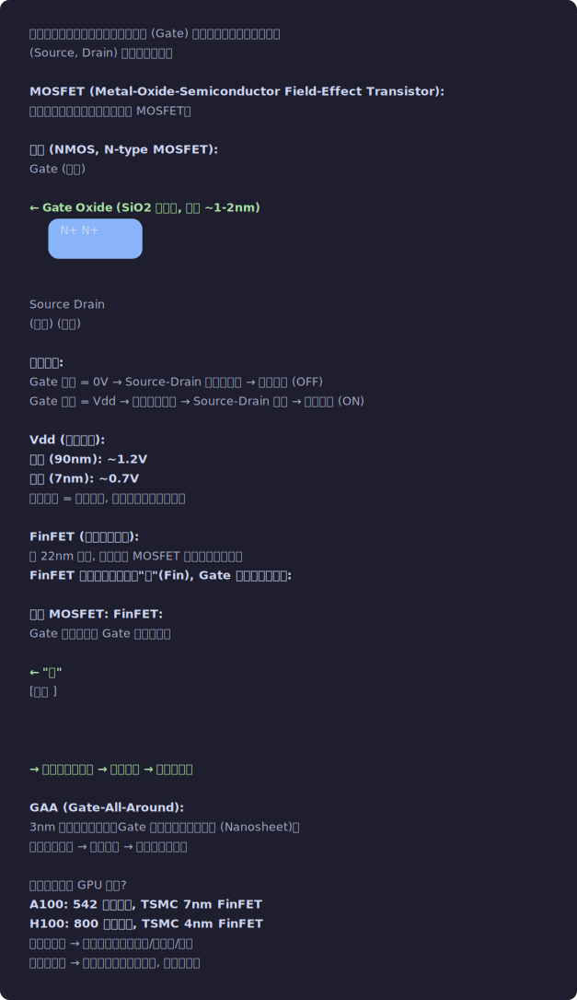
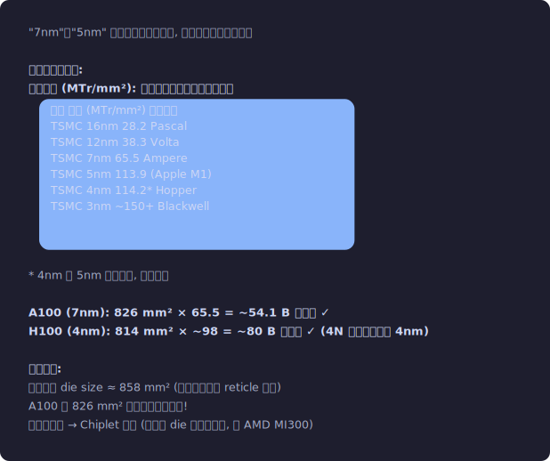
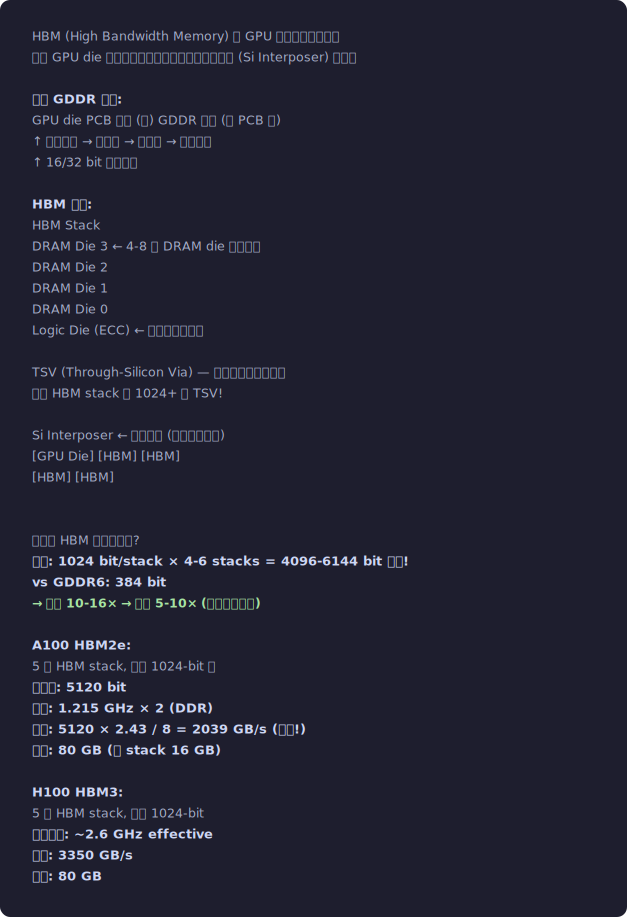
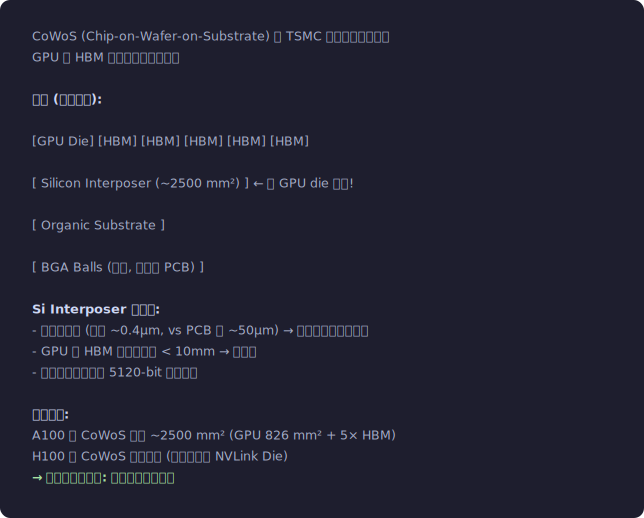
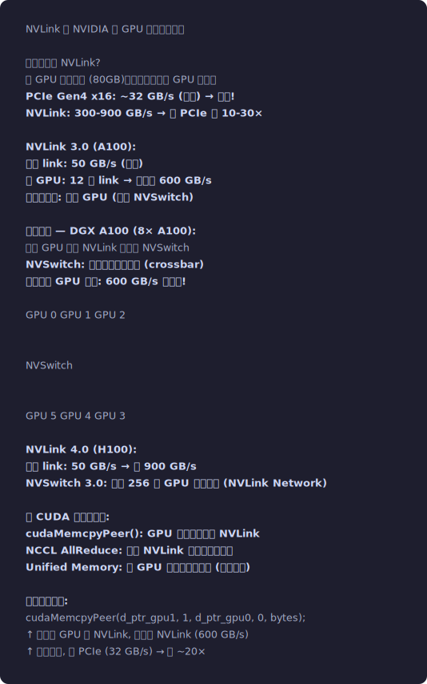

# 附录：半导体物理与数字逻辑基础

**难度**: ⭐⭐⭐ 专家 / 可选阅读
**说明**: 本附录包含晶体管、工艺节点、功耗、逻辑门、时钟、流水线等底层硬件知识。
对于 CUDA 编程和算子开发，这些内容不是必须的。如果你对"芯片为什么这样设计"感兴趣，
或者需要理解功耗/面积/工艺对 GPU 性能的影响，可以阅读本附录。


## A.1 半导体与晶体管 — 一切计算的物理基础

### 晶体管 (Transistor)

```
晶体管是一个电控开关。给一个端子 (Gate) 加电压，控制另外两个端子
(Source, Drain) 之间是否导通。

MOSFET (Metal-Oxide-Semiconductor Field-Effect Transistor):
现代芯片中几乎所有晶体管都是 MOSFET。

结构 (NMOS, N-type MOSFET):
        Gate (栅极)
         │
    ─────┴─────  ← Gate Oxide (SiO2 绝缘层, 厚度 ~1-2nm)
   ┌───────────┐ ← P-type Silicon (衬底)
   │  N+  │ N+ │
   └──┬───┴──┬─┘
      │      │
   Source   Drain
   (源极)  (漏极)

工作原理:
  Gate 电压 = 0V → Source-Drain 之间不导通 → 开关断开 (OFF)
  Gate 电压 = Vdd → 形成导电沟道 → Source-Drain 导通 → 开关闭合 (ON)
  
  Vdd (供电电压):
    早期 (90nm): ~1.2V
    现代 (7nm):  ~0.7V
    更低电压 = 更低功耗, 但也更容易受噪声干扰

FinFET (鳍式场效应管):
  从 22nm 开始, 传统平面 MOSFET 控制不住漏电流。
  FinFET 将沟道做成立体的"鳍"(Fin), Gate 从三面包裹沟道:
  
  传统 MOSFET:          FinFET:
  Gate 从上方覆盖        Gate 从三面包裹
  ═══════                ┌─┐
  ───────               ─┤ ├─  ← "鳍"
  [沟道 ]              ──┤ ├──
  ───────               ─┤ ├─
                         └─┘
  
  → 更好的栅控能力 → 更低漏电 → 可以做更小

GAA (Gate-All-Around):
  3nm 及以下开始采用。Gate 从四面完全包裹沟道 (Nanosheet)。
  更极致的栅控 → 更低漏电 → 可以继续缩小。

为什么这些对 GPU 重要?
  A100: 542 亿晶体管, TSMC 7nm FinFET
  H100: 800 亿晶体管, TSMC 4nm FinFET
  晶体管越多 → 可以放更多计算单元/寄存器/缓存
  工艺越先进 → 同样面积塞更多晶体管, 且更低功耗
```
<p align="center"></p>


### 代工厂对比 — TSMC vs Intel vs Samsung

```
工艺节点的命名不再对应实际物理尺寸。不同代工厂同一 "nm" 标签的实际密度差异很大:

TSMC (台积电) — 代工市场领导者:
  N7 (7nm):  ~65 MTr/mm²  (A100, AMD Zen 3)
  N5 (5nm):  ~137 MTr/mm² (H100 基于 4N, 是 N5 的变体)
  N4 (4nm):  ~114 MTr/mm²* (优化版 N5, yield 更好)
  N3 (3nm):  ~198 MTr/mm² (Blackwell B200)
  N3P:       ~215 MTr/mm² (预计 2025)

Intel (英特尔) — 改名策略 (Intel 4 = 原 7nm):
  Intel 10nm: ~100 MTr/mm² (Alder Lake)
  Intel 7:    ~100 MTr/mm² (Raptor Lake, 实际是 10nm 改进)
  Intel 4:    ~160 MTr/mm² (Meteor Lake)
  Intel 3:    ~195 MTr/mm²
  Intel 18A:  ~230+ MTr/mm² (预计 2025, GAA 类似技术)

Samsung (三星) — 曾经领先, 现在落后:
  8nm:  ~45 MTr/mm²  (Ampere 消费卡 RTX 3080/3090)
  5nm:  ~95 MTr/mm²
  3nm:  ~145 MTr/mm² (GAA 架构, 三星第一家 GAA)

注意: NVIDIA 数据中心 GPU 用 TSMC, 消费卡有时用 Samsung。
      A100 = TSMC 7nm, RTX 3090 = Samsung 8nm
      H100 = TSMC 4nm (N4 变体), RTX 4090 = TSMC 4nm

为何不同代工厂的密度差异这么大?
  1. 命名是营销, 不是物理尺寸
  2. 晶体管密度取决于: fin/gate pitch × metal pitch × cell height
     → 每个代工厂的设计规则不同
  3. 高密度 ≠ 高性能: 高性能库用更大晶体管 (更可靠, 更高频率)
     同一工艺有高密度库和高性能库两个版本
```

### 工艺节点 (Process Node)

```
"7nm"、"5nm" 指的是制造工艺代号, 不再是实际物理尺寸。

实际的关键指标:
  逻辑密度 (MTr/mm²): 每平方毫米多少百万个晶体管
  ┌─────────────────────────────────────────┐
  │ 工艺      │ 密度 (MTr/mm²) │ 代表芯片   │
  │ TSMC 16nm │ 28.2          │ Pascal     │
  │ TSMC 12nm │ 38.3          │ Volta      │
  │ TSMC 7nm  │ 65.5          │ Ampere     │
  │ TSMC 5nm  │ 113.9         │ (Apple M1) │
  │ TSMC 4nm  │ 114.2*        │ Hopper     │
  │ TSMC 3nm  │ ~150+         │ Blackwell  │
  └─────────────────────────────────────────┘
  * 4nm 是 5nm 的改良版, 密度接近

  A100 (7nm): 826 mm² × 65.5 = ~54.1 B 晶体管 ✓
  H100 (4nm): 814 mm² × ~98  = ~80 B 晶体管 ✓ (4N 略不同于标准 4nm)

光刻极限:
  当前最大 die size ≈ 858 mm² (光刻机曝光场 reticle 限制)
  A100 的 826 mm² 已经非常接近极限!
  更大的芯片 → Chiplet 方案 (多个小 die 封装在一起, 如 AMD MI300)
```
<p align="center"></p>


### 功耗 (Power)

```
芯片功耗有两个来源:

1. 动态功耗 (Dynamic Power): 晶体管切换时消耗
   P_dynamic = α × C × V² × f
   
   α: 活动因子 (有多少晶体管在切换, 0~1)
   C: 负载电容 (晶体管+连线的电容)
   V: 供电电压
   f: 时钟频率
   
   关键: 和 V² 成正比! 降压 10% → 功耗降 19%
   这就是为什么 GPU 降频可以大幅省电 (V 和 f 一起降)

   物理直觉 — 电容充放电:
   每个晶体管驱动一个电容负载 (下一级的 Gate 电容 + 连线电容)。
   每次 0→1 或 1→0 切换 = 通过电阻给电容充/放电一次。
   充放电一次消耗的能量: E = ½CV² (电容储能公式)
   每秒切换 f 次 → P = ½CV² × f
   考虑到实际切换概率 α: P = α × C × V² × f
   
   为什么 V² 是关键项:
   电压从 1.2V 降到 0.7V → V² 从 1.44 降到 0.49 → 降 66%!
   → 但电压不能无限降: Gate 阈值电压 ~0.2-0.3V
   → 降到 ~0.5V 时晶体管就很难可靠开关了 (热噪声干扰)

2. 静态功耗 (Static Power / Leakage): 晶体管关断时的漏电
   P_static ∝ 晶体管数量 × 漏电流
   工艺越先进, 漏电越难控制 (沟道越短, 漏电越大)
   
   漏电的物理来源:
   a) 亚阈值漏电 (Subthreshold Leakage):
      晶体管即使 "关断", 仍有微弱电流 (热电子越过势垒)
      沟道越短 → 势垒越容易被穿透 → 漏电越大
   
   b) 栅极漏电 (Gate Leakage):
      电子量子隧穿通过 Gate Oxide (SiO₂ 或 High-K 介电层)
      Gate Oxide 厚度 ~1-2nm → 电子可以直接隧穿!
      → High-K 介电层 (HfO₂ 等) + 金属栅 (HKMG) 缓解了这个问题
   
   c) 结漏电 (Junction Leakage):
      源/漏 PN 结的反向漏电
   
   温度对漏电的影响:
   漏电流 ∝ e^(T) (指数依赖于温度!)
   芯片温度从 25°C 升到 85°C → 漏电增加 ~5-10×
   → 这就是为什么散热不仅影响频率, 还影响功耗本身
   → 太热 → 漏电更大 → 更热 → 恶性循环 (Thermal Runaway)
   
   A100 TDP: 400W (SXM4)
   其中静态功耗估计 ~30-50W (取决于温度)

   Gate Capacitance 的物理:
   Gate 和沟道之间形成平行板电容器:
   C_gate = ε₀ × ε_r × A / d
   
   ε₀: 真空介电常数 (8.85 × 10⁻¹² F/m)
   ε_r: 相对介电常数 (SiO₂ = 3.9, HfO₂ = 25)
   A: Gate 面积 (工艺节点越小, A 越小)
   d: Gate Oxide 厚度 (越小电容越大, 但漏电也越大)
   
   为什么不无限缩小 d?
   隧穿电流 ∝ e^(-d) → d < 1nm 时隧穿电流呈指数增长
   → 这是摩尔定律放缓的物理原因之一

TDP (Thermal Design Power):
  芯片设计的最大散热功率。不是实际功耗, 而是散热系统需要处理的上限。
  实际功耗可以短暂超过 TDP (Boost), 也可以低于 TDP (空闲)。
  
  A100 SXM4: TDP = 400W
  A100 PCIe: TDP = 250W (同一个 die, 但限制了功耗 → 频率更低)
  H100 SXM5: TDP = 700W (!!)
```


## A.2 数字逻辑基础

### 逻辑门 (Logic Gate)

```
晶体管组合成逻辑门, 逻辑门是所有数字电路的构建块:

NOT (非):  1 个 NMOS + 1 个 PMOS = 2 个晶体管
AND (与):  通常用 NAND + NOT = 6 个晶体管
OR (或):   通常用 NOR + NOT = 6 个晶体管
XOR (异或): ~8-12 个晶体管

更复杂的单元:
  全加器 (Full Adder): ~28 个晶体管 → 1-bit 加法
  32-bit 加法器: ~数百个晶体管
  32-bit 乘法器: ~数万个晶体管
  32-bit FMA (Fused Multiply-Add): ~数万个晶体管
  
  一个 FP32 FMA 单元大约需要 ~40,000-60,000 个晶体管
  A100 有 6912 个 FP32 Core (= 108 SM × 64):
  仅 FP32 Core 就需要: 6912 × 50000 ≈ 3.5 亿晶体管
  占总量 (542亿) 的 ~0.6% !
  → 大部分晶体管在寄存器文件和缓存中, 不是计算单元
```

### 时钟 (Clock)

```
时钟是数字电路的心跳。所有同步操作都在时钟边沿发生。

时钟频率 (Clock Frequency):
  A100 Base Clock: 1095 MHz
  A100 Boost Clock: 1410 MHz
  H100 Base Clock: 1095 MHz  
  H100 Boost Clock: 1785 MHz
  
  1410 MHz = 每秒 14.1 亿个时钟周期
  1 个周期 = 1 / 1.41 GHz ≈ 0.71 ns (纳秒)

时钟域 (Clock Domain):
  芯片内部不同部分可以运行在不同频率:
  - SM 时钟: ~1.4 GHz (A100), 是主要的计算时钟
  - HBM 时钟: ~1.2 GHz (HBM2e 的 IO 时钟)
  - PCIe 时钟: 由 PCIe 标准定义
  - NVLink 时钟: 独立于 SM 时钟
  
  不同时钟域之间需要"跨时钟域同步" (CDC: Clock Domain Crossing)
  这增加了延迟 (~几个周期)

时钟树 (Clock Tree):
  时钟信号需要均匀分布到芯片每个角落。
  826 mm² 的 die 上, 时钟信号从中心到边缘传播需要时间。
  "Clock Skew" = 不同位置的时钟到达时间差, 必须控制在很小范围内。
  → 这是大 die 的工程挑战之一
```

### 流水线 (Pipeline)

```
流水线是处理器设计的核心概念: 将一个操作分成多个阶段,
不同阶段可以同时处理不同的操作。

类比: 洗衣房
  不用流水线: 洗 → 烘 → 叠 → 再洗下一批  (30+30+30=90 min/批)
  用流水线:   批1 洗 → 批1烘 + 批2洗 → 批1叠 + 批2烘 + 批3洗
              每 30min 出一批 (吞吐提高 3×)

### 流水线冒险 (Pipeline Hazards)

```
流水线不是没有代价的。三种经典的流水线冒险 (Hazards):

1. 数据冒险 (Data Hazard): 后续指令依赖前一条指令的结果

   RAW (Read After Write): 最常见
     FADD R0, R1, R2   // 写 R0 (Stage 4 才完成)
     FMUL R3, R0, R4   // 下一条就要读 R0! (Stage 1 就需要)
     
     如果 RAW 距离 < 流水线深度 → 需要等待 (Pipeline Stall)
     或者用数据前递 (Forwarding/Bypassing):
     前一条 ALU 的输出在 Stage 3 就已有结果,
     通过旁路 (Bypass) 直接送到下一条的 Stage 1, 不用等写回.
     → GPU 支持有限的前递 (Warp 间无依赖, 只有同一线程的依赖需要)

   WAR (Write After Read): 在乱序执行中才常见, GPU 是顺序发射 → 不存在
   WAW (Write After Write): 同上

2. 控制冒险 (Control Hazard): 分支指令

   @P0 BRA target   // 条件分支
   
   在分支结果出来之前, 流水线不知道下一条指令在哪.
   CPU: 分支预测器猜测 → 猜错就冲刷流水线
   GPU (Pre-Volta): 有谓词寄存器 (P0) → 直接执行两条路径!
     谓词为真的线程走一条, 谓词为假的线程走另一条
     → 不需要预测, 但 Divergence 会降低吞吐
   
   GPU (Volta+): ITS 下每条线程独立 PC
     但如果所有线程走同一路径 → 无分支延迟
     如果线程走到不同路径 → 串行执行两条路径

3. 结构冒险 (Structural Hazard): 硬件资源冲突

   两条指令同时需要同一硬件:
   例: 两条 LDG 指令同时准备好 → 但只有 4 个 LD/ST Unit
       → 后一条等前一条发射完才能发射
   
   Register File Bank Conflict:
   两条源操作数在同一个 Register Bank → 各多等 1 周期
   
   Shared Memory Bank Conflict:
   多个线程访问同一 Bank 不同地址 → 串行

编译器 (ptxas) 如何处理冒险:
  1. 指令调度: 重新排列指令顺序, 让有依赖的指令隔开足够距离
  2. 寄存器分配: 避免 WAW/RAW 的假依赖
  3. Stall Count: 计算需要的等待周期数, 编码到 SASS 控制码中
  4. 双发射: 两条不相关的指令可以从同一 Warp Scheduler 同时发射
     但这一般针对不同类型 (如 1 ALU + 1 MEM), 不是两条同类指令

GPU 比 CPU 更容易处理冒险:
  同一 Warp 的线程间没有寄存器依赖 → 不需要前递
  不同 Warp 完全独立 → 只要切换到另一个 Warp 发射即可
  → GPU 牺牲单线程延迟换取了极简的冒险处理逻辑
```
  FP32 FMA 是 4 级流水线:
  Stage 1: 读操作数
  Stage 2: 乘法
  Stage 3: 对齐 + 加法
  Stage 4: 舍入 + 写回
  
  延迟 (Latency) = 4 cycles (一条指令从开始到结果可用)
  吞吐 (Throughput) = 1 条/cycle (每周期可以发射一条新指令)
  
  延迟 vs 吞吐:
  延迟衡量"一件事做多快"
  吞吐衡量"单位时间做多少事"
  流水线不减少延迟, 但提高吞吐!

  GPU 的核心设计理念:
  不追求单条指令的低延迟 (CPU 做这个)
  而是追求同时执行大量指令的高吞吐 (通过流水线 + 大量线程)
```


## A.3 封装技术 — 芯片如何和外界连接

### HBM 堆叠封装

```
HBM (High Bandwidth Memory) 是 GPU 显存的物理形式。
它和 GPU die 封装在同一个基板上，通过硅中介层 (Si Interposer) 连接。

传统 GDDR 内存:
  GPU die ─── PCB 走线 (长) ─── GDDR 芯片 (在 PCB 上)
  ↑ 数据线长 → 高电容 → 低频率 → 带宽有限
  ↑ 16/32 bit 总线宽度

HBM 堆叠:
  ┌─── HBM Stack ───┐
  │ DRAM Die 3       │  ← 4-8 层 DRAM die 垂直堆叠
  │ DRAM Die 2       │
  │ DRAM Die 1       │
  │ DRAM Die 0       │
  │ Logic Die (ECC)  │  ← 底部的控制逻辑
  └──────┬───────────┘
         │ TSV (Through-Silicon Via) — 穿透硅片的垂直导线
         │ 每个 HBM stack 有 1024+ 根 TSV!
  ┌──────┴───────────────────────┐
  │     Si Interposer            │  ← 硅中介层 (超大面积硅片)
  │  [GPU Die]    [HBM] [HBM]   │
  │               [HBM] [HBM]   │
  └──────────────────────────────┘
  
  为什么 HBM 带宽这么高?
    位宽: 1024 bit/stack × 4-6 stacks = 4096-6144 bit 总线!
    vs GDDR6: 384 bit
    → 位宽 10-16× → 带宽 5-10× (即使频率较低)
  
  A100 HBM2e:
    5 个 HBM stack, 每个 1024-bit 宽
    总位宽: 5120 bit
    频率: 1.215 GHz × 2 (DDR)
    带宽: 5120 × 2.43 / 8 = 2039 GB/s (峰值!)
    容量: 80 GB (每 stack 16 GB)
  
  H100 HBM3:
    5 个 HBM stack, 每个 1024-bit
    频率更高: ~2.6 GHz effective
    带宽: 3350 GB/s
    容量: 80 GB
```
<p align="center"></p>


### CoWoS 封装

```
CoWoS (Chip-on-Wafer-on-Substrate) 是 TSMC 的先进封装技术。
GPU 和 HBM 都放在硅中介层上。

结构 (侧面视图):
  
  [GPU Die]    [HBM]  [HBM]  [HBM]  [HBM]  [HBM]
  ────────────────────────────────────────────────
  [        Silicon Interposer (~2500 mm²)        ]  ← 比 GPU die 还大!
  ────────────────────────────────────────────────
  [             Organic Substrate                 ]
  ────────────────────────────────────────────────
  [        BGA Balls (焊球, 连接到 PCB)           ]
  
  Si Interposer 的作用:
    - 极细的走线 (线宽 ~0.4μm, vs PCB 的 ~50μm) → 可以放数千根信号线
    - GPU 到 HBM 的物理距离 < 10mm → 低延迟
    - 连线密度足够支持 5120-bit 总线宽度
  
  面积挑战:
    A100 的 CoWoS 面积 ~2500 mm² (GPU 826 mm² + 5× HBM)
    H100 的 CoWoS 面积更大 (还有额外的 NVLink Die)
    → 良率是关键挑战: 越大越容易有缺陷
```
<p align="center"></p>


### Chiplet 方案

```
当单个 die 接近光刻极限 (~858 mm²) 时，chiplet 是出路。

传统单片 (Monolithic):
  一个超大 die → 良率低 → 成本极高
  (面积翻倍, 良率可能降到 1/3 → 成本翻 6 倍)

Chiplet 方案:
  多个小 die + 高速互连
  [SM die 1] ←→ [SM die 2] ←→ [SM die 3]
       ↕              ↕              ↕
  [  Memory Controller / IO die (用成熟工艺)  ]
  
  优点:
    - 小 die 良率高 → 成本可控
    - 不同 die 可以用不同工艺 (SM 用 5nm, IO 用 7nm)
    - 可以堆叠更多计算单元
  
  挑战:
    - chiplet 间通信延迟 > die 内通信 (跨 die 走中介层)
    - 对 CUDA 编程模型的影响: 同一 Grid 的不同 Block 可能在不同 die 上
    - SMEM 不能跨 die 共享
  
  实际案例:
    AMD MI300X: 8 个 XCD (计算 die) + 4 个 IOD
    NVIDIA Blackwell: 2 个 GPU die 通过 NVLink-C2C 连接
```


## A.4 互连技术 — GPU 之间和 GPU 到 CPU 的通信

### NVLink

```
NVLink 是 NVIDIA 的 GPU 间高速互连。

为什么需要 NVLink?
  单 GPU 显存有限 (80GB)，大模型需要多 GPU 并行。
  PCIe Gen4 x16: ~32 GB/s (双向) → 太慢!
  NVLink: 300-900 GB/s → 比 PCIe 快 10-30×

NVLink 3.0 (A100):
  每条 link: 50 GB/s (双向)
  每 GPU: 12 条 link → 总带宽 600 GB/s
  可以连接到: 其他 GPU (通过 NVSwitch)
  
  典型拓扑 — DGX A100 (8× A100):
    每个 GPU 通过 NVLink 连接到 NVSwitch
    NVSwitch: 一个大的交叉开关 (crossbar)
    任意两个 GPU 之间: 600 GB/s 全带宽!
    
    ┌─ GPU 0 ─┐   ┌─ GPU 1 ─┐   ┌─ GPU 2 ─┐
    └────┬─────┘   └────┬─────┘   └────┬─────┘
         │              │              │
    ═════╪══════════════╪══════════════╪═══════  NVSwitch
         │              │              │
    ┌────┴─────┐   ┌────┴─────┐   ┌────┴─────┐
    └─ GPU 5 ─┘   └─ GPU 4 ─┘   └─ GPU 3 ─┘

NVLink 4.0 (H100):
  每条 link: 50 GB/s → 总 900 GB/s
  NVSwitch 3.0: 支持 256 个 GPU 的全互连 (NVLink Network)

对 CUDA 编程的影响:
  cudaMemcpyPeer(): GPU 间拷贝自动走 NVLink
  NCCL AllReduce: 利用 NVLink 带宽做梯度聚合
  Unified Memory: 跨 GPU 的虚拟地址空间 (透明迁移)

在你的代码中:
  cudaMemcpyPeer(d_ptr_gpu1, 1, d_ptr_gpu0, 0, bytes);
  ↑ 如果两 GPU 有 NVLink, 自动走 NVLink (600 GB/s)
  ↑ 如果没有, 走 PCIe (32 GB/s) → 慢 ~20×
```
<p align="center"></p>


### PCIe

```
PCIe (PCI Express) 是 GPU 到 CPU 的标准接口。

PCIe Gen4 x16 (A100 PCIe 版):
  单向: ~32 GB/s
  双向: ~64 GB/s
  延迟: ~1-2 μs

PCIe Gen5 x16 (H100 PCIe 版):
  单向: ~64 GB/s
  双向: ~128 GB/s

对 CUDA 编程的影响:
  cudaMemcpy(HostToDevice / DeviceToHost) 走 PCIe
  → 大数据传输的瓶颈!
  → 这就是为什么要用 Pinned Memory + 异步传输 (见 16_streams/)
  → 也是为什么 DGX 系统尽量让 GPU 间通信走 NVLink 而不是 PCIe

PCIe BAR (Base Address Register):
  CPU 通过 PCIe BAR 窗口访问 GPU 显存
  传统: BAR 只有 256MB → CPU 不能直接访问全部 GPU 显存
  Resizable BAR: 支持到 GPU 显存大小 → cudaHostRegister 等功能的基础
```
