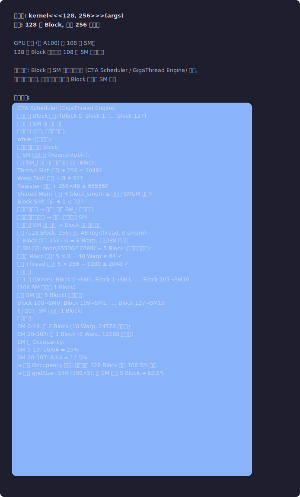
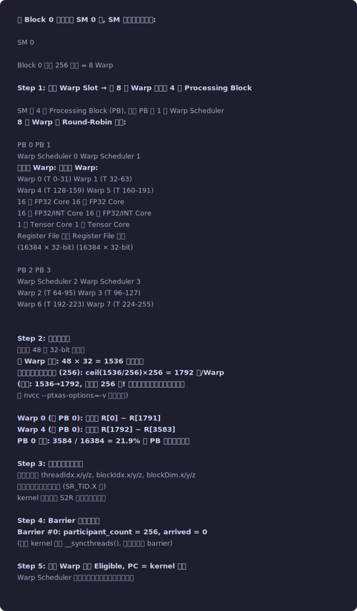
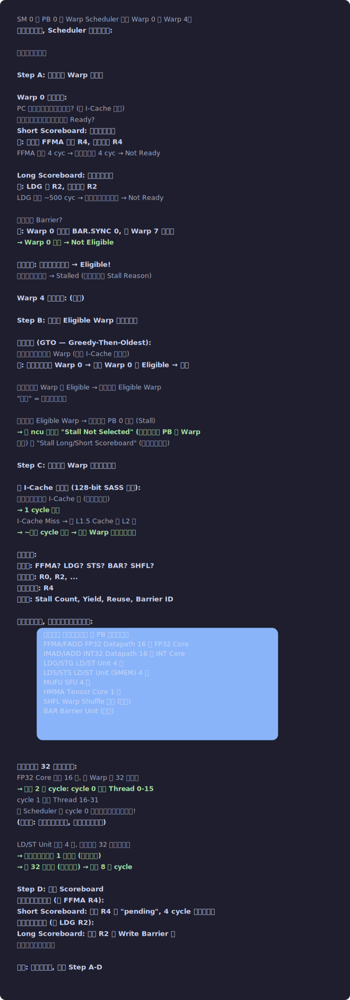
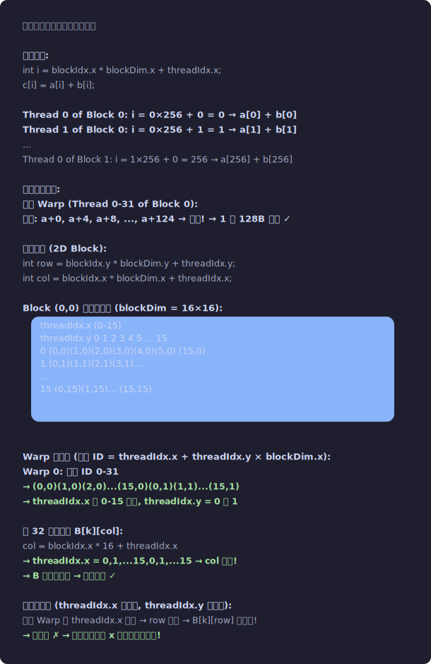
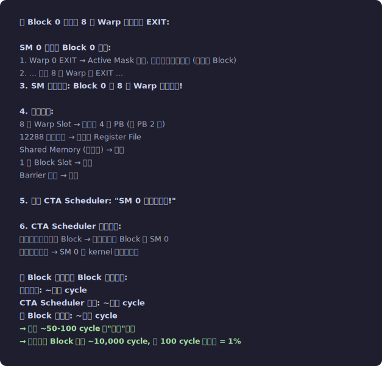
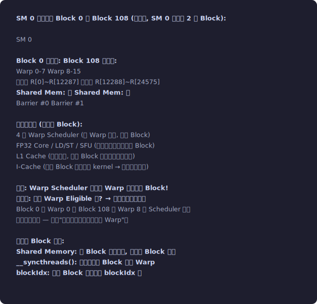

# 软硬件映射全景 — Grid/Block/Thread 如何落到 GPU 硬件上

本文档是所有代码配套文档的补充。回答一个核心问题：
**你写的 <<<gridSize, blockSize>>> 到底怎么变成硬件上的真实执行？**


## 第一层映射：Grid → GPU 芯片

```
你写的: kernel<<<128, 256>>>(args)
含义:   128 个 Block, 每个 256 个线程

GPU 芯片 (如 A100) 有 108 个 SM。
128 个 Block 要分配到 108 个 SM 上执行。

在深入看分配过程之前，先了解 SM 的资源限制从哪来:

  SM 的硬件限制 (不同架构不同! 这里以 A100 / SM 8.0 为例):
  
  ┌────────────────────┬─────────┬───────────────────────────────────┐
  │ 限制项             │ A100 值 │ 如何查询                           │
  ├────────────────────┼─────────┼───────────────────────────────────┤
  │ Max Threads / SM   │ 2048    │ cudaDeviceProp.maxThreadsPerMultiProcessor │
  │ Max Warps / SM     │ 64      │ = maxThreadsPerMultiProcessor / 32 │
  │ Max Blocks / SM    │ 32      │ cudaDeviceProp.maxBlocksPerMultiProcessor │
  │ Max Registers / SM │ 65536   │ cudaDeviceProp.regsPerMultiprocessor │
  │ Max SMEM / SM      │ 最大 164KB│ cudaDeviceProp.sharedMemPerMultiprocessor │
  │                    │ (可配置) │ (取决于 SMEM 配置: 100KB/132KB/164KB) │
  └────────────────────┴─────────┴───────────────────────────────────┘

  用代码查询你当前 GPU 的限制:
    cudaDeviceProp prop;
    cudaGetDeviceProperties(&prop, 0);
    printf("Max Threads / SM: %d\n", prop.maxThreadsPerMultiProcessor);
    printf("Max Regs / SM:    %d\n", prop.regsPerMultiprocessor);
    printf("Max SMEM / SM:    %zu KB\n", prop.sharedMemPerMultiprocessor / 1024);
    printf("SM count:          %d\n", prop.multiProcessorCount);
    
  不同架构对比 (为什么不能写死数字):
    Maxwell (GTX 980):   maxThreadsPerSM=2048, regsPerSM=65536, smem=96KB
    Volta (V100):        maxThreadsPerSM=2048, regsPerSM=65536, smem=96KB
    Ampere (A100):       maxThreadsPerSM=2048, regsPerSM=65536, smem=164KB
    Ada (RTX 4090):      maxThreadsPerSM=1536, regsPerSM=65536, smem=100KB
    Hopper (H100):       maxThreadsPerSM=2048, regsPerSM=65536, smem=228KB
    
  注意: maxThreadsPerSM 在 Ada Lovelace 上降到了 1536! 
  所以不能假设所有 GPU 都是 2048。

关键事实: Block 到 SM 的分配由硬件 (CTA Scheduler / GigaThread Engine) 完成,
          程序员无法控制, 也不应该假设特定 Block 在特定 SM 上。

分配过程:
┌─────────────────────────────────────────────────────────────────┐
│  CTA Scheduler (GigaThread Engine)                              │
│                                                                 │
│  维护一个 Block 队列: [Block 0, Block 1, ..., Block 127]         │
│  维护每个 SM 的资源使用表                                         │
│                                                                 │
│  分配算法 (简化, 实际更复杂):                                     │
│    while (队列非空):                                             │
│      取出队列头部的 Block                                        │
│      按 SM 编号轮询 (Round-Robin):                               │
│        检查 SM_i 是否有足够资源容纳这个 Block:                    │
│          Thread Slot: 已用 + 256 ≤ 2048?                        │
│          Warp Slot:   已用 + 8 ≤ 64?                            │
│          Register:    已用 + 256×48 ≤ 65536?  ← 48 regs/thread  │
│          Shared Mem:  已用 + block_smem ≤ 配置的 SMEM 总量?      │
│          Block Slot:  已用 + 1 ≤ 32?                            │
│        如果全部满足 → 分配! 更新 SM_i 的资源表                    │
│        如果任何一项不足 → 跳过, 试下一个 SM                       │
│      如果所有 SM 都装不下 → Block 在队列中等待                   │
│                                                                 │
│    关于 Register 的约束: 48 regs/thread 由编译器决定              │
│    (nvcc --ptxas-options=-v 可查看)。详细分配见"第二层映射"Step 2.│                    │
│                                                                 │
│  本例 (128 Block, 256 线程, 48 reg/thread, 0 smem):             │
│    每 Block 需要: 256 线程 = 8 Warp, 12288 寄存器               │
│    每 SM 能装: floor(65536/12288) = 5 Block (受寄存器限制)        │
│    但也受 Warp 限制: 5 × 8 = 40 Warp ≤ 64 ✓                    │
│    也受 Thread 限制: 5 × 256 = 1280 ≤ 2048 ✓                    │
│                                                                 │
│  分配结果:                                                       │
│    第 1 波 (Wave): Block 0→SM0, Block 1→SM1, ..., Block 107→SM107│
│      (108 SM 各分配 1 Block)                                     │
│    但每 SM 能装 5 Block! 所以继续:                                │
│    Block 108→SM0, Block 109→SM1, ..., Block 127→SM19            │
│      (前 20 个 SM 各再加 1 Block)                                │
│                                                                 │
│    最终分配:                                                      │
│      SM 0-19:  各 2 Block (16 Warp, 24576 寄存器)                │
│      SM 20-107: 各 1 Block (8 Warp, 12288 寄存器)                │
│      SM 的 Occupancy:                                            │
│        SM 0-19:  16/64 = 25%                                    │
│        SM 20-107: 8/64 = 12.5%                                  │
│        → 整体 Occupancy 不高! 因为只有 128 Block 要在 108 SM 上跑 │
│        → 如果 gridSize=540 (108×5), 每 SM 正好 5 Block → 62.5%  │
└─────────────────────────────────────────────────────────────────┘
```
<p align="center"></p>


## 第二层映射：Block → SM 内部的资源分配

```
当 Block 0 被分配到 SM 0 时, SM 内部做的初始化:

┌── SM 0 ──────────────────────────────────────────────────────────┐
│                                                                   │
│  Block 0 需要 256 线程 = 8 Warp                                   │
│                                                                   │
│  Step 1: 分配 Warp Slot → 将 8 个 Warp 分配到 4 个 Processing Block│
│                                                                   │
│  SM 有 4 个 Processing Block (PB), 每个 PB 有 1 个 Warp Scheduler │
│  8 个 Warp 按 Round-Robin 分配:                                    │
│                                                                   │
│  ┌─── PB 0 ────────────┐  ┌─── PB 1 ────────────┐              │
│  │ Warp Scheduler 0     │  │ Warp Scheduler 1     │              │
│  │ 管理的 Warp:          │  │ 管理的 Warp:          │              │
│  │   Warp 0 (T 0-31)   │  │   Warp 1 (T 32-63)  │              │
│  │   Warp 4 (T 128-159) │  │   Warp 5 (T 160-191)│              │
│  │ 16 个 FP32 Core      │  │ 16 个 FP32 Core      │              │
│  │ 16 个 FP32/INT Core  │  │ 16 个 FP32/INT Core  │              │
│  │ 1 个 Tensor Core     │  │ 1 个 Tensor Core     │              │
│  │ Register File 分区    │  │ Register File 分区    │              │
│  │   (16384 × 32-bit)   │  │   (16384 × 32-bit)   │              │
│  └──────────────────────┘  └──────────────────────┘              │
│  ┌─── PB 2 ────────────┐  ┌─── PB 3 ────────────┐              │
│  │ Warp Scheduler 2     │  │ Warp Scheduler 3     │              │
│  │   Warp 2 (T 64-95)  │  │   Warp 3 (T 96-127) │              │
│  │   Warp 6 (T 192-223) │  │   Warp 7 (T 224-255)│              │
│  └──────────────────────┘  └──────────────────────┘              │
│                                                                   │
│  Step 2: 分配寄存器                                                │
│    每线程 48 个 32-bit 寄存器                                       │
│    每 Warp 需要: 48 × 32 = 1536 个寄存器                           │
│    向上取整到分配粒度 (256): ceil(1536/256)×256 = 1792 个/Warp     │
│    (注意: 1536→1792, 浪费了 256 个! 这就是为什么实际寄存器消耗      │
│     比 nvcc --ptxas-options=-v 报告的多)                            │
│                                                                   │
│    Warp 0 (在 PB 0):  寄存器 R[0] ~ R[1791]                      │
│    Warp 4 (在 PB 0):  寄存器 R[1792] ~ R[3583]                   │
│    PB 0 总计: 3584 / 16384 = 21.9% 的 PB 寄存器被占用             │
│                                                                   │
│  Step 3: 初始化特殊寄存器                                          │
│    每个线程的 threadIdx.x/y/z, blockIdx.x/y/z, blockDim.x/y/z     │
│    被写入硬件特殊寄存器 (SR_TID.X 等)                               │
│    kernel 代码通过 S2R 指令读取这些值                                │
│                                                                   │
│  Step 4: Barrier 硬件初始化                                        │
│    Barrier #0: participant_count = 256, arrived = 0                │
│    (如果 kernel 使用 __syncthreads(), 会用到这个 barrier)           │
│                                                                   │
│  Step 5: 所有 Warp 设为 Eligible, PC = kernel 入口                 │
│    Warp Scheduler 下一个周期就可以开始发射指令                       │
└──────────────────────────────────────────────────────────────────┘
```
<p align="center"></p>


## 第三层映射：Warp → 指令执行 (Warp Scheduler 的每周期行为)

```
SM 0 的 PB 0 的 Warp Scheduler 管理 Warp 0 和 Warp 4。
每个时钟周期, Scheduler 做以下操作:

┌─── 每周期决策流程 ──────────────────────────────────────────────┐
│                                                                  │
│  Step A: 检查每个 Warp 的状态                                     │
│                                                                  │
│    Warp 0 状态检查:                                               │
│    ├── PC 处的下一条指令是什么? (从 I-Cache 获取)                  │
│    ├── 这条指令的源寄存器是否都 Ready?                             │
│    │   ├── Short Scoreboard: 检查计算依赖                         │
│    │   │   例: 上一条 FFMA 写了 R4, 下一条读 R4                   │
│    │   │   FFMA 延迟 4 cyc → 如果还没过 4 cyc → Not Ready         │
│    │   │                                                         │
│    │   └── Long Scoreboard: 检查内存依赖                          │
│    │       例: LDG 写 R2, 下一条读 R2                             │
│    │       LDG 延迟 ~500 cyc → 如果数据还没回来 → Not Ready        │
│    │                                                              │
│    ├── 是否在等 Barrier?                                          │
│    │   例: Warp 0 已到达 BAR.SYNC 0, 但 Warp 7 还没到            │
│    │   → Warp 0 在等 → Not Eligible                               │
│    │                                                              │
│    └── 综合判断: 所有条件都满足 → Eligible!                        │
│                  任何一个不满足 → Stalled (原因记录在 Stall Reason)│
│                                                                  │
│    Warp 4 状态检查: (同上)                                        │
│                                                                  │
│  Step B: 从所有 Eligible Warp 中选择一个                           │
│                                                                  │
│    选择策略 (GTO — Greedy-Then-Oldest):                           │
│    ├── 优先选上次执行的 Warp (利用 I-Cache 局部性)                 │
│    │   例: 上周期执行了 Warp 0 → 如果 Warp 0 还 Eligible → 选它   │
│    │                                                              │
│    └── 如果上次的 Warp 不 Eligible → 选最老的 Eligible Warp       │
│        "最老" = 最久没执行的                                       │
│                                                                  │
│    如果没有 Eligible Warp → 这个周期 PB 0 空闲 (Stall)            │
│    → 在 ncu 中记为 "Stall Not Selected" (如果有其他 PB 的 Warp    │
│       在跑) 或 "Stall Long/Short Scoreboard" (如果全卡住了)        │
│                                                                  │
│  Step C: 发射选中 Warp 的下一条指令                                │
│                                                                  │
│    从 I-Cache 取指令 (128-bit SASS 指令):                         │
│    ├── 指令可能已经在 I-Cache 中 (之前预取过)                      │
│    │   → 1 cycle 取到                                             │
│    └── I-Cache Miss → 从 L1.5 Cache 或 L2 取                     │
│        → ~几十 cycle 延迟 → 这个 Warp 暂时不能发射                │
│                                                                  │
│    解码指令:                                                       │
│    ├── 操作码: FFMA? LDG? STS? BAR? SHFL?                        │
│    ├── 源寄存器: R0, R2, ...                                      │
│    ├── 目标寄存器: R4                                              │
│    └── 控制码: Stall Count, Yield, Reuse, Barrier ID              │
│                                                                  │
│    根据指令类型, 发射到对应的执行单元:                               │
│    ┌─────────────────────────────────────────────────────┐       │
│    │ 指令类型   │ 目标执行单元      │ 该 PB 有几个单元    │       │
│    │ FFMA/FADD │ FP32 Datapath    │ 16 个 FP32 Core    │       │
│    │ IMAD/IADD │ INT32 Datapath   │ 16 个 INT Core     │       │
│    │ LDG/STG   │ LD/ST Unit       │ 4 个               │       │
│    │ LDS/STS   │ LD/ST Unit (SMEM)│ 4 个               │       │
│    │ MUFU      │ SFU              │ 4 个               │       │
│    │ HMMA      │ Tensor Core      │ 1 个               │       │
│    │ SHFL      │ Warp Shuffle 网络│ (内置)              │       │
│    │ BAR       │ Barrier Unit     │ (共享)              │       │
│    └─────────────────────────────────────────────────────┘       │
│                                                                  │
│    一条指令对 32 个线程执行:                                       │
│    ├── FP32 Core 只有 16 个, 但 Warp 有 32 个线程                 │
│    │   → 需要 2 个 cycle: cycle 0 处理 Thread 0-15                │
│    │                       cycle 1 处理 Thread 16-31              │
│    │   但 Scheduler 在 cycle 0 就可以发射下一条指令!              │
│    │   (流水线: 上一条还在执行, 下一条已经开始)                    │
│    │                                                              │
│    └── LD/ST Unit 只有 4 个, 但要处理 32 线程的请求                │
│        → 合并后可能只有 1 个事务 (合并访问)                         │
│        → 或 32 个事务 (随机访问) → 需要 8 个 cycle                 │
│                                                                  │
│  Step D: 更新 Scoreboard                                          │
│    如果指令有写目标 (如 FFMA R4):                                  │
│      Short Scoreboard: 标记 R4 为 "pending", 4 cycle 后自动清除   │
│    如果是内存指令 (如 LDG R2):                                     │
│      Long Scoreboard: 标记 R2 在 Write Barrier 上                  │
│      直到数据返回才清除                                             │
│                                                                  │
│  然后: 下一个周期, 重复 Step A-D                                   │
└──────────────────────────────────────────────────────────────────┘
```
<p align="center"></p>


## 第四层映射：Thread → 数据 (threadIdx 如何决定内存地址)

```
这是程序员直接控制的层面。

向量加法:
  int i = blockIdx.x * blockDim.x + threadIdx.x;
  c[i] = a[i] + b[i];

  Thread 0 of Block 0: i = 0×256 + 0 = 0      → a[0] + b[0]
  Thread 1 of Block 0: i = 0×256 + 1 = 1      → a[1] + b[1]
  ...
  Thread 0 of Block 1: i = 1×256 + 0 = 256    → a[256] + b[256]
  
  合并访问分析:
    同一 Warp (Thread 0-31 of Block 0):
    地址: a+0, a+4, a+8, ..., a+124 → 连续! → 1 次 128B 事务 ✓

矩阵乘法 (2D Block):
  int row = blockIdx.y * blockDim.y + threadIdx.y;
  int col = blockIdx.x * blockDim.x + threadIdx.x;
  
  Block (0,0) 的线程布局 (blockDim = 16×16):
  ┌────────────────────────────────────────────────────────────┐
  │                         threadIdx.x (0-15)                  │
  │ threadIdx.y   0    1    2    3    4    5    ...  15         │
  │     0       (0,0)(1,0)(2,0)(3,0)(4,0)(5,0)    (15,0)       │
  │     1       (0,1)(1,1)(2,1)(3,1)...                        │
  │     ...                                                    │
  │     15      (0,15)(1,15)...              (15,15)           │
  └────────────────────────────────────────────────────────────┘
  
  Warp 的映射 (线性 ID = threadIdx.x + threadIdx.y × blockDim.x):
    Warp 0: 线性 ID 0-31
      → (0,0)(1,0)(2,0)...(15,0)(0,1)(1,1)...(15,1)
      → threadIdx.x 在 0-15 循环, threadIdx.y = 0 和 1
      
    这 32 个线程读 B[k][col]:
      col = blockIdx.x * 16 + threadIdx.x
      → threadIdx.x = 0,1,...15,0,1,...15 → col 连续!
      → B 的地址连续 → 合并访问 ✓
      
    如果反过来 (threadIdx.x 对应行, threadIdx.y 对应列):
      同一 Warp 的 threadIdx.x 连续 → row 连续 → B[k][row] 不连续!
      → 不合并 ✗ → 这就是为什么 x 必须对应列方向!
```
<p align="center"></p>


## Block 内多个 Warp 的并发行为

```
一个 Block 有 8 个 Warp, 分布在 4 个 PB 上。
它们的执行是交错 (Interleaved) 的, 不是顺序的:

时间轴 (PB 0, 管理 Warp 0 和 Warp 4):

Cycle 0:  Warp 0, 指令 0 (S2R)     → 发射, 4 cyc 延迟
Cycle 1:  Warp 0, 指令 1 (S2R)     → Warp 0 连续发射 (GTO 策略)
Cycle 2:  Warp 0, 指令 2 (IMAD)    → 依赖指令 0, 但 stall count=0 已过
Cycle 3:  Warp 0, 指令 3 (ISETP)   → 
Cycle 4:  Warp 0, 指令 4 (LDG)     → 发射后, Warp 0 进入 Stall (等 HBM)
Cycle 5:  Warp 4, 指令 0 (S2R)     → 切换到 Warp 4! (Warp 0 Stalled)
Cycle 6:  Warp 4, 指令 1 (S2R)
Cycle 7:  Warp 4, 指令 2 (IMAD)
Cycle 8:  Warp 4, 指令 3 (ISETP)
Cycle 9:  Warp 4, 指令 4 (LDG)     → Warp 4 也 Stall 了
Cycle 10: (没有 Eligible Warp)       → PB 0 空闲!
...
Cycle ~500: Warp 0 的 LDG 数据回来 → Warp 0 变 Eligible
Cycle 501: Warp 0, 指令 5 (LDG)    → 继续
...

问题: PB 0 只有 2 个 Warp, 都 Stall 后 PB 空闲 → 延迟没有被隐藏!

如果 SM 上有 5 个 Block (40 Warp, 每 PB 10 个):
Cycle 0:  Warp 0, 指令 0
...
Cycle 4:  Warp 0, LDG → Stall
Cycle 5:  Warp 4, 指令 0
...
Cycle 9:  Warp 4, LDG → Stall
Cycle 10: Warp 8, 指令 0     ← Block 1 的 Warp!
...
Cycle 49: Warp 36, LDG → Stall
Cycle 50: (如果 ~500 cyc 后 Warp 0 回来) → 可能还没回来
          → 需要更多 Warp!
Cycle ~500: Warp 0 回来 → 继续

10 个 Warp × ~5 cycles/Warp ≈ 50 cycles 的工作填充
vs LDG 的 ~500 cycles 延迟
→ 需要 ~100 个 Warp 才能完全隐藏 (但 PB 最多 16 个)
→ 对于 Memory Bound kernel, Occupancy 越高越好 (更多 Warp 隐藏延迟)
```


## Block 完成后的资源回收

```
当 Block 0 的所有 8 个 Warp 都执行到 EXIT:

SM 0 检测到 Block 0 完成:
  1. Warp 0 EXIT → Active Mask 清零, 但资源不立即释放 (等整个 Block)
  2. ... 所有 8 个 Warp 都 EXIT ...
  3. SM 硬件确认: Block 0 的 8 个 Warp 全部完成!
  
  4. 释放资源:
     ├── 8 个 Warp Slot → 归还给 4 个 PB (每 PB 2 个)
     ├── 12288 个寄存器 → 归还给 Register File
     ├── Shared Memory (如果有) → 归还
     ├── 1 个 Block Slot → 归还
     └── Barrier 硬件 → 释放
  
  5. 通知 CTA Scheduler: "SM 0 空出资源了!"
  
  6. CTA Scheduler 检查队列:
     如果还有未分配的 Block → 立即分配新 Block 到 SM 0
     如果队列空了 → SM 0 该 kernel 的工作结束

  从 Block 完成到新 Block 开始执行:
    资源释放: ~几个 cycle
    CTA Scheduler 通知: ~几个 cycle
    新 Block 初始化: ~几十 cycle
    → 总计 ~50-100 cycle 的"换班"时间
    → 如果每个 Block 执行 ~10,000 cycle, 这 100 cycle 的开销 = 1%
```
<p align="center"></p>


## 多 Block 在同一 SM 上的资源共享

```
SM 0 上同时有 Block 0 和 Block 108 (本例中, SM 0 分到了 2 个 Block):

┌── SM 0 ──────────────────────────────────────────────────────┐
│                                                               │
│  Block 0 的资源:                 Block 108 的资源:             │
│  ├── Warp 0-7                   ├── Warp 8-15                │
│  ├── 寄存器 R[0]~R[12287]       ├── 寄存器 R[12288]~R[24575] │
│  ├── Shared Mem: 无              ├── Shared Mem: 无           │
│  └── Barrier #0                 └── Barrier #1               │
│                                                               │
│  共享的资源 (不区分 Block):                                    │
│  ├── 4 个 Warp Scheduler (按 Warp 分配, 不按 Block)           │
│  ├── FP32 Core / LD/ST / SFU (执行单元不属于特定 Block)        │
│  ├── L1 Cache (硬件管理, 两个 Block 的访问都可能缓存)           │
│  └── I-Cache (两个 Block 跑同一个 kernel → 共享指令缓存)       │
│                                                               │
│  关键: Warp Scheduler 不关心 Warp 属于哪个 Block!              │
│  它只看: 这个 Warp Eligible 吗? → 选最合适的发射。              │
│  Block 0 的 Warp 0 和 Block 108 的 Warp 8 对 Scheduler 来说   │
│  没有任何区别 — 都是"一个可能被选中发射的 Warp"。                │
│                                                               │
│  唯一的 Block 边界:                                            │
│  ├── Shared Memory: 每 Block 独立区域, 不能跨 Block 访问       │
│  ├── __syncthreads(): 只同步同一 Block 内的 Warp                │
│  └── blockIdx: 不同 Block 有不同的 blockIdx 值                  │
└──────────────────────────────────────────────────────────────┘
```
<p align="center"></p>


## 完整的软硬件映射对照表

```
┌─────────────────────┬────────────────────────────────────────────────┐
│ 软件概念             │ 硬件对应                                       │
├─────────────────────┼────────────────────────────────────────────────┤
│ Grid                │ 整个 GPU (所有 SM 参与执行这个 kernel)          │
│ gridDim             │ CTA Scheduler 要分配的 Block 总数               │
│                     │                                                │
│ Block (CTA)         │ SM 上的一组资源 (寄存器区 + SMEM 区 + Barrier)  │
│ blockIdx            │ CTA Scheduler 分配时设定, 写入硬件特殊寄存器    │
│ blockDim            │ 写入 Constant Memory, kernel 通过 c[0x0] 读取  │
│                     │                                                │
│ Warp                │ Warp Scheduler 的调度单位 (32 线程一组)         │
│                     │ 驻留在特定 PB 的 Scheduler 上                  │
│                     │ 拥有独立的 PC、Active Mask、Scoreboard 条目     │
│                     │                                                │
│ Thread              │ CUDA Core (ALU) 的一次运算 (一条指令的一个 lane)│
│ threadIdx           │ 硬件特殊寄存器 SR_TID.X, 初始化时设定          │
│                     │                                                │
│ __global__ kernel   │ GPU 指令内存中的 SASS 代码段                    │
│ kernel 参数          │ Constant Memory Bank 0 (CB0)                   │
│ <<<grid, block>>>   │ CTA Scheduler 的 launch 命令                   │
│                     │                                                │
│ 局部变量 (float x)  │ Register File 中的一个 32-bit 寄存器            │
│ __shared__ 变量      │ SM 内的 Shared Memory SRAM 的一段地址           │
│ 全局数组 (float *d)  │ HBM 显存中的一段物理地址                       │
│                     │                                                │
│ __syncthreads()     │ BAR.SYNC 指令 → Barrier Unit 的计数器           │
│ __shfl_down_sync()  │ SHFL.DOWN 指令 → Warp 内 Crossbar 网络         │
│ atomicAdd()         │ RED/ATOM 指令 → L2 Cache 的 Atomic Unit        │
│                     │                                                │
│ cudaMalloc          │ GPU 页表分配虚拟地址 → MC 预留 HBM 物理页       │
│ cudaMemcpy (H2D)    │ Copy Engine DMA: CPU DRAM → PCIe → HBM         │
│ cudaMemcpy (D2H)    │ Copy Engine DMA: HBM → PCIe → CPU DRAM         │
│ cudaDeviceSynchronize│ CPU 等待 GPU Command Buffer 的所有命令完成     │
└─────────────────────┴────────────────────────────────────────────────┘
```
<p align="center"></p>

